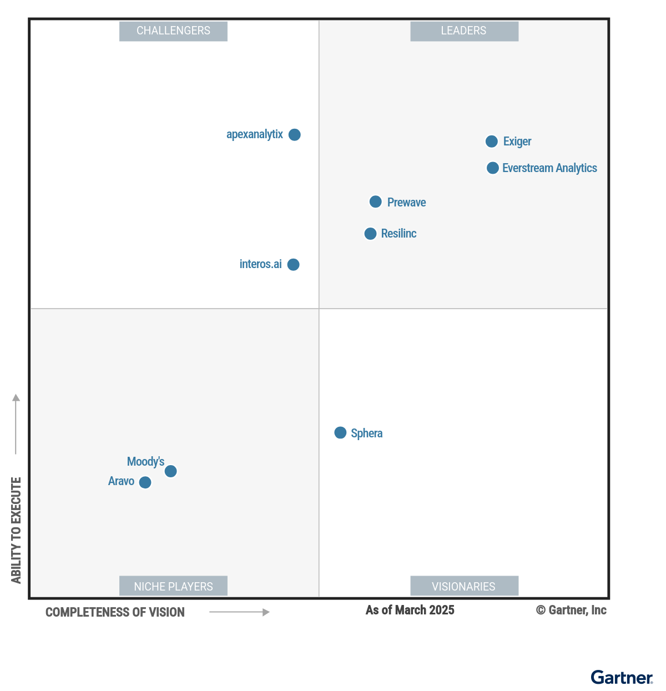

# 供应商风险管理解决方案魔力象限

2025 年 4 月 21 日 - ID G00820163 - 阅读时长约 36 分钟

作者：Cian Curtin、Martin Shreffler **及另外 2 位分析师**

地缘政治的不确定性使采购与供应链组织重新聚焦于供应商风险管理。技术虽无法消除所有风险敞口，但有助于预判和应对中断事件。采购技术负责人可借助本研究评估市场格局。

---

> ## 📌 关键洞察与战略摘要
>
> ### 象限格局一览
>
> | 象限 | 厂商 |
> |------|------|
> | **🏆 领导者** | **Everstream Analytics**、**Exiger**、**Prewave**、**Resilinc** |
> | **⚡ 挑战者** | apexanalytix、interos.ai |
> | **🔭 远见者** | Sphera |
> | **🎯 利基玩家** | Aravo、Moody's |
>
> ### 五大核心趋势
>
> 1. **AI/GenAI 成为核心分水岭** — 所有领导者都深度集成了 AI 能力（预测分析、智能体 AI、NLP），这已从"加分项"变为"必备项"。Exiger 和 Everstream 在 AI 创新方面尤为突出。
> 2. **地缘政治驱动市场增长** — 全球地缘政治不确定性是推动企业投资供应商风险管理的首要驱动力，解决方案需要能将现实世界事件与供应链影响直接关联。
> 3. **多层级映射日益关键** — 从单一供应商管理向全供应链网络透明化演进，零部件/物料级别的风险追溯（如 Exiger）代表了市场前沿方向。
> 4. **ESG/可持续发展成为默认维度** — Prewave 将可持续发展风险默认集成，Sphera 在 ESG 评估方面领先，这反映了监管合规（如 GDPR、FCPA）对市场的深刻影响。
> 5. **市场仍以北美和欧洲为主** — 大多数厂商的客户群集中在北美和欧洲，多语言支持和全球覆盖仍是普遍短板。
>
> ### 选型关键建议
>
> - **匹配风险类型**：不同解决方案擅长不同风险领域（财务、地缘政治、ESG、网络安全），需根据自身优先风险选择。
> - **评估 AI 成熟度**：关注厂商的 AI 能力是否已落地（而非仅在路线图中），尤其是预测分析和智能体 AI。
> - **构建技术生态**：避免依赖单一解决方案，应构建与 ERP、计划系统等集成的风险技术生态。
> - **关注客户留存率**：部分领导者（如 Everstream）的客户留存率低于平均水平，选型时应重点考察实际客户体验。
> - **美国联邦客户注意 FedRAMP**：仅 Exiger 已获得 FedRAMP 授权。
>
> ### OptiMax 产品启示
>
> - 供应商风险管理市场正从"被动监控"向"主动预测+自动响应"演进，这与 OptiMax 的智能供应链优化方向高度契合
> - **多层级映射 + AI 预测 + 实时事件关联**是领导者的共同特征，可作为 OptiMax 供应链风险模块的核心能力参考
> - 行业专属预配置方案（如 Resilinc 的 25+ 行业模板）是提升客户价值感知的有效策略

---

## 市场定义与描述

供应商风险管理解决方案是一类先进的技术平台，旨在支撑全面的供应商风险管理活动。这些平台不仅能够识别和持续监控潜在风险——包括财务不稳定、地缘政治隐患和合规挑战——还能深入分析风险的整体影响，并协调运营层面和战略层面的应对措施，从而有效缓解风险。作为端到端供应链风险管理的核心组成部分，供应商风险管理旨在帮助组织在整个供应生态系统（涵盖实体供应链和数字供应链）中对已识别的优先风险进行缓解。

供应商风险管理解决方案赋能供应链和采购组织，使其能够有效应对可预见和不可预见的中断事件，例如地缘政治紧张局势或极端天气事件引发的供应中断。这些解决方案可确保合规性、优化供应商绩效管理、缓解财务风险，并推动可持续发展与 ESG（环境、社会和治理）相关举措。此外，它们还能加强网络安全防护并管理产能波动，从而保障供应链的完整性和韧性。通过运用高级分析和实时数据，供应商风险管理系统提供了一套完整的风险识别、评估和缓解框架。这种前瞻性方法不仅能最大限度地减少潜在中断，还能提升供应链的整体敏捷性和响应能力。

供应商风险管理与第三方风险管理（TPRM）是风险管理大框架下两个不同的概念。供应商风险管理主要关注组织与其供应商之间的直接关系和依赖性，而第三方风险管理则涵盖更广泛的外部实体，包括监管机构、分包服务商以及各类合作伙伴。第三方风险管理超越了保持一定距离的关系（译注：指买卖双方仅通过合同维系、缺乏深度协作的传统交易关系），涉及更全面的交互和依赖关系。此外，第三方风险管理通常不会将现实世界的事件与其对供应链的潜在影响直接关联，因此需要一种更加整体化和集成化的风险评估与缓解方法。

#### 必备功能

> 💡 **以下四项能力是入选魔力象限的门槛要求，也是评估任何供应商风险管理解决方案的基线。**

供应商风险管理解决方案需要支持以下功能：

- **风险识别与评估：**
  - 采用先进的算法和模型，基于财务稳定性、地缘政治因素、合规性和运营绩效等多种参数对供应商风险进行评估和评分。
  - 提供可定制的风险评估框架，以匹配组织的风险偏好和行业标准。
- **持续监控：**
  - 利用新闻、监管动态及其他相关来源的数据流对供应商进行监控。
  - 在供应商风险状况发生变化时发出警报和通知。
  - 提供覆盖多个风险领域的风险情报，实现更广泛的风险可见性，涵盖财务、可持续发展/ESG、事件监控（如地缘政治、极端天气等）、产能、网络安全监控、绩效和合规等领域。
- **风险应对管理：**
  - 提供事件跟踪和管理工具，用于记录和处理供应商相关问题。
  - 支持根因分析和纠正措施规划。
  - 协调风险应对工作，实现无缝报告和监督。
- **学习与分析：**
  - 提供指标和 KPI，用于评估供应商绩效和风险的长期趋势。
  - 提供数据可视化工具以支持直观分析和决策，例如用于展示供应商风险和绩效数据的仪表盘和报告工具。
  - 具备高级分析和机器学习能力，用于识别风险模式和趋势。

#### 常见功能

> 💡 **以下功能中，预测分析与 AI、多层级映射、生成式 AI 是当前市场最具差异化的能力，也是领导者与其他象限厂商的核心分水岭。**

供应商风险管理解决方案还可支持以下附加功能：

- **实时风险情报：**
  - 与全球新闻、监管机构和市场情报来源的实时数据流集成。
  - 支持对可能影响供应商的地缘政治事件、极端天气和市场波动进行实时或近实时的持续监控。
  - 通过分析向用户交付洞察，例如实时风险敞口价值和风险对营收的影响。
- **预测分析与 AI：** <!-- ⭐ 领导者核心差异化能力 -->
  - 利用人工智能、生成式 AI 和机器学习算法，在潜在风险发生之前进行预测。
  - 通过高级分析识别供应商行为和绩效中的模式与趋势。
- **多层级映射：** <!-- ⭐ 供应链透明化的关键技术 -->
  - 绘制并持续更新整个供应链网络图谱，涵盖所有层级的供应商。
  - 提供可视化工具（如交互式地图和仪表盘），直观展示不同供应商之间的关系和依赖性。
  - 分析低层级供应商的风险如何沿供应链传导并影响采购方组织，评估不同层级中断事件可能引发的连锁效应。
  - 帮助组织深入了解完整的关系网络，识别与供应商协作开展联合风险缓解的机会。
- **供应商管理：**
  - 提供集中化的供应商信息库，涵盖联系方式、财务数据、合规记录、绩效指标和风险评估等内容。
  - 提供精简且自动化的供应商入驻流程，包括数据采集、验证和审批。可包含供应商自助门户，供供应商自行更新和维护其信息。
  - 通过改善与供应商在联合风险缓解方面的沟通与协作，增强协同效应。
- **法规合规跟踪：**
  - 自动跟踪法规变化及其对供应商合规性的影响。
  - 与全球监管数据库集成，确保合规信息的时效性。
- **社区化情报：**
  - 通过多租户架构提供情报服务，汇聚所有租户的集体知识和洞察，以提升风险管理实践水平。
  - 利用来自多个组织的脱敏数据和经验，构建更加稳健和全面的风险管理框架。
- **图技术：** <!-- 🔭 新兴技术方向，值得关注 -->
  - 利用图数据库和图分析技术，通过提升数据处理效率和改善可视化效果来增强供应商风险管理解决方案。
  - 将数据表示为节点（实体）和边（关系），从而更全面地理解复杂的供应链网络，更清晰地呈现风险可能引发的级联影响。
- **生成式 AI：** <!-- ⭐ 2025 年最热门的技术方向，所有厂商都在布局 -->
  - 借助先进的 AI 模型，生成式 AI 驱动的解决方案能够提供一系列增强决策、预测分析和运营效率的高级功能。
  - 包括对话式交互界面，以及由 AI 智能体自动完成的风险情报和风险应对措施的上下文摘要。
- **合作伙伴生态系统：**
  - 情报合作伙伴，如气象服务、财务报告服务、可持续发展/ESG 评级服务、网络安全平台、供应商信息管理（SIM）、寻源应用、计划技术和 ERP 系统。
  - 实施合作伙伴，支持解决方案的成功部署和持续管理，帮助客户实现风险管理目标并创造长期价值。
- **可扩展性：**
  - 支持通过 EDI（电子数据交换）、平面文件和 API 进行连接，以集成常见的后端系统。
  - 随着资产追踪的日益普及，将 IoT（物联网）数据纳入解决方案。
- **移动端访问：**
  - 提供适配移动端的界面和应用，支持随时随地通过移动设备访问实时警报和通知。

## 魔力象限

图 1：供应商风险管理解决方案魔力象限

##### 厂商优势与注意事项

###### apexanalytix ⚡

> **【挑战者】** 客户满意度最高，GenAI 智能体能力突出，但直接物料和品牌知名度是短板

apexanalytix 在本次魔力象限中位列挑战者。其 Supplier Risk Resolution 产品涵盖供应商发现与入驻、供应商管理、风险事件管理、营运资金管理、实时 P2P（采购到付款）交易合规以及欺诈防范。该产品利用自有数据源和第三方数据源生成风险控制评分，用户可自定义评分规则以确定优先级并自动执行风险处置操作。apexanalytix 总部位于北美，全球业务版图持续扩展。其客户涵盖各种规模的企业，覆盖工业制造、金融、食品饮料等广泛行业。未来增强方向将聚焦于为特定角色提供更大的灵活性，以及进一步提升自动化水平——代表采购方组织采取更广泛的行动来缓解和处置风险，减少人工干预。

*优势*

- **客户满意度（客户体验）：** apexanalytix 凭借相对于本研究中其他厂商更高的客户满意度和净推荐值（NPS）脱颖而出。客户将 apexanalytix 视为风险管理领域值得信赖的合作伙伴。
- **生成式 AI 应用（创新）：** apexanalytix 提供由其私有云环境中的专有生成式 AI 数据库驱动的智能体 AI 功能。应用场景包括自动处置供应商风险问题、自主支持 P2P 系统应用，以及通过 AI 智能体促进供应商协作来解答数据相关查询。
- **收购整合（产品）：** 2023 年，apexanalytix 通过收购扩展了风险领域覆盖范围：收购专注于网络风险评级和主动威胁监控的 Darkbeam，以及提供 ESG 评级和解决方案的 ESG enterprise。此外，apexanalytix 还投资了 Certificial，以实现供应商保险合规监控的自动化。

*注意事项*

- **直接物料（产品策略）：** 对于需要管理直接物料供应风险的特定能力（如详细的产品或物料级多层级映射）的客户，应对照 apexanalytix 的产品能力充分评估自身需求。
- **品牌知名度（市场营销执行）：** Gartner 对 apexanalytix 供应商风险管理解决方案的客户兴趣分析显示，其关注度相对于本研究中其他被评估厂商偏低。潜在客户应确保所有利益相关方了解 apexanalytix 的能力，并就其是否满足组织在供应商风险管理方面的特定需求和战略目标达成共识。
- **韧性（市场理解）：** apexanalytix 提供供应商发现与入驻、供应商管理、供应商风险管理、营运资金管理、实时 P2P 交易合规和欺诈防范等能力。正在推进韧性建设的潜在客户——例如评估恢复时间或吸收能力——应充分考量 apexanalytix 满足其独特需求的能力。

###### Aravo 🎯

> **【利基玩家】** 集成框架强大，但缺乏多层级映射和 GenAI 等前沿能力，仅支持英语

Aravo 在本次魔力象限中位列利基玩家。其 Third-Party Risk Management 产品主要聚焦于提供一套全面的第三方关系清单管理系统，通过多种流程和技术实现第三方关系的管理与可视化。其业务主要集中在北美，客户在规模和行业分布上较为多元，涵盖制药、金融和制造业等。未来增强方向将集中在扩展对不断演变的监管要求的合规支持。此外，Aravo 计划将 AI 集成到供应链风险管理（SCRM）和第三方风险管理（TPRM）功能中，包括供应商分级和基于最新最佳实践发起相应操作。

*优势*

- **预置连接器（产品）：** Aravo 提供强大的集成框架，通过 API 实现与风险情报提供商的无缝数据交换，同时支持与 ERP 和主数据管理（MDM）平台等系统的集成。它提供面向多种第三方供应商的预置连接器以简化集成流程，使组织能够快速获取外部数据，为供应商风险管理中的决策提供信息支撑。
- **协作文化（客户体验）：** 客户在实施后报告了较高的满意度，反映出 Aravo 解决方案的有效性和集成能力。客户经常称赞 Aravo 的协作文化能够促进牢固的合作关系和开放的沟通，确保客户反馈被纳入产品开发和支持流程。
- **逐项定价（销售策略）：** Aravo 采用逐项定价模式，允许客户根据自身的具体业务需求和供应商风险管理流程定制采购内容，从而优化资源配置和预算。

*注意事项*

- **供应链风险管理（产品策略）：** Aravo 提供供应商入驻和第三方风险管理功能；然而，拥有成熟供应链风险管理流程的客户可能会发现 Aravo 的产品能力有所不足。其能力清单中缺少自主多层级映射以及能够实时评估中断事件对营收影响的高级分析等功能。
- **新兴技术（创新）：** 对于希望通过知识图谱和生成式 AI 等先进工具来革新供应商风险管理技术的客户，Aravo 可能并非理想选择。尽管其传统能力较为扎实，但缺乏组织有效利用这些新兴技术所需的前沿功能。
- **语言支持（地域策略）：** Aravo 仅支持英语，这可能会限制其对有多语言需求的组织的适用性。单一语言支持可能导致非英语用户需要额外投入翻译或本地化资源。

###### Everstream Analytics 🏆

> **【领导者】** AI 驱动的预测分析标杆，但客户留存率是隐忧

Everstream Analytics 在本次魔力象限中位列领导者。其产品套件包括 Everstream Discover、Everstream Explore 和 Everstream Reveal，广泛聚焦于通过 AI 实现主动风险识别和监控、预测可预防的脆弱性，以及风险应对跟踪。其业务主要集中在北美和欧洲，客户以全球化企业和中型企业为主，覆盖食品饮料、汽车和化工等行业。未来增强方向聚焦于 AI、风险模拟和大数据分析，包括分析历史风险趋势和打造基于角色的用户体验。Everstream 的路线图纳入了生成式 AI 应用场景，涉及风险协作、高级影响评估和模拟建模等领域。

*优势*

- **预测性 AI（创新）：** 前沿 AI 和机器学习（ML）技术的深度集成是 Everstream Analytics 解决方案的核心支撑，能够实现主动风险识别和预测性脆弱性评估。该平台利用实时、广泛的公开和专有数据网络持续监控供应风险，赋能组织全面管理供应链面临的新兴威胁。
- **客户响应力（市场理解）：** Everstream 在主动产品管理方面采取整体化策略，持续关注市场趋势，调整产品路线图以适应不断变化的市场动态，并通过创新满足目标行业客户不断变化的需求。与供应商风险管理领域的先进客户合作，使其能够深入了解行业特定的挑战和痛点。
- **行业媒体影响力（市场营销执行）：** Everstream Analytics 的年度风险报告是其营销策略的基石，能够有效且广泛地吸引市场关注，展示其行业洞察力。作为备受信赖的供应链风险权威机构，Everstream 通过与传统媒体和数字媒体平台的长期合作不断强化其媒体影响力。

*注意事项*

- **客户留存率（客户体验）：** Everstream Analytics 的客户 Logo 留存率低于平均水平。这是衡量客户满意度和忠诚度的关键指标，表明该公司在客户互动和服务方面存在改进空间。
- **成熟业务流程（产品）：** Everstream Analytics 为不同成熟度水平的组织提供成熟的解决方案。业务流程成熟度较低的客户应评估自身需求，并借助托管服务或咨询支持以最大化投资回报。
- **美国联邦政府相关行业（行业策略）：** Everstream 尚未获得 FedRAMP（联邦风险与授权管理计划）授权。服务于美国联邦政府的潜在客户可能需要考虑其他供应商。

###### Exiger 🏆

> **【领导者】** 零部件级风险解析能力独树一帜，唯一获得 FedRAMP 授权的厂商

Exiger 在本次魔力象限中位列领导者。其 1Exiger 产品广泛聚焦于通过内嵌的专有风险优先级框架，在供应商或供应商生态系统中识别、评估和管理风险。其业务在地域上高度多元化，客户涵盖多种规模，覆盖航空航天与国防、高科技和工业制造等多个行业。Exiger 未来的产品开发路线图以持续投资 AI（包括智能体 AI）为基础，通过定向集成拓展技术生态系统并利用大数据。另一个重点方向是通过根据客户需求定制解决方案来增强供应链透明度，例如提供合成（AI 生成的）BOM（物料清单）。

*优势*

- **零部件级风险（市场理解）：** Exiger 的解决方案将供应链解析到零部件和物料级别，将工程专业知识与先进技术相结合。传统的供应商实体级分析往往忽略关键的零部件级风险，例如多个供应商依赖单一国家获取某种物料。Exiger 的解决方案能够识别这些隐性依赖关系，提供更全面的风险评估。
- **新兴技术应用（创新）：** Exiger 的解决方案采用多种 AI 技术，包括自然语言处理（NLP）和智能体 AI 模型，以自动化通常由分析师完成的任务。这包括生成企业洞察、识别风险、优化工作流、分析数据、文本摘要和供应链映射，还能识别替代供应商并自动生成产品 BOM。这些能力旨在帮助组织预判中断并增强供应链韧性，在全球市场中获得战略优势。
- **FedRAMP 授权（行业策略）：** FedRAMP 授权使组织能够与美国联邦政府开展业务合作。Exiger 已获得 FedRAMP 授权，因此服务于该领域的客户应将 Exiger 纳入供应商风险管理解决方案的考量范围。

*注意事项*

- **监控功能（客户体验）：** 客户反映对 1Exiger 的风险监控功能存在不满。用户关注的问题包括平台在报告和监控定制化方面的局限性，尤其是在用户级别针对特定风险维度和阈值的偏好设置方面。
- **定价（销售执行/定价）：** 与市场上部分其他解决方案相比，Exiger 的定价偏高。寻求更具性价比选项的潜在客户可能需要考察其他可用方案。
- **客户兴趣（市场营销执行）：** 与本研究中评估的其他厂商相比，客户对 Exiger 供应商风险管理解决方案的兴趣处于中等水平。潜在客户可能需要向内部利益相关方普及 Exiger 为组织提供的能力。

###### interos.ai ⚡

> **【挑战者】** 品牌知名度高，风险可视化强，但仅支持英语且客户支持响应慢

interos.ai 在本次魔力象限中被评为挑战者。其 Operational Resilience、Catastrophic Risk 和 Resilience Watchtower 产品主要聚焦于提供基于 AI 的 SaaS 供应链风险情报平台，帮助企业在其扩展供应商生态系统中识别和评估供应商风险。interos.ai 的业务主要集中在北美地区，服务于金融服务、政府、航空航天与国防等行业的各类规模客户。其未来发展重点包括：利用 AI 增强平台的预测能力、实现产品级供应链风险追溯，以及构建 AI 驱动的风险缓解方案手册。此外，先进的安全数据净室架构将支持 BYOD（自带数据），从而提供可操作的洞察。

*优势*

- **客户兴趣（市场营销执行）：** interos.ai 成功建立了较高的品牌知名度，并在 Gartner 客户群体中引发了广泛关注，充分体现了其出色的市场营销执行力和有效传达价值主张与差异化优势的能力。来自 Gartner 客户的积极反馈表明，interos.ai 能够与关键决策者产生共鸣，反映出其对客户需求的深刻理解。
- **风险可视化（产品）：** interos 平台提供的风险可视化功能通过其 Resilience Analytics 工具得到增强，该工具是一个集成的商业智能（BI）解决方案。它提供可配置的可视化能力，简化了自定义报告和仪表板的创建流程。用户可以在风险管理职能范围内定制数据体验，以交付风险评估成果。
- **行业专属愿景（行业策略）：** interos.ai 的产品路线图包括开发行业专属配置方案，通过数据净室技术将其市场情报与客户的第一方数据相融合。这将实现行业专属的风险分类体系、基准对标和定制化分析。interos.ai 旨在利用其平台和供应商关系知识图谱，提供具有行业背景的深度洞察。

*注意事项*

- **供应商位置类型（产品策略）：** interos.ai 的解决方案在未经人工输入的情况下，无法区分供应商总部与供应商生产基地。潜在客户应评估这一限制对其供应商风险管理流程的影响。
- **北美客户群体（地域策略）：** interos.ai 主要服务于北美客户群体，平台仅支持英语。在国际市场拓展方面，该公司依赖其合作伙伴网络进行销售和分销。
- **客户支持（运营）：** 与其他受评厂商相比，interos.ai 的工单解决周期较长。较长的解决时间可能影响客户充分使用平台的能力，这表明 interos.ai 需要提升其支持服务水平，以确保更加及时、以客户为中心的服务体验。

###### Moody's 🎯

> **【利基玩家】** 数据库庞大、定价灵活，但解决方案尚在成熟中，缺乏行业预配置方案

Moody's 在本次魔力象限中被评为利基玩家。其 Supply Chain Catalyst 产品广泛聚焦于提供一系列风险管理能力，包括实时风险情报、预测分析和 AI 驱动的洞察。Moody's 的业务遍布全球，客户涵盖各种规模和行业。Moody's 的未来愿景是利用先进技术、数据和分析来支持供应链风险管理。该公司计划通过合作伙伴关系和专有数据来扩展其当前的风险管理与合规解决方案，包括多层级供应商可见性和情景分析的应用。

*优势*

- **庞大的数据库（产品策略）：** Moody's 的解决方案利用庞大的供应商数据库，结合先进的分析建模，生成详细的风险画像。这些风险画像为客户提供了优先处理和管理特定供应商风险的起点。
- **更新计划（运营）：** Moody's 通过季度更新来持续强化其供应商风险管理解决方案，体现了其紧跟行业趋势和技术进步的决心。这些更新通常包含新功能、增强的功能特性和先进的数据分析能力。
- **定价（销售执行/定价）：** Moody's 提供灵活的定价方案，可根据客户需求的具体范围进行调整。部署规模、定制化程度以及分析的数量和复杂性等因素通常会影响定价。实施规模越大，成本可能越高；延长的概念验证（POC）阶段也可能产生额外费用。

*注意事项*

- **尚在成熟中的解决方案（产品）：** Moody's 的 Supply Chain Catalyst 于 2022 年 3 月推出，作为 SCRM 解决方案仍在不断成熟。例如，风险告警的"噪声"过滤功能目前更多依赖人工操作，尚未经过大规模的实际使用验证。随着平台的持续成熟，Moody's 预计将重点优化这些功能，以确保其实际有效性。
- **预配置方案（行业策略）：** 与许多竞争对手不同，Moody's 不提供开箱即用的行业专属预配置方案。这类预配置方案能够显著简化实施流程并提升运营效率，为企业带来重要优势。缺少这些预配置选项意味着使用 Moody's 的企业可能需要投入更多时间和资源进行定制化，从而可能延迟实现全部收益。
- **品牌知名度（市场营销执行）：** Moody's 在金融领域是一个广为人知的品牌，但其 Supply Chain Catalyst 产品在这一竞争激烈的细分市场中尚未建立起立足点。

###### Prewave 🏆

> **【领导者】** ESG/可持续发展默认集成，欧洲市场领先，但全球覆盖有限

Prewave 在本次魔力象限中被评为领导者。其基于 AI 驱动的 Supply Chain Superintelligence Platform 产品主要聚焦于提供可定制的 SaaS 工具，用于主动识别和理解供应商风险的影响，并支持风险管理。Prewave 的业务主要集中在欧洲，客户规模各异，覆盖工业制造、汽车、矿业与建筑等多个行业。其未来愿景是进一步利用 AI 和生成式 AI 技术来增强功能并主动提升韧性。这些增强包括 BOM 级产品数据、多层级映射以及风险响应自动化的提升。

*优势*

- **默认集成的可持续发展/ESG 分析（产品）：** 可持续发展风险默认集成在 Prewave 的供应商风险分析中，优先级由企业对供应商的影响力决定。可持续发展和 ESG 风险评估采用基于供应商所在国家和行业的统计风险数据，并辅以与特定风险事件类型相关的实时风险事件信息。
- **全面的销售方法（销售策略）：** Prewave 采用全面的销售策略，利用数据驱动的洞察来支持客户。这一方法包括量化价值主张、提供定制化演示，以及在整个销售过程中与利益相关方保持互动。
- **行业专属统计风险均值（行业策略）：** Prewave 通过提供预配置的行业专属模板来加速部署，这些模板针对各行业的独特风险画像、监管要求和最佳实践而设计。其中一个显著特色是为每个行业量身定制的统计风险均值，以及确保符合行业特定法规的预格式化尽职调查报告。

*注意事项*

- **新功能发布（客户体验）：** 客户反映，历史上一些小版本增强更新对客户体验产生了负面影响。由于缺乏及时的沟通，企业无法提前准备和培训用户，导致混乱和效率低下。
- **全球覆盖有限（地域策略）：** Prewave 的客户群体主要集中在欧洲，因此其支持基础设施也主要面向该地区。欧洲以外的客户应通过评估本地化客户服务的可用性，确保能够获得满足其特定需求的充分支持。
- **交易规模（销售执行/定价）：** Prewave 的平均交易规模低于本研究中分析的许多其他厂商。潜在客户应评估 Prewave 的可扩展性，以确保其能够满足预期的更高使用需求。

###### Resilinc 🏆

> **【领导者】** 25+ 行业预配置方案，假设分析能力突出，但 UI 和数据管理体验待提升

Resilinc 在本次魔力象限中被评为领导者。其 EventWatchAI、CommodityWatchAI、RiskShield 和 Multi-Tier Mapping 产品广泛聚焦于提供可配置的 SaaS 供应商风险监控与告警解决方案，以及风险事件情报（包括影响分析和多层级供应链可见性）。Resilinc 的业务主要集中在北美、欧洲和 EMEA 地区，服务于高科技、工业制造和汽车等众多行业的各类规模客户。其未来发展重点是利用智能体 AI 提供规范性建议并执行自主操作。Resilinc 还致力于采用混合方法进行多层级映射，将自主映射与经过验证的数据准确性相结合。

*优势*

- **风险响应（产品）：** Resilinc 的假设分析工具使企业能够主动模拟供应链中断场景并精确评估其影响。用户可以将供应商纳入情景规划，征询其在中断发生时的应急策略和响应机制。
- **可扩展性（市场理解）：** Resilinc 通过先进的集成方案优化供应链风险管理。它与评级机构对接进行风险评估，并与控制塔和物流系统集成以实现实时数据交换。Resilinc 采用 API 框架，确保与企业系统的安全、可扩展且稳健的集成，支持高效的数据管理。
- **行业专属配置（行业策略）：** Resilinc 在其解决方案中提供超过 25 种预配置的行业专属配置方案，旨在增强供应商风险监控、告警和风险事件情报能力。这些定制化配置使客户能够根据其所在行业最相关的风险，个性化定制中断通知。

*注意事项*

- **易用性（产品策略）：** Resilinc 平台的用户界面（UI）注重功能性而非美观性，这通常意味着需要全面的初始培训和持续的变更管理，以确保用户能够有效地导航和使用平台。随着更新的实施，持续学习对于保持用户熟练度和满意度至关重要。
- **数据管理（客户体验）：** 客户普遍反映使用 Resilinc 进行数据管理较为复杂，尤其是在使用供应商门户收集数据时。主要挑战在于确保文件格式正确，由于需要额外的时间和资源来指导供应商，这可能导致效率低下和延误。这凸显了简化流程以促进更顺畅数据交换的必要性。
- **高管层变动（整体可行性）：** 近年来，Resilinc 的高管团队经历了多次人事变动。客户应密切关注这些动态，以预判其对服务交付和客户体验可能产生的影响。

###### Sphera 🔭

> **【远见者】** ESG/可持续发展评估最全面，但 AI 能力有限且依赖大量人工参与

Sphera 在本次魔力象限中被评为远见者。其 Supply Chain Transparency 产品广泛聚焦于供应链风险管理解决方案，帮助企业从运营、财务和 ESG 三个维度识别和管理供应商风险。Sphera 的业务主要集中在 EMEA 和北美地区，服务于制造、零售和汽车等多元化行业的各类规模客户。其未来发展重点包括：通过定向数据集成增强供应商情报和经过验证的多层级映射。Sphera 还致力于利用生成式 AI 实现风险情景模拟、影响评估和推荐行动方案。

*优势*

- **ESG/可持续发展能力（产品策略）：** Sphera 在广泛的可持续发展议题上对供应商进行全面评估，涵盖所有主要 ESG 法规、多元化、人权和运输可持续发展，以识别未被发现的、当前的和历史性的风险。Sphera 使客户能够直接向被识别为 ESG 高风险的供应商发送评估模板，促进响应和文档收集，以及纠正行动计划的制定。
- **行业专属定制（行业策略）：** Sphera 的服务和客户成功团队专注于通过筛选和报告功能，为每个行业和客户量身定制解决方案，以评估和展示相关风险。该公司还参与行业专属活动和圆桌会议，作为持续监测和分析市场动态的战略举措。
- **实施支持（客户体验）：** 客户对 Sphera 强大的支持基础设施和专业的对接人员给予了高度评价，尤其是其实施支持。该公司通过举办研讨会、提供基准对标服务和培训项目，为项目的成功部署提供指导。

*注意事项*

- **UI/用户体验（产品）：** Sphera 通过收购实现扩张，导致产品组合多样化，在外观、风格和用户体验（UX）方面存在一定差异。这些差异可能影响无缝的用户体验和集成，客户可能需要适应并接受额外培训，才能充分利用每个产品的功能。
- **新兴技术的应用（创新）：** Sphera 的解决方案支持供应商风险管理，但需要大量人工参与。其用于优化和筛选风险监控与告警的 AI 能力目前较为有限，需要人工监督来识别和应对风险。
- **客户兴趣（市场营销执行）：** 客户对 Sphera 供应商风险管理解决方案的兴趣似乎偏低，表明其市场营销策略可能存在不足。不过，该解决方案基于 Sphera 2023 年收购的 riskmethods，而 riskmethods 似乎仍保持着持续的市场相关性和认知度。

## 入选与排除标准

供应商需满足以下条件方可入选：

- 以单一独立解决方案的形式向市场推广和销售客户所期望的供应商风险管理解决方案。该解决方案须支持上述市场定义中描述的全部四项必备能力，以及上述常见功能中的至少六项。所有产品必须在 2023 年 10 月 1 日之前已正式发布并开始销售。

此外，供应商还须满足：

- 截至 2023 年 10 月 31 日，拥有至少 75 个将该解决方案作为独立供应商风险管理能力使用的活跃客户（企业标识）。
- 在过去 12 个月内，向至少 12 个或以上将该解决方案作为独立供应商风险管理能力使用的客户完成销售。
- 在 Gartner 供应商风险管理解决方案 CII 分析中排名前 25。
- 解决方案须通过平台原生提供四个或以上不同风险领域的覆盖。

### 荣誉提名

> 📝 **Craft 虽未入选，但具备与领导者相似的能力，值得关注。品牌知名度不足是其主要短板。**

Craft 未能满足 CII 分析的入选标准，原因是其在采购和供应链潜在客户群体中的品牌知名度较低。Craft 是一款供应商风险管理解决方案，具备与本魔力象限中所列厂商相似的能力。

## 评估标准

### 执行能力

> 🔑 **Gartner 将"产品/服务质量"和"客户体验"列为最高优先级（高），这意味着实际交付能力比愿景更重要。**

Gartner 通过深入分析厂商的产品、服务、可行性以及整体客户体验来评估其执行能力。衡量厂商执行能力的最终标准在于其兑现承诺的能力及其成功履约的历史记录。基于此，Gartner 供应商风险管理解决方案魔力象限将产品或服务质量以及客户体验列为"高"优先级评估标准。这些要素是衡量厂商有效兑现承诺能力的关键指标。

整体可行性、销售执行/定价、市场营销执行和运营效率被赋予"中等"权重。这一权重设置强调了厂商需要获得充足资金、维持增长，并持续开发、增强和支持其产品。

市场响应能力在本次首版魔力象限中未予评估。由于这是供应商风险管理解决方案魔力象限的首次发布，历史表现并非区分性因素；但预计这一维度在未来的迭代中将变得更加重要。在本次迭代中，客户体验作为重要的参考指标。

### 执行能力评估标准

|                              |          |
| :--------------------------- | :------- |
| 产品或服务           | 高     |
| 整体可行性            | 中     |
| 销售执行/定价      | 中   |
| 市场响应能力/历史记录 | 未评估 |
| 市场营销执行          | 中   |
| 客户体验          | 高     |
| 运营                   | 中   |
|                              |          |

来源：Gartner（2025 年 4 月）

### 愿景完整性

> 🔑 **"市场理解"、"产品策略"和"创新"三项均为高权重——Gartner 认为这三者是厂商能否持续交付价值的最关键指标。**

Gartner 对厂商理解当前和未来市场与技术趋势、客户需求及竞争动态的能力进行全面评估——这些统称为愿景完整性。该评估最终取决于厂商对如何利用市场力量创造增长机会的理解。这一定性评估基于 Gartner 与终端用户的广泛互动及其全面的市场洞察。随着供应商风险管理解决方案市场的持续演进，深刻的市场理解、强大的产品策略和创新能力成为厂商在客户需求不断扩大的背景下持续交付价值的最关键要素。因此，这三项标准被赋予"高"权重。

销售策略被赋予"中等"权重，反映其作为厂商整体愿景重要组成部分的地位。地域策略和行业策略被赋予"低"权重。尽管这些因素很重要，但 Gartner 认为，经过验证的市场理解能力加上强大的产品策略和创新能力，是衡量厂商愿景的更准确指标。

市场营销策略和商业模式未予评估。大多数供应商风险管理厂商采用相似的商业模式，使其成为评估厂商愿景时的非差异化因素。此外，市场营销策略与销售策略密切相关，Gartner 认为销售策略比市场营销方法更能体现厂商的愿景。

### 愿景完整性评估标准

|                             |          |
| :-------------------------- | :------- |
| 市场理解        | 高     |
| 市场营销策略          | 未评估 |
| 销售策略              | 中   |
| 产品策略 | 高     |
| 商业模式              | 未评估 |
| 行业策略  | 低      |
| 创新                  | 高     |
| 地域策略         | 低      |
|                             |          |

来源：Gartner（2025 年 4 月）

### 象限描述

#### 领导者

领导者在市场增长和方向上具有显著影响力。他们对供应商风险管理解决方案如何助力采购和供应链领导者实现风险管理、合规和组织韧性目标，提出了富有前瞻性的方法论。凭借先进的平台能力和服务，这些领导者有效执行其愿景，并通过收入和利润的增长展现商业成功。全面的市场理解、创新能力、产品功能和整体可行性是他们脱颖而出的关键。

领导者拥有稳固的长期客户基础，同时持续获取新业务并确保成功实施。其客户部署覆盖多个地理区域，涵盖广泛的行业领域和组织规模。虽然领导者是大多数企业在选择供应商风险管理解决方案时值得优先考虑的对象，但建议评估更广泛的厂商范围，以确保决策过程的全面性。

#### 挑战者

挑战者在市场中已建立起强大的影响力、信誉和可行性，能够持续满足客户在功能和客户体验方面的期望。他们通常拥有扎实的技术愿景，尤其在架构和 IT 层面，但其策略或愿景可能未完全契合客户对供应商风险管理解决方案厂商的期望。尽管如此，挑战者在市场中仍处于有利地位。

然而，他们可能不具备与领导者同等水平的思想领导力或创新能力。对于那些更看重执行力和能够大规模交付的全面产品套件、而非未来潜在创新的企业而言，挑战者可能是一个理想的选择。

#### 远见者

远见者站在定义供应商风险管理解决方案未来发展方向的前沿。这些厂商正在或即将引领塑造供应商风险管理市场的趋势。然而，他们可能尚未获得广泛认知，其执行能力也可能存在一定疑虑。远见者拥有强大的愿景和路线图，为其平台带来创新和强大的功能。对于寻求前沿解决方案且不愿支付知名品牌溢价的企业而言，远见者是一个具有吸引力的选择。

此外，这些厂商为客户提供了提升技术和业务流程成熟度的机会，并能够影响厂商的产品路线图。虽然他们目前可能缺乏大规模使用其技术的可参考客户基础，但随着不断成熟并展现出有效的执行力，他们有潜力发展成为领导者。

#### 利基玩家

利基玩家提供有效的供应商风险管理解决方案，但其在各行业的采用率可能有限，且可能缺少某些功能能力。他们在市场中的业务执行方面往往面临挑战。然而，这些厂商能够为特定的采购和供应链需求提供最优解决方案，以满足特定企业的供应商风险管理目标。虽然他们可能在某些地区或行业赢得订单，但无法像其他象限的厂商那样在多个地区或行业中持续快速地获取新业务。

部分利基玩家展现出有望提升至远见者地位的前景，但他们可能难以使其愿景具有说服力，或难以保持持续的创新记录。另一些利基玩家则有潜力通过专注于产品开发和增强执行能力而成长为挑战者。

## 背景

> ⚠️ **核心观点：技术无法消除所有风险，但战略性部署技术是构建韧性的关键。选型需两步走：① 匹配特定风险类型 ② 构建风险技术生态系统。**

在错综复杂且不断演变的全球供应链格局中，技术已成为成功实施全面供应商风险管理不可或缺的支撑。虽然必须认识到技术本身无法完全消除与供应商和供应链风险相关的脆弱性，但对于致力于构建韧性的企业而言，技术正日益成为一项关键需求。这种韧性对于预见、吸收和恢复供应链中断与风险事件至关重要——由于全球化、地缘政治紧张局势和气候变化等因素，这些事件正变得更加频繁和复杂。

供应商风险管理解决方案在此背景下不可或缺，因为它们能够将现实世界的事件（如供应链中断）与其对供应链的潜在影响直接关联起来。这种关联要求采用更加全面和综合的风险评估与缓解方法。在供应商风险管理方面表现卓越的企业，往往是那些根据自身特定需求战略性地部署技术解决方案的企业。

对于正在评估供应商风险管理解决方案市场中厂商选项的领导者，需要采用精细化的两步方法：

**将技术解决方案与特定风险相匹配：** <!-- 🔑 选型第一步 -->

- 必须将技术解决方案与所管理的特定风险类型相匹配。这需要对厂商产品之间的功能差异进行全面评估。**部分解决方案旨在基于历史模式和数据评估风险**，利用过往事件的洞察来指导未来策略。**另一些解决方案则具备实时风险监控能力，利用 AI 和生成式 AI 等前沿技术，在风险发生之前进行智能预测。** <!-- ⭐ 历史评估 vs 实时预测——两种根本不同的技术路线 -->

**构建供应商风险技术生态系统：** <!-- 🔑 选型第二步 -->

- 构建供应商风险技术生态系统需要选择与企业所需能力精确匹配的解决方案。**这一方法对于避免在冗余系统上过度投资或选择无法提供全面风险管理框架的单一解决方案至关重要。**通过聚焦企业的特定需求，领导者可以确保技术投资获得最大回报并有效缓解风险。

随着全球供应链的复杂性和互联性持续增长，技术在供应商风险管理中的作用日益关键。通过将技术解决方案与特定风险进行战略性匹配，并构建量身定制的供应商风险技术生态系统，企业可以增强韧性并确保在面对中断时的业务连续性。采购和供应链领导者可以将其供应商风险数据与计划技术等其他交易解决方案相结合，在整个供应链分析中实现供应商风险的运营化应用。这一战略方法不仅保障了供应链安全，还有助于提升企业在全球市场中的整体竞争力和可持续性。

## 市场概览

> 💡 **市场正处于快速增长期，AI/GenAI、地缘政治风险、监管合规和 ESG 是四大核心驱动力。**

供应商风险管理解决方案市场是更广泛的供应链风险管理和供应链管理领域中的一个关键细分市场。该市场专注于为企业提供评估、监控和管理供应商相关风险的工具和技术。此外，供应商风险管理解决方案使供应链和采购组织能够有效应对可预见和不可预见的中断，例如地缘政治紧张局势或极端天气事件引发的中断。随着全球供应链日益复杂和互联，对强大的供应商风险管理解决方案的需求显著增长。

**主要驱动因素包括：** <!-- 🔑 这四大驱动力定义了市场增长方向 -->

- **技术进步：** AI 和机器学习（ML）、生成式 AI、先进大数据分析和智能体 AI 与供应商风险管理解决方案的集成，增强了其更有效地预测和管理风险的能力。 <!-- ⭐ AI 是最核心的技术驱动力 -->
- **供应链全球化：** 随着供应链全球化程度的不断提高，企业面临地缘政治不稳定、监管变化和自然灾害等风险的敞口也在增大。供应商风险管理解决方案有助于识别和缓解这些风险。此外，这些解决方案还支持企业供应商生态系统的透明化。 <!-- ⭐ 透明化是关键价值主张 -->
- **监管合规：** 企业面临着遵守《反海外腐败法》（FCPA）（译者注：美国联邦法律，禁止向外国官员行贿以获取商业利益）、《通用数据保护条例》（GDPR）等各类法规的压力。这些解决方案通过提供全面的风险评估和监控来协助确保合规。
- **可持续发展和道德采购：** 企业日益关注可持续发展和道德采购，这要求深入了解供应商的实践和风险。风险管理解决方案能够提供这些领域的洞察。 <!-- ⭐ ESG 已从可选变为必选 -->

**主要挑战包括：** <!-- ⚠️ 选型和实施时需重点关注的障碍 -->

- **动态风险环境：** 快速变化的风险格局要求解决方案具备适应性，并能够近实时地进行更新。 <!-- ⚠️ 实时性是核心技术挑战 -->
- **数据隐私问题：** 随着数据分析应用的增加，确保数据隐私和安全成为一项挑战。
- **集成复杂性：** 将风险管理解决方案与现有系统集成可能既复杂又成本高昂。 <!-- ⚠️ 集成能力是选型的关键考量 -->

供应商风险管理解决方案市场有望实现显著增长，驱动力来自对增强风险可见性、监管合规和可持续采购实践的需求。随着企业在供应链中断频发和全球供应链格局日益复杂的时代中持续前行，对先进风险管理工具的需求将继续上升。

## 证据

本魔力象限中用于制定入选标准、市场定义和厂商评估的信息来源广泛：

- Gartner 分析师在 2023 年和 2024 年与数百位终端用户客户就其供应商风险管理举措进行的交流。
- 2023 年和 2024 年与供应商风险管理厂商的交流。
- 2023 年和 2024 年在 Gartner Peer Insights 上发布的经过验证的客户反馈。
- 本魔力象限中所含厂商提供的一系列简报、视频演示和问卷回复。

## 评估标准定义

### 执行能力

**产品/服务：** 厂商在所定义市场中提供的核心产品和服务。包括当前的产品/服务能力、质量、功能集、技能等，无论是原生提供还是通过 OEM 协议/合作伙伴关系提供（如市场定义中所述并在子标准中详细说明）。

**整体可行性：** 可行性评估包括对整体组织财务健康状况、业务单元的财务和实际成功程度，以及该业务单元持续投资产品、持续提供产品并在组织产品组合中推动行业领先水平的可能性的评估。

**销售执行/定价：** 厂商在所有售前活动中的能力及其支撑结构。包括交易管理、定价与谈判、售前支持，以及销售渠道的整体有效性。

**市场响应能力/历史记录：** 在机会出现、竞争对手行动、客户需求演变和市场动态变化时，厂商做出响应、调整方向、保持灵活性并取得竞争成功的能力。该标准还考虑厂商的历史响应记录。

**市场营销执行：** 旨在向市场传递组织信息、推广品牌和业务、提升产品知名度，并在买家心目中建立对产品/品牌和组织的正面认知的各类项目的清晰度、质量、创意和效果。这种心智份额可以通过公关宣传、促销活动、思想领导力、口碑传播和销售活动的组合来驱动。

**客户体验：** 使客户能够成功使用所评估产品的关系、产品和服务/项目。具体包括客户获得技术支持或客户支持的方式，也可包括辅助工具、客户支持项目（及其质量）、用户社区的可用性、服务级别协议等。

**运营：** 组织实现其目标和承诺的能力。影响因素包括组织结构的质量，包括使组织能够持续有效和高效运营的技能、经验、项目、系统和其他手段。

### 愿景完整性

**市场理解：** 厂商理解买家需求并将其转化为产品和服务的能力。展现最高愿景水平的厂商能够倾听和理解买家的需求，并通过其附加愿景来塑造或增强这些需求。

**市场营销策略：** 在整个组织内部一致传达并通过网站、广告、客户项目和定位声明对外传播的一套清晰、差异化的信息。

**销售策略：** 利用适当的直接和间接销售、市场营销、服务和沟通关联网络来扩展市场覆盖的范围和深度、技能、专业知识、技术、服务和客户基础的产品销售策略。

**产品策略：** 厂商在产品开发和交付方面的方法，强调差异化、功能性、方法论和功能集，以及它们与当前和未来需求的匹配程度。

**商业模式：** 厂商底层商业主张的合理性和逻辑性。

**行业策略：** 厂商将资源、技能和产品定向于满足特定市场细分（包括垂直行业市场）需求的策略。

**创新：** 出于投资、整合、防御或先发制人目的，对资源、专业知识或资本进行的直接、相关、互补和协同的布局。

**地域策略：** 厂商将资源、技能和产品定向于满足"本土"或原生地域以外地区特定需求的策略，可通过直接方式或通过适合该地域和市场的合作伙伴、渠道和子公司来实现。
