# Prewave Click-Guide v1.0

> **用户操作手册** | Version 1.0 | Updated: 07.02.2023
> Creator: Customer Success | INTERNAL

---

## 目录

1. [首次使用 (First Steps)](#1-首次使用-first-steps)
2. [功能列表 (List of Features)](#2-功能列表-list-of-features)
3. [预警流 (Feed)](#3-预警流-feed)
4. [供应商画像 (Target Profile)](#4-供应商画像-target-profile)
5. [地图 (Map)](#5-地图-map)
6. [网络管理 (Network)](#6-网络管理-network)
7. [分析 (Analysis)](#7-分析-analysis)
8. [商品监控 (Commodity)](#8-商品监控-commodity)
9. [尽职调查/LkSG (Due Diligence/LkSG)](#9-尽职调查lksg-due-diligencelksg)
10. [Tier-N 供应链](#10-tier-n-供应链)
11. [360° 评分](#11-360-评分)
12. [角色与管理](#12-角色与管理)
13. [术语表 (Terminology)](#13-术语表-terminology)

---

## 1. 首次使用 (First Steps)

### 1.1 登录

作为 Prewave 的第一步，您将收到登录凭证。您可能通过邮件收到，或者您的公司已为我们的软件激活了 SSO。

**设置密码流程：**
1. 收到 "Welcome to Prewave" 邮件
2. 点击邮件中的链接设置密码
3. 如链接过期，访问 https://www.prewave.com/reset-password

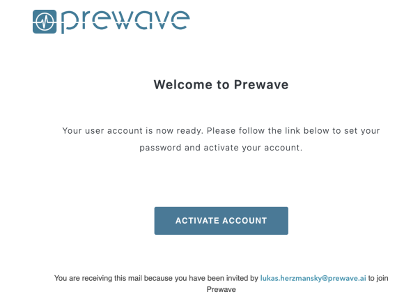

### 1.2 个人设置

在个人设置中，您可以更改：
- 姓名、职位和部门
- Feed 中预警分类的视角（包含通知设置）

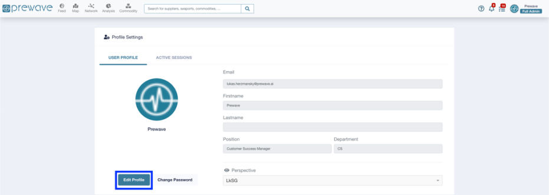

### 1.3 网络：选择集合

在 "Network" 标签页，您可以指定：
- 不同通知设置应选择的供应商集合
- 每个集合可设置 Feed 预警和/或邮件通知

**默认设置：**
- **Feed**: 从 Low 优先级开始
- **实时邮件**: 关闭
- **每日邮件**: 从 Mid 优先级开始
- **每周邮件**: 从 Mid 优先级开始

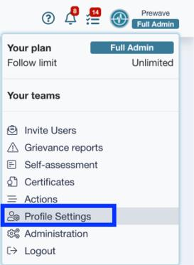

---

## 2. 功能列表 (List of Features)

### 2.1 风险监控 (Risk Monitoring)
通过搜索公开媒体中的事件，主动监控供应商群，并基于主动和潜在风险创建预警。预警显示在 Feed 和供应商画像页面。

### 2.2 供应商评分 (Supplier Scoring)
添加供应商/目标评分。供应商拥有 360° 评分，包括：
- **Peer Score**（国家和行业/商品风险）
- **Alert Score**（过去2年预警历史）
- **Self-Assessment Score**（客户发送的自评问卷）
- **External Data Score**（客户自定义）

### 2.3 尽职调查 (Due Diligence)
涵盖 LkSG、挪威透明度法案等法律，提供供应商分析（法律要求）以及报告和仪表板。

### 2.4 Tier-N
分析 Tier-N 供应链或特定产品分析。使用的数据主要是提单(BOL)数据以及公开媒体。对于没有 BOL 的供应链，Prewave 还可以基于相关供应链进行预测。

### 2.5 商品监控 (Commodity Monitoring)
用户可以主动监控商品和在该特定商品中运营的公司。用户可以看到当前预警和生产状态的概览，以及一定时间范围内的发展。

---

## 3. 预警流 (Feed)

### 3.1 概览

Feed 是收集和显示供应商群所有预警的主页面。提供 3 个核心功能：

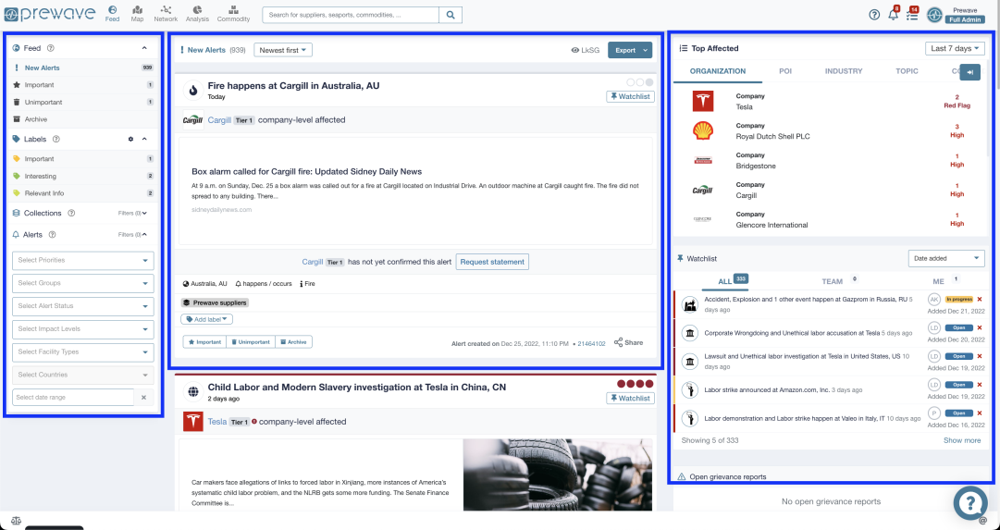

**三栏布局：**
```
┌──────────────┬──────────────────────────┬──────────────┐
│  左侧: 筛选   │      中间: 预警列表        │  右侧: 仪表板  │
│  Filter      │      Alerts              │  Dashboards  │
└──────────────┴──────────────────────────┴──────────────┘
```

### 3.2 筛选选项

**分组系统 (Grouping System):**
将预警分为 3 类：
1. **Important** - 重要
2. **Unimportant** - 不重要
3. **Archive** - 已归档

点击分组后，预警从 "New Alerts" 页面移除，可在相应文件夹中找到。

**标签 (Labels):**
可用于给预警添加信息标签。标签可以：
- 仅对特定用户创建
- 作为公司标签对所有公司成员可见

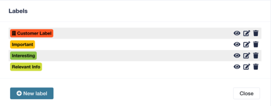

**集合 (Collections):**
可按集合筛选。取决于 Network 标签页中的设置。

**预警筛选:**
可按以下条件筛选：
- 预警优先级
- 事件组
- 预警状态
- 影响级别
- 设施类型
- 国家
- 时间范围

### 3.3 预警 (Alert)

预警是新闻/社交媒体文章的摘要，引用供应商。根据视角不同，覆盖不同的事件类型并相应排序。

**预警头部包含：**
- 主要信息标签（事件类型、事件状态、受影响公司、受影响地点）
- 优先级显示在右上角

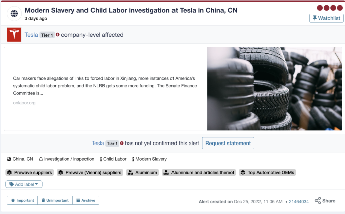

**预警优先级 (Alert Priority):**

| 优先级 | 图标 | 影响 |
|-------|------|------|
| No Priority | ○ | 不在 Feed 中显示 |
| Low | ○○ | 显示但不影响评分 |
| Mid | ●●● | 对评分有轻微影响 |
| High | ●●●● | 对评分有中等影响 |
| Critical (Red Flag) | ●●●●● | 对评分有高影响，最严重的预警 |

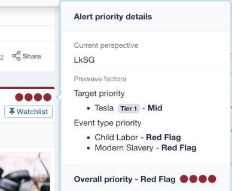

**关注列表 (Watchlist):**
- 用于跟踪预警或与同事协作
- 添加预警到 Watchlist 会创建一个 Action
- 可分配给同事或团队
- 支持评论和状态变更

### 3.4 仪表板 (Dashboards)

**Top Affected:**
显示在所选时期（默认7天，可改为30天）受预警影响最大的目标。

**Watchlist:**
显示所有触发的 Watchlist Action。可筛选：
- 所有 Watchlist 预警
- 团队分配的预警
- 分配给我的预警

**Grievance Reports:**
显示添加到公司画像的所有未解决投诉报告。

---

## 4. 供应商画像 (Target Profile)

### 4.1 概览

Prewave 中的每个目标都有自己的页面。每个 EOI 和 POI 一个页面。头部包含公司的一般信息，如名称和网站。

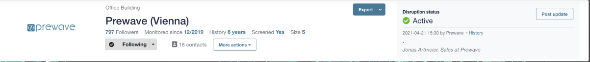

**关键字段：**
- **Followers**: 关注该目标的用户数
- **Monitored since**: Prewave 开始监控的时间
- **History**: 筛查执行的时间框架
- **Screened**: 是否已进行历史筛查（YES/NO）
- **Size**: 媒体曝光度（L/XL = 高曝光，S = 低曝光）

### 4.2 360° 评分

360° 评分页面根据视角显示评分组件。组可以展开以显示所选组中包含的事件类型。

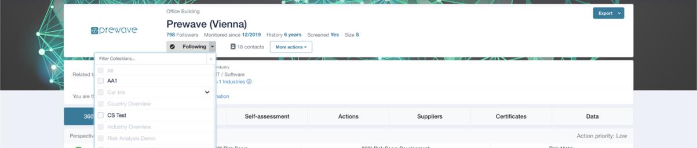

**360° Risk Score Development:**
显示过去24个月的变化。点击时间框架可筛选该时期的预警。

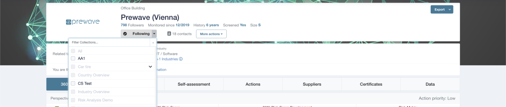

### 4.3 关注地点 (Points of Interest)

POI 代表公司的不同工厂和地点。这些位置显示在地图上。此功能仅适用于公司目标画像，不适用于位置本身。

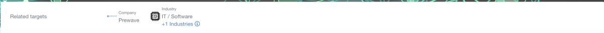

### 4.4 自评问卷 (Self-Assessments)

如果客户发送问卷且供应商回答了请求，这些文档将存储在这里。

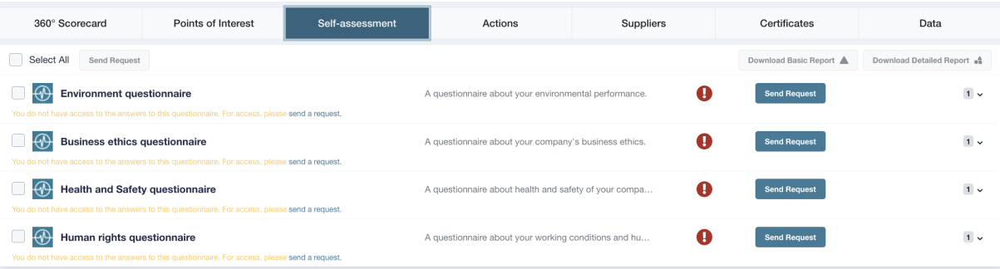

### 4.5 行动 (Actions)

显示客户定义的所有 Action。用户还可以选择添加新 Action。所有字段可按升序/降序筛选。

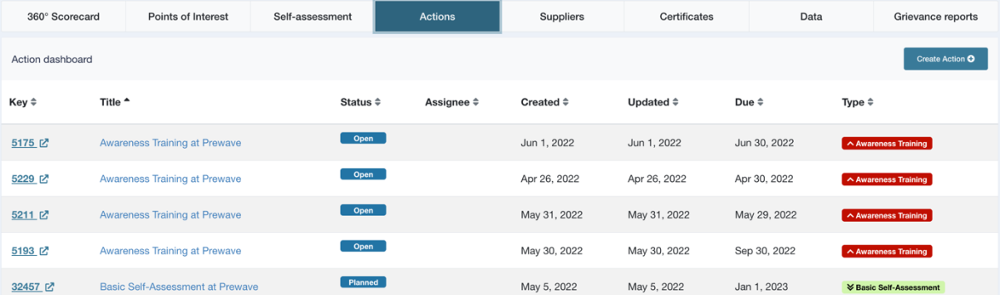

### 4.6 供应商 (Suppliers)

识别的供应链显示在供应商标签页中。默认筛选为 Tier-1 以减少加载时间。

点击两个目标之间的连接会显示弹出窗口，显示有关来源、货运和 HS 编码的更多信息。

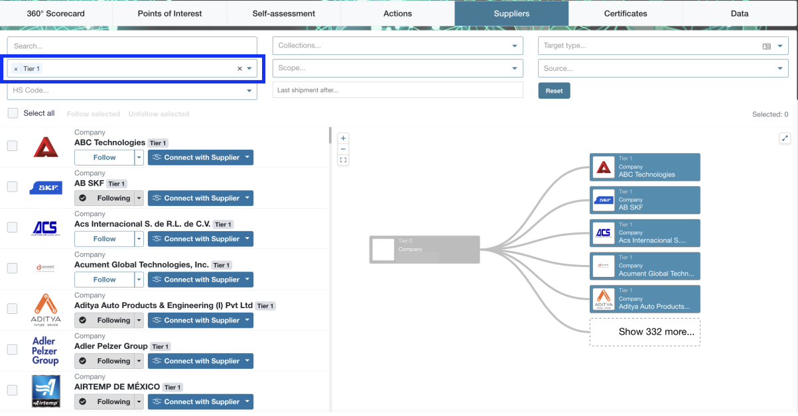

### 4.7 证书 (Certificates)

供应商和客户可以上传证书到平台，并可以选择与连接方共享这些文档。

### 4.8 数据 (Data)

供应商和客户之间的元数据只能由数据标签页中的 "Connection Managers" 配置。根据默认视角，影响从影响程度（LkSG）变为业务中断（Disruption 视角）。

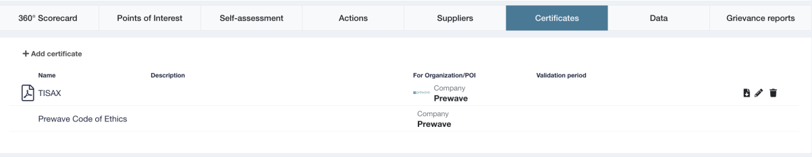

### 4.9 投诉报告 (Grievance Reports)

作为投诉经理，用户可以访问投诉报告页面，查看提交的所有投诉报告列表。

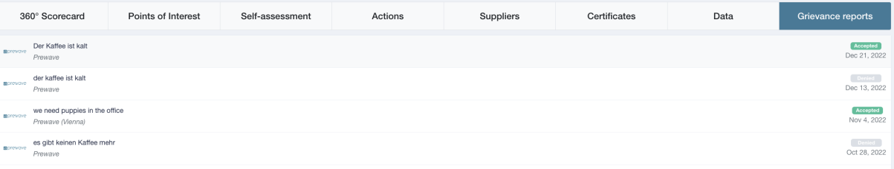

---

## 5. 地图 (Map)

### 5.1 概览

地图（也称为 Disruption Map）是在世界地图上显示预警和供应商的可视化展示。一般用例是中断视角，突出显示受近期事件影响最大的区域。

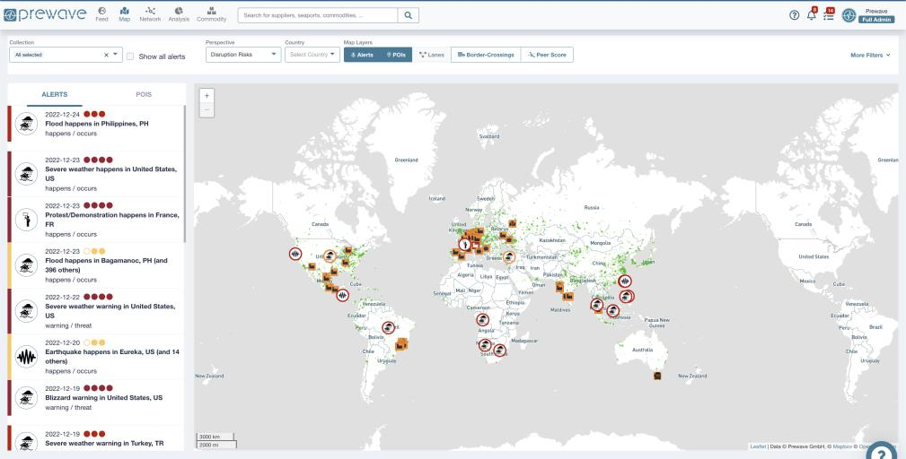

破坏性事件如自然灾害显示地理端点以展示受影响区域。

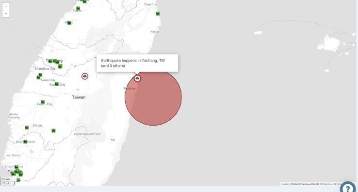

### 5.2 筛选选项

地图可通过多种选项筛选：

- 特定集合
- 按视角
- **中断状态 (Disruption Status)**:
  - 🟢 **No Risk** (无预警)
  - 🟠 **At Risk** (识别到某种中断)
  - 🔴 **Inactive** (工厂关闭)
- 公司、事件类型、POI 类型

**地图图层 (Map Layers):**
- Show Alerts (显示预警)
- Show POIs (显示关注点)
- Show Lanes (供应链可视化)
- Show Border Crossings (边境口岸)
- Show Peer Score (国家和行业风险)

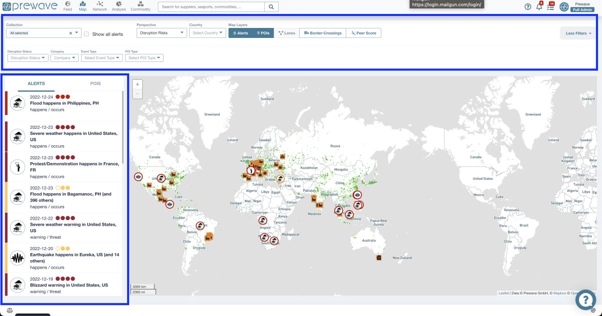

---

## 6. 网络管理 (Network)

### 6.1 概览

Network 页面管理所有客户和用户集合。用户可以在此创建/添加/移除集合并相应更改通知设置。

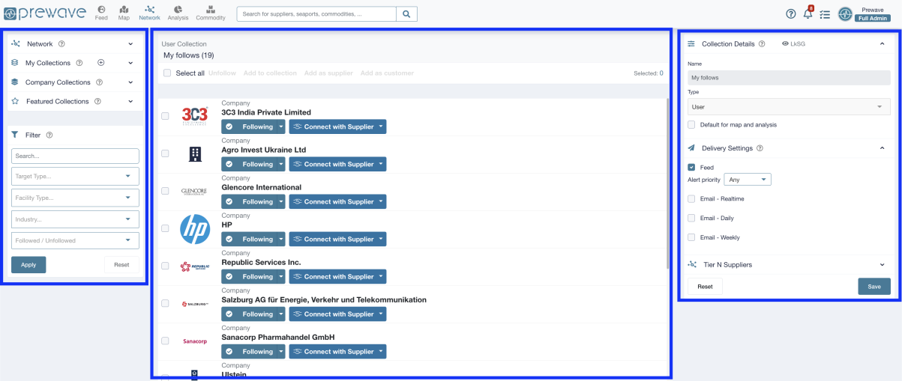

**左侧栏类别：**
1. **Network**:
   - My Follows - 我关注的目标
   - My Targets - 我的业务/地点
   - Prewave Suppliers - Prewave 供应商
   - Prewave Customers - Prewave 客户
   - All - 所有

2. **My Collections** - 用户主动关注的集合
3. **Company Collections** - 公司集合
4. **Featured Collections** - Prewave 提供的行业/地区洞察

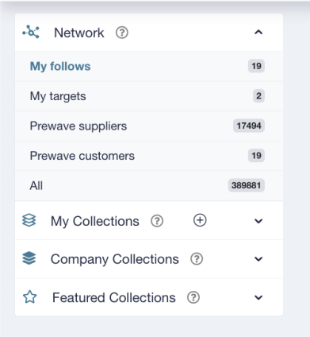

### 6.2 集合详情 (Collection Details)

在页面右侧，用户可以找到集合详情。集合的所有者/编辑/经理可以更改这些详情。

**访问管理 (Access-Management):**
所有者可以将编辑/经理添加到集合。这些用户可以配置集合、添加/移除供应商或更改集合详情。

**通知设置 (Delivery Settings):**
可根据用户更改通知设置。用户可以：
- 选择 Feed 呈现的预警类型和优先级
- 激活邮件通知（实时、每日或每周摘要）

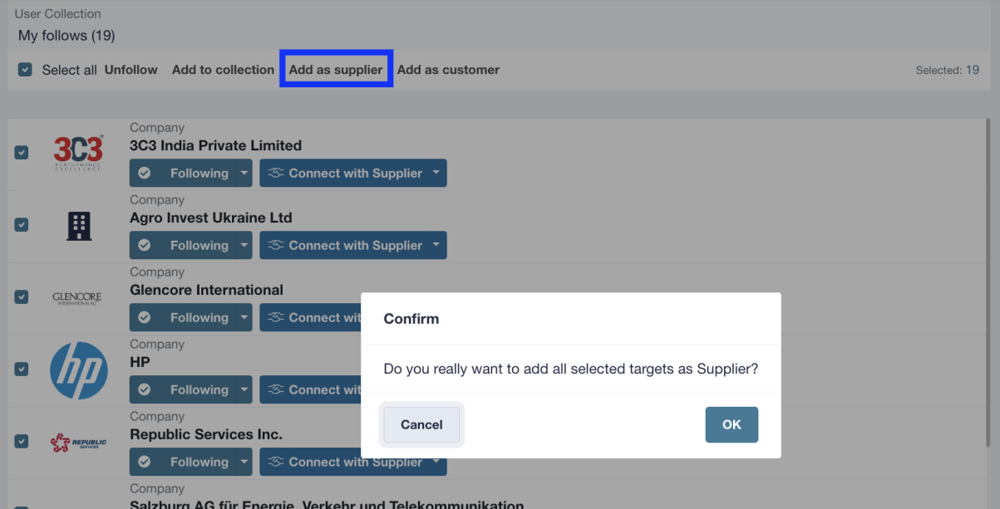

### 6.3 Tier-N 设置

启用 Tier-N 是一项附加功能。允许：
- 监控 Tier-N 供应商
- 在 Feed 页面显示相关预警
- 选择连接类型（private/shared/public）
- 按商品筛选（仅包含相关 HS 编码的货运）

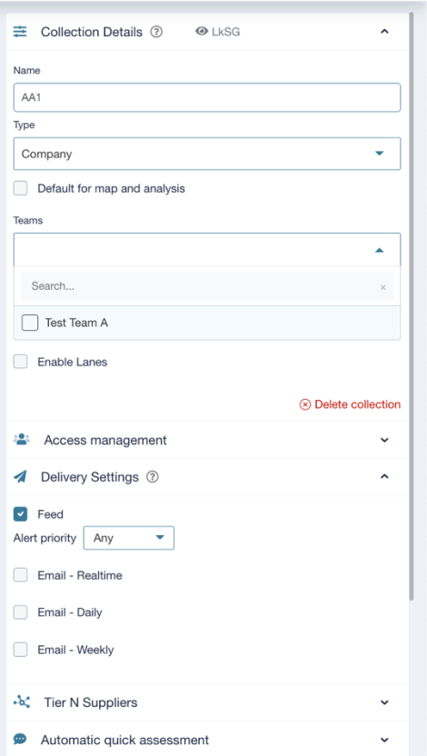

### 6.4 自动快速评估 (Automatic Quick Assessment)

此设置在预警创建时向供应商发送自动声明请求。仅影响所选集合中的供应商。用户可以：
- 自定义优先级
- 更改发件人名称

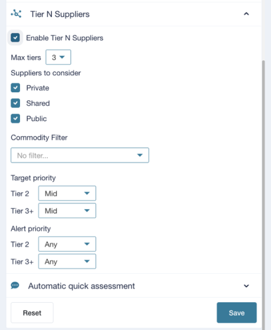

---

## 7. 分析 (Analysis)

### 7.1 实时风险分析 (Live Risk Analysis)

实时风险分析默认可用，提供用户特定的快速概览和筛选。

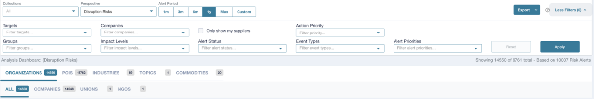

包含用户关注的所有目标，连接状态不限。用户有多种筛选选项来缩小搜索范围。评分再次取决于选择的视角。

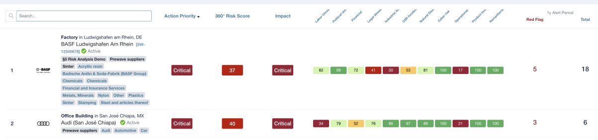

### 7.2 风险仪表板 (Risk Dashboards)

仪表板用于显示供应商群的操作优先级。

**Risk Matrix (风险矩阵):**
可视化供应商的 Impact 和 360° Score 对比。矩阵中的颜色定义操作优先级：
- 高影响 + 低评分 = Critical Action Priority (深红色)
- 低影响 + 高评分 = 无操作优先级

**默认 Impact 值：**
- 0-1% - 无影响
- 1-3% - 低影响
- 3-7% - 中等影响
- 7-20% - 高影响
- 20-100% - 严重影响

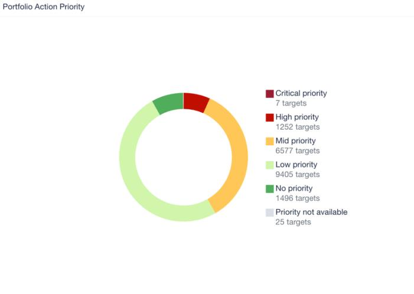

**Portfolio Action Priority:**
汇总基于操作优先级的目标。环形图的有色条也可用作筛选。

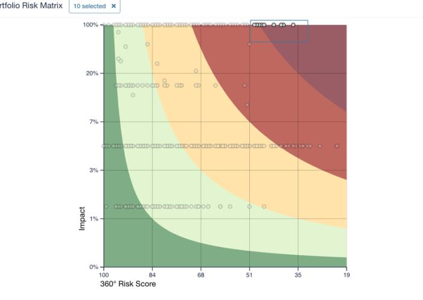

### 7.3 新风险分析 (New Risk Analysis)

用于尽职调查目的，新风险分析提供对供应商群的深入分析。

**分析流程：**
```
General Information → Suppliers → Risk Matrix → Measures & Actions → Reporting
```

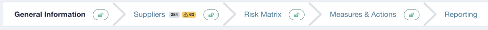

**General Information 标签:**
- **Perspective** (视角) - 影响目标评分
- **DI Model** - 计算影响的方式
  - Direct: 支出金额 vs 选定目标收入
  - Parent: 汇总同一 EOI 的所有支出 vs EOI 收入
  - Auto: 取两种计算中较高的
- **Level of Analysis** - POI/公司等

**Suppliers 标签:**
显示连接的供应商及其可用评分和影响。可按评分和影响级别筛选。

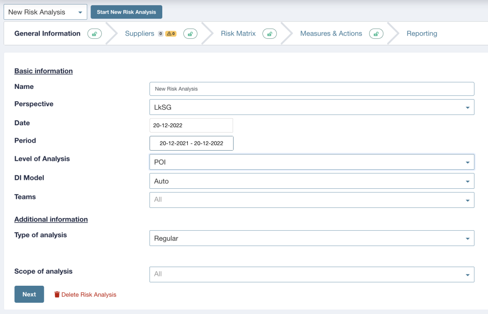

**Risk Matrix:**
显示评分组对比和操作组合。风险矩阵阈值可调整。

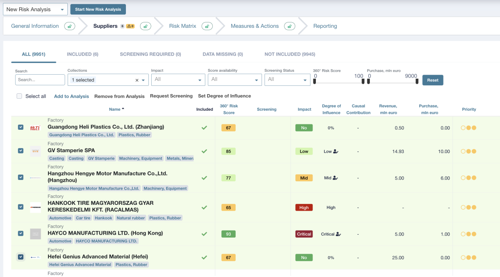

**Measures & Actions:**
显示过去的操作以及基于评分和预警的建议操作。

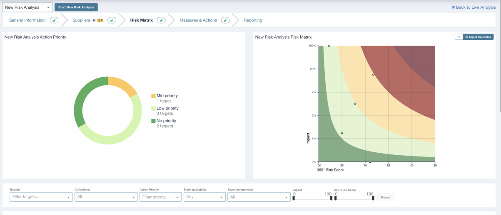

---

## 8. 商品监控 (Commodity)

### 8.1 概览

商品标签页提供行业概览，以及影响商品的事件的详细分析和涉及该商品的公司（历史和实时）。

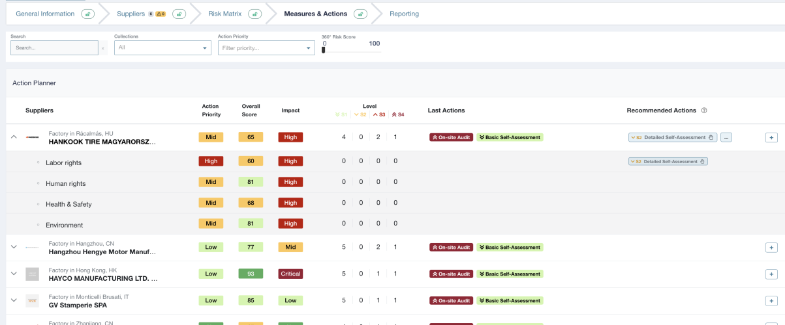

**开始使用：**
1. 关注感兴趣的商品集合
2. 集合将出现在 "My Collection" 列表中
3. 查看概览

### 8.2 界面组件

**左侧栏：**
1. **Commodity collection** - 选择商品进行分析
2. **Perspectives** - 筛选页面显示的预警
3. **Period** - 调整显示预警的时间段
4. **Filter options** - 按设施类型或公司筛选

**Production Capacity Chart (产能图表):**
显示所选时期内商品的生产状态。点击柱状图可筛选该时期的预警。

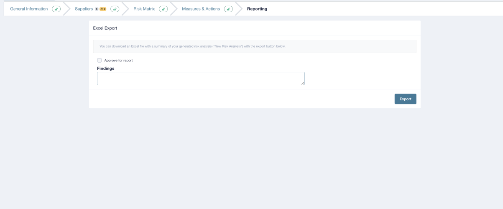

**Alerts (预警列表):**
与所选商品相关的所有事件列表。每个预警可点击。

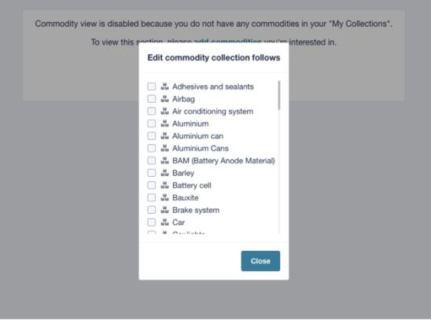

**Map (地图):**
显示选定时间段内受预警影响的所有目标。目标按状态着色：
- 🟢 active = 绿色
- 🟡 at risk = 黄色
- 🔴 inactive = 红色

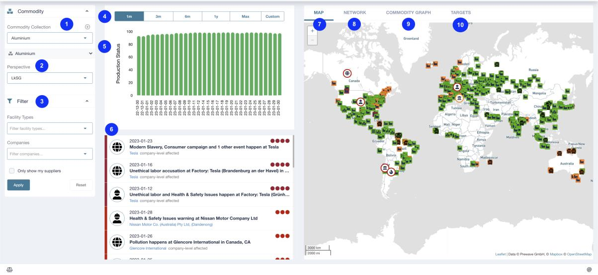

---

## 9. 尽职调查/LkSG (Due Diligence/LkSG)

### 9.1 概览

Prewave 将为上传到系统的每个供应商生成评分。初始风险评估 (Peer Score) 基于供应商的国家和行业风险。

**Full Scoring 流程：**
1. 基于 Peer Score，客户决定哪些供应商进行 Full Scoring
2. Prewave 创建 Alert Score 并提供收入数据（用于影响计算）
3. Prewave 基于目标评分和预警建议措施

### 9.2 行动计划 (Action Planner)

行动计划提供供应商组合所有建议的和已触发的操作的完整概览。

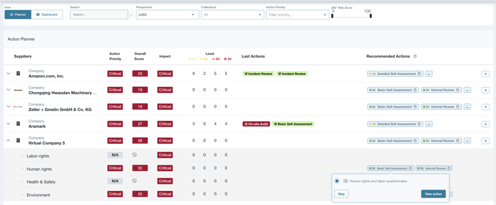

**功能：**
- 包括基于组评分和预警的建议操作（High 及以上）
- 建议的操作级别取决于之前触发/跳过的操作
- 点击建议的操作可直接添加到操作列表

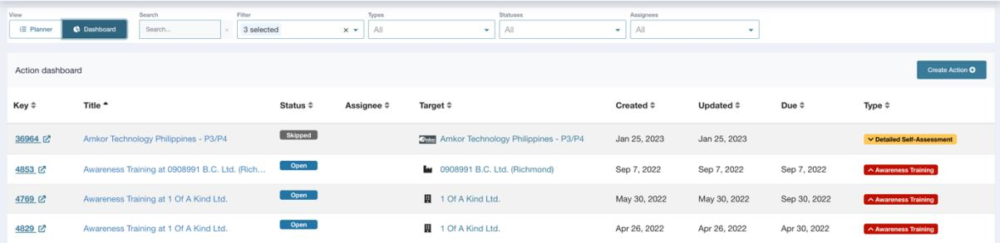

**Action Dashboard:**
仅显示客户触发的措施。提供主要信息标签的筛选选项。

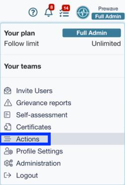

### 9.3 自评问卷 (Self-Assessments)

可通过 Account settings 访问自评部分。

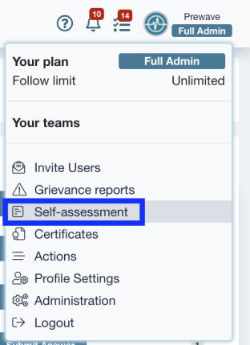

**状态：**
- ⚪ Not received - 未收到
- 🟢 Answered (Good) - 已回答（良好）
- 🔵 Requested - 已请求
- 🔵 Answer in progress - 回答中
- 🔴 Answered (Bad) - 已回答（不佳）

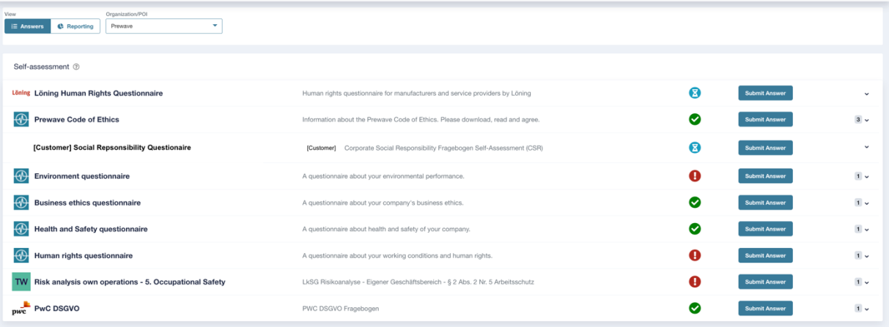

### 9.4 发送自评问卷

**发送流程：**

**步骤 1-3: 选择供应商**
- 选择相关供应商参数
- 选择供应商（复选框或全选）
- 发送请求

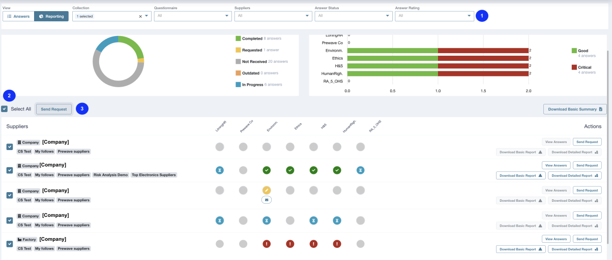

**步骤 4: 选择问卷**
可选择多个问卷一起发送。

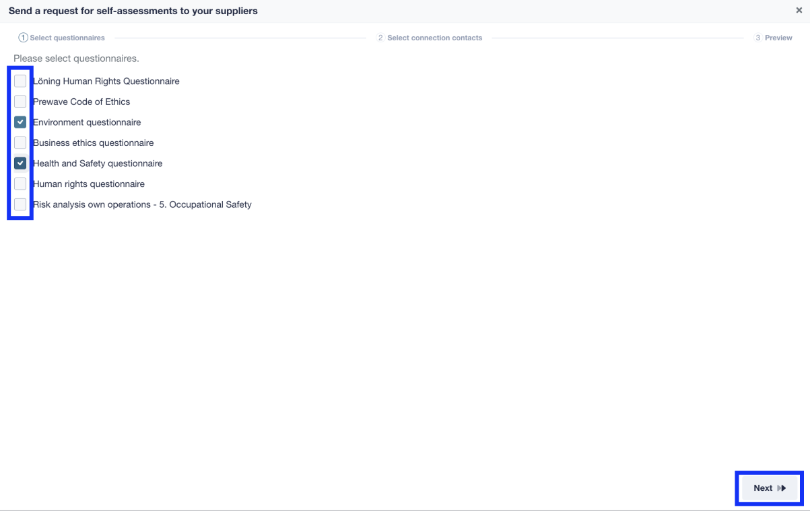

**步骤 5-6: 添加联系人并发送**
- 为每个供应商添加联系信息
- 可选择双周自动提醒（最长2个月）

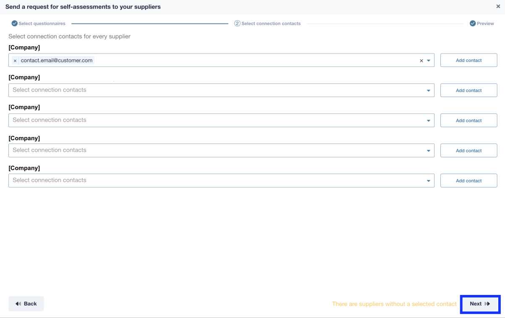

**步骤 7: 成功确认**
如果成功，左下角会显示消息："Request created - Self-assessment request created successfully"

### 9.5 任务列表 (Task Lists)

任务列表跟踪 Prewave 中所有未完成的待办事项：
- 用户请求的预警声明
- 收到的自评问卷权限更新
- 用户请求的筛查

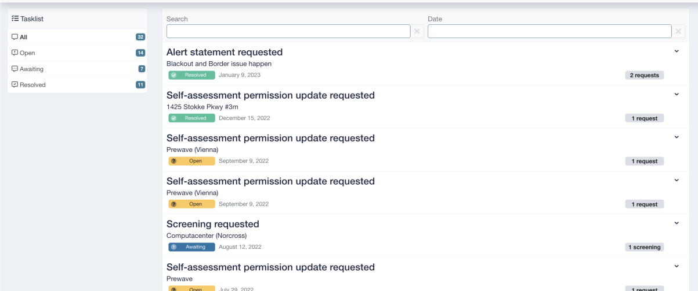

### 9.6 通知铃铛 (Notification Bell)

传入的更新（如填写的声明或问卷）将显示在通知概览中。这些都是 Prewave 中用户特定的消息/事件。

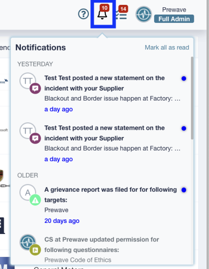

### 9.7 证书 (Certificates)

证书可以上传到 Prewave 私密存储，或供连接的客户查看。

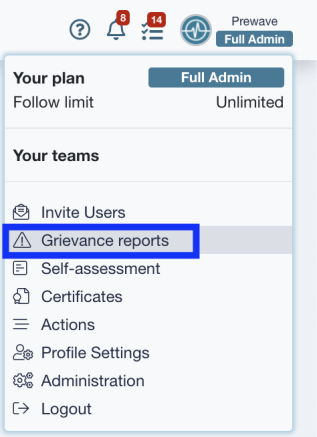

### 9.8 投诉报告 (Grievance Report)

'Grievance Manager'（用户角色）可以访问添加到公司画像的所有投诉报告。这些报告是匿名的，所有登录 Prewave 的用户都可以添加。

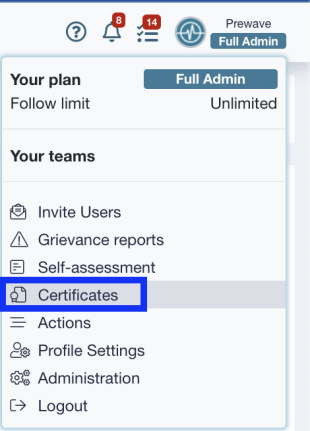

'Grievance Manager' 可以跟进这些报告，并通过将状态从 'Open' 更改为 'Accepted' 或 'Denied' 来记录流程。

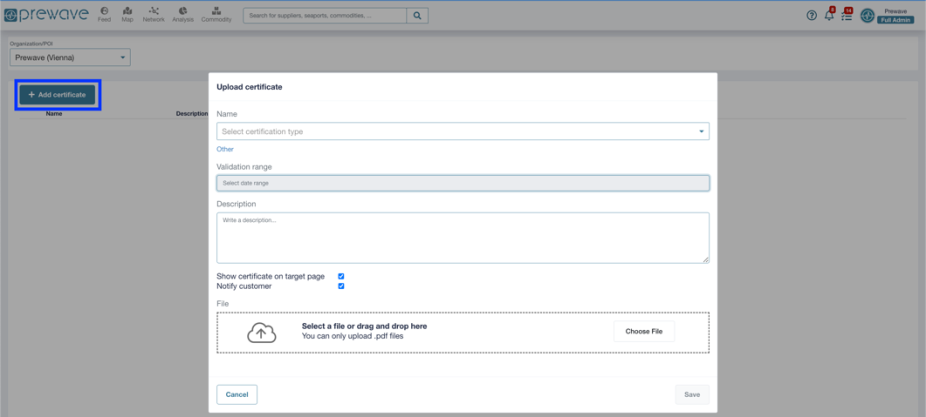

---

## 10. Tier-N 供应链

### 10.1 概览

承运人签发提单 (BOL) 以确认收到货物装运。此文件在某些国家是公开可访问的，Prewave 用它来识别供应链。HS 编码代表协调制度编码，作为识别各种形式产品的国际标准。这些 HS 编码用于构建产品树并分解相关供应商的供应链。

### 10.2 Tier-N 来源类型

供应链可以由 Prewave 创建或由客户共享。连接用来源标记：

| 类型 | 线条样式 | 说明 |
|------|---------|------|
| Private | ───── | 客户共享的数据，仅自己可见 |
| Shared | ─ ─ ─ | 客户共享的数据，选定客户可见（需书面同意） |
| Public Media | - - - | 通过公开媒体筛查识别的供应链 |
| Public Customs | -·-·- | 提单数据 |
| Prewave Predictions | ······ | 基于相关连接的预测供应链 |


### 10.3 Tier-N 在 Target Profiles 中

供应商画像在 'Suppliers' 标签页中列出所有 Tier-N 连接。供应链可按集合、目标类型、范围/来源和 HS 编码筛选。默认供应链筛选为 Tier-1，可以移除此筛选。

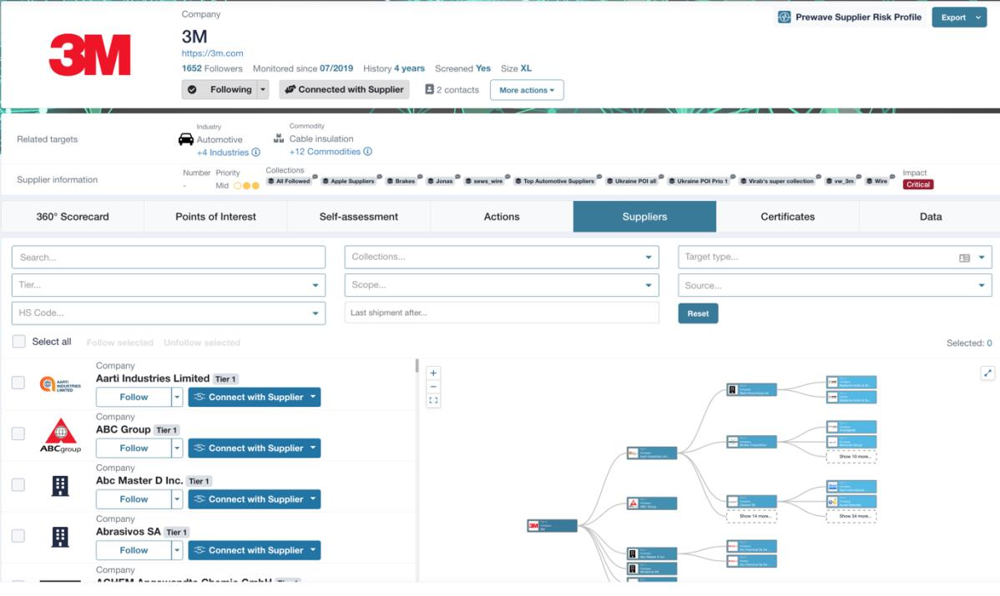

点击两个目标之间的连接显示货运信息。货运详情包含 HS 编码和货运次数（如有）。

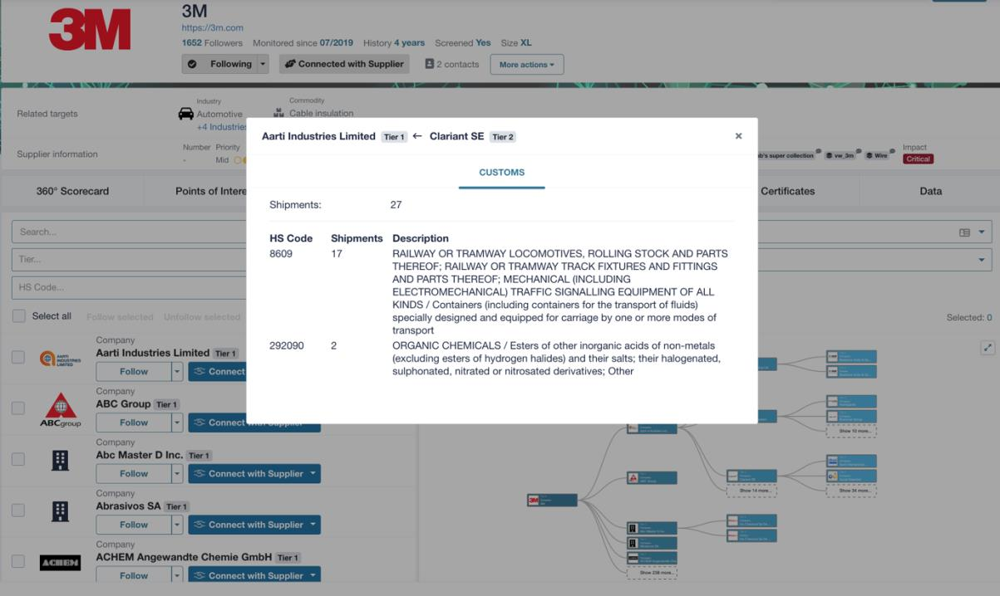

预测基于相关货运，并相应显示概率。

### 10.4 Tier-N 在 Collections 中

可以为特定集合启用 Tier-N 以显示供应链并设置 Tier-N 监控规则。供应链默认筛选为 Tier-1 以减少加载时间。集合中 Tier-N 的供应商数量限制为 5000。

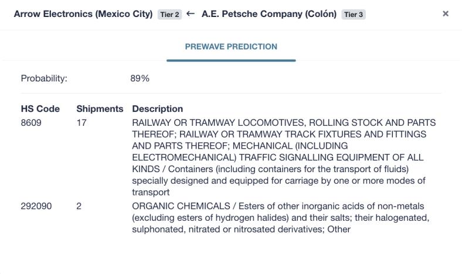

### 10.5 Tier-N 在 Feed 中

可以为 Feed 激活 Tier-N 监控。影响供应链的预警因此会出现在 Feed 页面。对于每个 Tier-N 预警，显示受影响的供应链。Feed 也可以筛选为仅显示影响 Tier-N 供应商的预警。

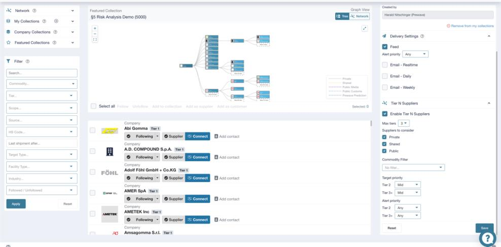

---

## 11. 360° 评分

### 11.1 评分组件

**360° Score** 是 Prewave 的供应商风险评分。它是一个不断变化的值，计算中包含不同因素。计算是非线性的，基于各种因素加权：

- 公开媒体曝光度（每天创建的新闻文章数量）
- 时间戳（此预警何时发生）
- 严重程度（为预警定义的优先级）
- 复发性（此事件类型过去发生的频率）

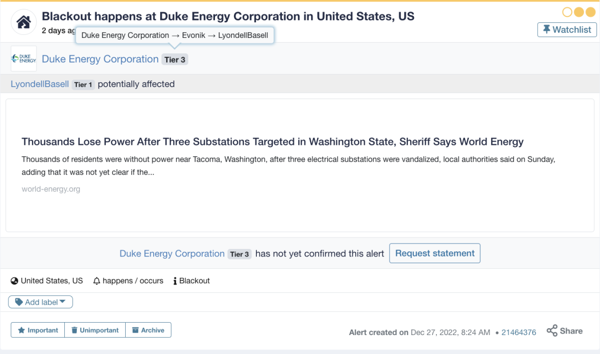

### 11.2 评分构成

| 组件 | 权重 | 说明 |
|------|------|------|
| **Peer Score** | 30% | 每个供应商的初始风险分类。包含国家风险（基于全球指数）和行业/商品风险（基于 Prewave 数据分析） |
| **Alert Score** | 40% | 供应商被主动监控，也可以被筛查（过去2年历史事件研究）以识别实际风险。创建的预警被优先排序并计入 360° Score。预警最多有2年影响，每月递减。2年后预警不再影响评分。重复预警影响也递减。 |
| **Self-Assessment Score** | 20% | 供应商可以回答自评问卷以提高评分。但如果问卷要求未满足，也可能对评分产生负面影响。 |
| **External Data Score** | 10% | 此评分组件可由客户选择。建议客户已有额外信息或证书并可验证某种改进时使用。客户可以在系统中手动添加此评分或通过 API 从其他外部平台包含。 |

### 11.3 参考指数

**劳工权益：**
- ITUC Global Rights Index v2020

**人权：**
- Fragile States Index
- Global Slavery Index v2018
- ILO Mean weekly hours usually worked per employed person
- UN SDG Indicators

**健康与安全：**
- ILO Fatal Labour Accidents v24.08.2020

**环境：**
- EPI Environmental Health Index v2020
- WHO Poison control and unintentional poisoning

**腐败：**
- Corruption Perceptions Index

**劳工罢工：**
- ILO Days not worked due to strikes

**政治稳定：**
- World Governance Index - Political Stability and Absence of Violence

**海关/贸易限制：**
- ITUC Global Rights Index v2020

**制裁：**
- OpenSanctions.org

**自然灾害：**
- Prewave aggregation based on GDACS

**军事冲突：**
- Integrated Network for Societal Conflict Research (INSCR)

### 11.4 评分阈值

阈值指风险组并定义最低组（严重）。评分分为 5 组：No, Low, Mid, High, Critical。根据视角，这些组可能不同。

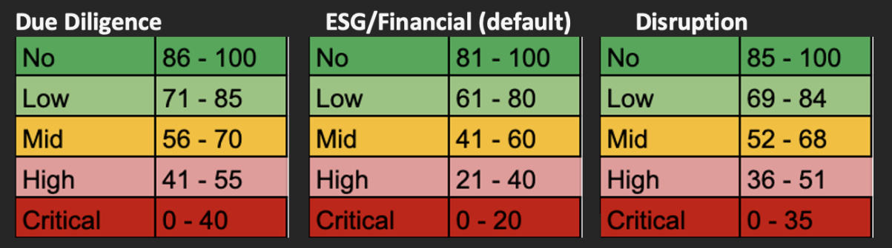

**不同视角的阈值示例：**

| Due Diligence | ESG/Financial (default) | Disruption |
|--------------|------------------------|------------|
| No: 86-100 | No: 81-100 | No: 85-100 |
| Low: 71-85 | Low: 61-80 | Low: 69-84 |
| Mid: 56-70 | Mid: 41-60 | Mid: 52-68 |
| High: 41-55 | High: 21-40 | High: 36-51 |
| Critical: 0-40 | Critical: 0-20 | Critical: 0-35 |

---

## 12. 角色与管理

### 12.1 角色 (Roles)

角色用于扩展对不同主题和功能的访问。分为客户管理的角色和 Prewave 管理的角色。

**客户管理的角色：**

| 角色 | 权限 |
|------|------|
| **User Manager** | 邀请新用户进入环境。默认接收 "Free Tier" 计划。可更改用户活跃状态并分配客户管理的角色。 |
| **Team Manager** | 创建和编辑团队。团队可用于限制对特定集合和风险分析的访问。团队也可用于在 watchlist 上协作。 |
| **Grievance Manager** | 如果客户画像添加新投诉报告，接收预警。可以管理这些报告并更改状态。 |
| **Connection Manager** | 负责 Prewave 中所有供应商/客户连接。可以在需要时添加/移除这些连接。这些连接对于进行完整风险分析或发送自评是必要的。仅适用于连接的目标。 |

### 12.2 管理 (Administration)

管理标签页用于管理用户和公司结构内的组。

**用户 (Users):**
显示公司系统中所有相关用户。User manager 可以：
- 配置现有用户
- 邀请新用户
- 更改与用户的视角/集合关联

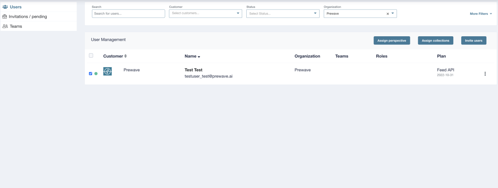

**邀请用户流程：**
1. 通过 "invite users" 按钮添加邮箱
2. 联系人注册后，必须在 Invitations/Pending 部分给予二次权限

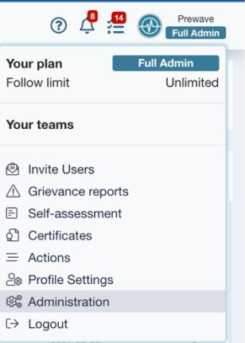

用户右侧的 3 个点打开设置以配置用户画像。可以分配客户管理的角色以及团队。

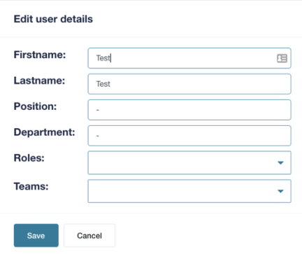

**团队 (Teams):**
团队用于限制工具中对特定组的访问。集合、任务和风险分析可以分配给团队，仅团队成员可见。Watchlist 预警/任务也可以分配给团队。

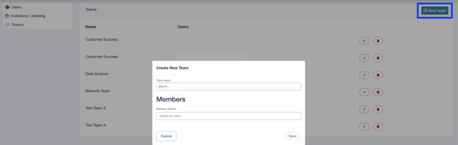

---

## 13. 术语表 (Terminology)

| 术语 | 英文全称 | 说明 |
|------|---------|------|
| **EOI** | Entity of Interest | 目标实体，最高层级。通常反映工厂的母公司。每个供应商位置都连接到 EOI。如 Volkswagen EOI 汇总全球所有大众工厂和地点。Prewave 定义: 如果公司有独立网站和logo |
| **POI** | Point of Interest | 关注地点，供应商的特定位置。始终连接到 EOI。可以是工厂、矿山、办公楼、冶炼厂等 |
| **Target** | - | Prewave 中的目标可以有不同类型，但总是有指定位置。可以是工厂、矿山等形式，或地标/区域如边境口岸、机场、港口 |
| **Action Priority** | - | 由两个因素计算的值: Impact 和 360° Score。可视化客户需要采取行动的程度 |
| **Impact** | - | 代表客户对供应商的影响力。支出金额与供应商收入比较，以百分比计算 |
| **Groups** | - | 事件类型分组以展示风险。如 "自然灾害" 是组合不同事件（暴风雪、干旱、地震、洪水、滑坡、恶劣天气、热带风暴、火山爆发）的组 |
| **Alerts** | - | Prewave 分析的媒体报道。信息标签如受影响公司、地点、事件类型、优先级等，用于将预警包含在评分模型中 |
| **Red Flag** | - | Prewave 中的最高优先级（4个红点）。最严重的预警，根据视角可能不同 |
| **Commodity** | - | 可以是原材料、初级农产品或客户生产的产品（如汽车座椅）。用于评分目标、显示特定原材料的生产状态和预测供应链 |

---

## 附录：截图索引

本手册包含以下截图文件（存放于 `Prewave分析报告/` 文件夹）：

| 截图文件 | 所在章节 | 描述 |
|---------|---------|------|
| page6_img2.png | 1.1 | 登录页面 |
| page6_img3.jpeg | 1.3 | 网络设置 |
| page6_img4.png | 1.2 | 个人设置 |
| page8_img2.png | 3.1 | Feed 概览 |
| page8_img5.png | 3.2 | 标签系统 |
| page9_img3.png | 3.3 | 预警详情 |
| page9_img4.jpeg | 3.3 | 预警优先级示例 |
| page11_img2.png | 4.1 | Target Profile 头部 |
| page11_img4.jpeg | 4.2 | 360° Score 页面 |
| page11_img5.png | 4.2 | 评分详情 |
| page12_img2.png | 4.3 | POI 地图 |
| page12_img4.jpeg | 4.2 | 评分组件 |
| page12_img5.jpeg | 4.2 | 评分图表 |
| page13_img2.png | 4.4 | 自评问卷 |
| page13_img3.png | 4.5 | Actions 仪表板 |
| page14_img2.png | 4.6 | Suppliers Tab |
| page14_img3.png | 4.8 | 数据配置 |
| page14_img4.png | 4.6 | 供应链可视化 |
| page15_img2.png | 4.9 | 投诉报告 |
| page16_img2.jpeg | 5.1 | Disruption Map |
| page16_img3.jpeg | 5.1 | 灾害展示 |
| page17_img5.jpeg | 5.2 | 地图筛选 |
| page18_img2.png | 6.1 | Network 页面 |
| page18_img3.png | 6.1 | 网络详情 |
| page19_img2.png | 6.2 | 集合设置 |
| page19_img3.png | 6.3 | Tier-N 设置 |
| page20_img2.png | 6.4 | 自动评估设置 |
| page20_img3.png | 6.4 | 自动评估配置 |
| page21_img2.png | 7.1 | Live Risk Analysis |
| page21_img3.png | 7.1 | 分析详情 |
| page21_img4.jpeg | 7.1 | 分析列表 |
| page22_img2.jpeg | 7.2 | Risk Matrix |
| page22_img3.jpeg | 7.2 | Action Priority |
| page23_img2.png | 7.3 | 新风险分析配置 |
| page23_img3.png | 7.3 | 供应商列表 |
| page24_img2.png | 7.3 | 分析 Risk Matrix |
| page24_img3.png | 7.3 | Measures & Actions |
| page25_img2.png | 8.1 | Commodity 监控 |
| page25_img3.png | 8.2 | 产能图表 |
| page25_img4.jpeg | 8.2 | 商品预警 |
| page26_img2.jpeg | 8.2 | 商品地图 |
| page28_img2.png | 9.2 | Action Planner |
| page28_img3.jpeg | 9.2 | Action Dashboard |
| page28_img4.jpeg | 9.2 | Action 详情 |
| page29_img2.png | 9.3 | Self-Assessments |
| page29_img3.png | 9.3 | 问卷列表 |
| page30_img2.png | 9.4 | 选择供应商 |
| page30_img3.png | 9.4 | 选择问卷 |
| page31_img2.png | 9.4 | 检查信息 |
| page31_img3.png | 9.4 | 发送确认 |
| page32_img3.png | 9.5 | Task List |
| page32_img4.png | 9.6 | Notification |
| page33_img3.png | 9.7 | Certificates |
| page33_img4.png | 9.8 | Grievance Report |
| page33_img5.png | 9.8 | 投诉状态 |
| page34_img2.png | 10.2 | Tier-N Source Types |
| page35_img2.jpeg | 10.3 | Tier-N Suppliers |
| page35_img3.jpeg | 10.3 | 货运详情 |
| page36_img2.jpeg | 10.4 | Tier-N Collections |
| page36_img3.jpeg | 10.5 | Tier-N Feed |
| page37_img2.png | 11.1 | 360 Scoring |
| page39_img2.png | 11.4 | Score Threshold |
| page40_img3.png | 10.3 | 供应链图谱 |
| page42_img2.png | 12.2 | 用户管理 |
| page42_img3.jpeg | 12.2 | 邀请用户 |
| page42_img4.png | 12.2 | 用户设置 |
| page42_img5.jpeg | 12.2 | 团队管理 |

---

*手册版本: 1.0*
*基于: Prewave Click-Guide v1.0 (2023.02.07)*
*生成日期: 2026-03-19*
