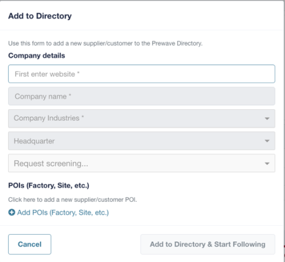
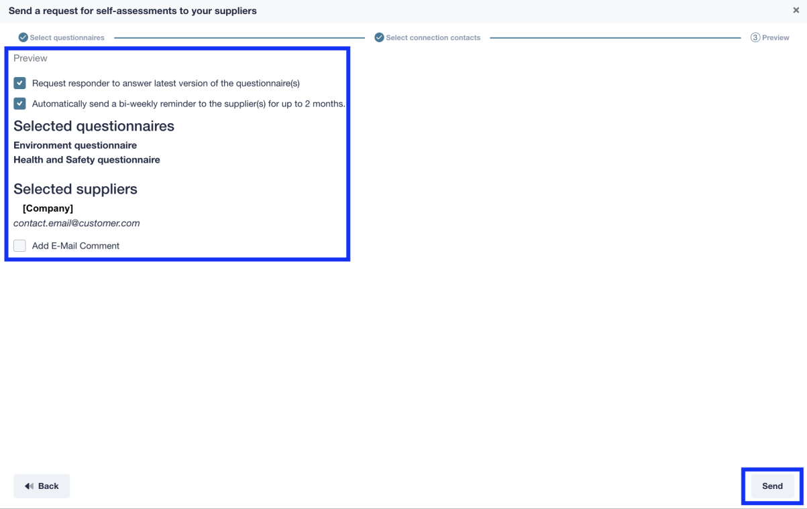

# Prewave产品分析报告

> **分析日期**: 2026-03-19
> **数据来源**: Prewave Click-Guide v1.0 (2023.02.07)、Prewave 官方网站、Gartner 报告
> **分析目标**: 评估 Prewave 能力与 OptiMax 战略的契合度，提出融合建议

---

## 目录

1. [Prewave 核心能力解构](#一prewave-核心能力解构)
2. [关键功能深度分析](#二关键功能深度分析)
   - [2.1 360° 供应商评分系统深度解析](#21-360-供应商评分系统深度解析)
   - [2.2 Tier-N 供应链穿透深度解析](#22-tier-n-供应链穿透深度解析)
3. [产品功能完整翻译与解读](#三产品功能完整翻译与解读)
4. [与 OptiMax 战略的契合度分析](#四与-optimax-战略的契合度分析)
5. [具体融合建议](#五具体融合建议)
6. [战略定位修正建议](#六战略定位修正建议)
7. [产品路线图融合建议](#七产品路线图融合建议)
8. [关键结论](#八关键结论)
9. [Prewave 功能截图索引](#九prewave-功能截图索引)

---

## 一、Prewave 核心能力解构

### 1.1 五大核心能力模块

| 能力模块 | Prewave 实现方式 | 技术特点 |
|---------|-----------------|---------|
| **Monitoring & Alerting** | 400+语言公开媒体监控、社交媒体、政府/NGO数据源、140+风险类型识别 | 十年研发的AI引擎、NLP+机器学习+爬虫 |
| **Scoping & Rapid Onboarding** | 基于BOL(提单)数据自动发现Tier-N供应商、供应链图谱构建 | 260万站点数据、每月新增10万、1000万供应商关系 |
| **Scoring** | 360°评分 = Peer Score(30%) + Alert Score(40%) + Self-Assessment(20%) + External Data(10%) | 非线性加权、按事件类型分组计算 |
| **Integrations** | API集成、与o9 Solutions等平台合作 | 主要是数据导出和外部系统接入 |
| **Action Platform** | Action Planner、Task Lists、Self-Assessment问卷、Grievance报告 | 合规驱动(LkSG/EUDR/CS3D)、人工闭环为主 |

### 1.2 360° Scoring 评分体系详解

```
┌─────────────────────────────────────────────────────────────┐
│                    360° Score 构成                          │
├─────────────────────────────────────────────────────────────┤
│  Peer Score (30%)                                           │
│  └── 国家风险指数 + 行业/商品风险基准                        │
│                                                             │
│  Alert Score (40%) ← 权重最高                               │
│  └── 过去2年历史预警数据分析                                 │
│  └── 预警影响随时间递减（2年后归零）                         │
│  └── 重复预警影响递减                                        │
│                                                             │
│  Self-Assessment Score (20%)                                │
│  └── 供应商完成的自评问卷                                    │
│                                                             │
│  External Data Score (10%)                                  │
│  └── 客户自定义的外部数据                                    │
│  └── 可通过API从其他平台导入                                 │
└─────────────────────────────────────────────────────────────┘
```

**评分计算因素**:
- 公开媒体曝光度（每日新闻文章数量）
- 时间戳（预警发生时间）
- 严重程度（预警定义的优先级）
- 复发性（该事件类型过去发生频率）
- 按事件类型分组计算

**评分等级** (以 Disruption 视角为例):
| 等级 | 分数范围 | 说明 |
|------|---------|------|
| No Risk | 85-100 | 无风险 |
| Low | 69-84 | 低风险 |
| Mid | 52-68 | 中风险 |
| High | 36-51 | 高风险 |
| Critical | 0-35 | 严重风险 |

**界面截图示例**:


*图1: 供应商*


*图2: 不同视角的评分阈值配置界面*

---

## 二、关键功能深度分析

### 2.1 360° 供应商评分系统深度解析

#### 2.1.1 评分架构设计理念

360° 评分系统的核心设计思想是**多源数据融合**与**时间敏感性建模**。不同于传统的静态供应商评级，Prewave 采用动态评分机制，反映供应商风险的实时变化。

**设计原则：**
1. **外部数据优先**：不依赖供应商自报数据，降低信息不对称
2. **时效性加权**：近期事件权重更高，历史事件影响衰减
3. **可解释性**：每个评分组件都有明确的业务含义和数据来源
4. **可定制性**：支持客户注入外部数据（External Data Score）

#### 2.1.2 算法机制详解

**1. 时间衰减模型**

Alert Score 采用**非线性时间衰减**机制：

```
预警影响值 = 基础优先级权重 × 时间衰减系数 × 复发调整系数

时间衰减系数：
- 0-6个月：100% 影响
- 6-12个月：75% 影响
- 12-18个月：50% 影响
- 18-24个月：25% 影响
- 24个月后：0% 影响（移出评分计算）
```

这种设计的业务逻辑：
- **短期事件**（如罢工、事故）的影响会自然消退
- **长期趋势**（如持续的环境违规）通过复发机制体现
- 避免单一历史事件对供应商造成永久性负面影响

**2. 复发惩罚机制**

同一类型事件的复发会触发**递减影响**规则：

| 复发次数 | 影响系数 | 业务含义 |
|----------|----------|----------|
| 首次 | 1.0x | 正常计入 |
| 第2次 | 0.8x | 轻微递减，考虑偶发因素 |
| 第3次 | 0.6x | 明显递减，可能存在系统性问题 |
| 第4次+ | 0.4x | 最小影响，评分已充分反映风险 |

**设计意图**：防止评分被单一类型事件的重复报道过度拉低，同时通过历史累积仍能看到风险趋势。

**3. 多视角评分阈值**

不同业务场景使用不同的风险分级标准：

| 风险等级 | Due Diligence | ESG/Financial | Disruption |
|----------|---------------|---------------|------------|
| No Risk | 86-100 | 81-100 | 85-100 |
| Low | 71-85 | 61-80 | 69-84 |
| Medium | 56-70 | 41-60 | 52-68 |
| High | 41-55 | 21-40 | 36-51 |
| Critical | 0-40 | 0-20 | 0-35 |

**阈值差异的业务逻辑：**
- **Due Diligence**（合规视角）：阈值较高，关注人权和劳工权益，零容忍度高
- **ESG/Financial**（投资视角）：阈值最严格，关注财务和声誉风险
- **Disruption**（运营视角）：阈值适中，关注业务连续性，接受一定风险换取供应稳定性

#### 2.1.3 评分组件深度分析

**Peer Score（30%权重）**

这是所有供应商的**初始风险基准**，基于两个维度：

| 维度 | 数据来源 | 更新频率 |
|------|----------|----------|
| 国家风险 | ITUC、Fragile States Index、Corruption Perception Index 等 | 年度 |
| 行业/商品风险 | Prewave 自有数据分析（基于该行业历史预警密度） | 季度 |

**关键洞察**：Peer Score 确保新纳入监控的供应商（无历史预警）仍有风险评估，避免"无新闻即安全"的盲区。

**Alert Score（40%权重）**

这是评分系统中**权重最高**的组件，也是 Prewave 的核心技术壁垒。

**计算公式要素：**
```
Alert Score = f(预警数量, 优先级, 时间戳, 媒体曝光度, 事件严重性)
```

**媒体曝光度（Size）的作用：**
- **L/XL（高曝光）**：大型跨国企业，媒体关注度高，同等事件影响更大
- **S（低曝光）**：小型企业，媒体关注度低，可能存在"沉默风险"

Prewave 通过 Size 参数进行**曝光度归一化**，避免大企业因媒体曝光多而被过度惩罚。

**Self-Assessment Score（20%权重）**

这是**供应商主动参与**风险管理的机制：

**正向激励**：
- 完成问卷并表现良好 → 评分提升
- 提供证书和合规证明 → 评分提升

**负向约束**：
- 问卷回答不佳（如承认无合规体系）→ 评分下降
- 拒绝参与 → 可能触发合规风险标记

**External Data Score（10%权重）**

这是**客户自定义**的数据注入点，支持：
- 手动录入供应商的认证信息（ISO、SA8000等）
- API 对接第三方数据源（如征信数据、财务数据）
- 内部审计结果的数字化录入

#### 2.1.4 评分系统的业务价值

| 应用场景 | 价值体现 |
|----------|----------|
| **供应商准入** | 新供应商初始风险评估，决定是否需要额外尽调 |
| **风险监控** | 评分变化趋势预警，提前识别恶化信号 |
| **资源分配** | 根据评分优先级分配有限的审计/管理资源 |
| **合规报告** | 量化的风险数据支撑 LkSG 等法规的审计要求 |
| **供应商沟通** | 客观评分作为与供应商讨论改进的基础 |

---

### 2.2 Tier-N 供应链穿透深度解析

#### 2.2.1 技术架构与数据源

Tier-N 功能是 Prewave 的**技术壁垒功能**，解决传统 SRM 系统只能管理直接供应商（Tier-1）的痛点。

**数据来源矩阵：**

| 数据类型 | 覆盖率 | 准确性 | 更新频率 | 来源 |
|----------|--------|--------|----------|------|
| **提单(BOL)数据** | 中 | 高 | 实时 | 公开海关数据（美国、南美等） |
| **公开媒体筛查** | 高 | 中 | 实时 | 新闻/社交媒体 NLP 分析 |
| **预测算法** | 补全用 | 中 | 周度 | 基于相关供应链的机器学习预测 |
| **客户共享数据** | 视情况 | 高 | 按需 | 客户上传的供应商清单 |

**BOL 数据的核心价值：**

提单（Bill of Lading）是货物运输的法律文件，包含：
- **发货人**（Shipper）
- **收货人**（Consignee）
- **货物描述**（含 HS 编码）
- **起运港/目的港**

通过分析 BOL，Prewave 可以构建：
```
[原材料供应商] → [中间商] → [制造商] → [品牌商]
     (Tier-3)      (Tier-2)    (Tier-1)   (客户)
```

#### 2.2.2 供应链连接类型体系

Tier-N 系统设计了**五级连接类型**，区分数据的可靠性和可见性：

| 连接类型 | 线条样式 | 数据来源 | 可信度 | 可见性 |
|----------|----------|----------|--------|--------|
| **Private** | ───── | 客户上传的内部数据 | 最高 | 仅上传客户可见 |
| **Shared** | ─ ─ ─ | 客户授权共享的数据 | 高 | 指定客户可见 |
| **Public Customs** | -·-·- | 海关 BOL 数据 | 高 | 平台所有用户 |
| **Public Media** | - - - | 公开媒体报道 | 中 | 平台所有用户 |
| **Prewave Predictions** | ······ | 算法预测 | 待验证 | 平台所有用户 |

**设计意图：**
- **可信度分层**：让用户直观了解连接的数据基础
- **隐私保护**：客户敏感供应链数据可设为 Private
- **网络效应**：Shared 连接促进客户间的协作生态

#### 2.2.3 预测算法机制

对于缺乏 BOL 数据的供应链，Prewave 使用**关联预测算法**：

**核心逻辑：**
```
如果 供应商A → 供应商B（已知连接）
且 供应商B → 供应商C（已知连接）
且 供应商A 和 供应商C 有相似的行业/商品特征
则 推断 供应商A → 供应商C 可能存在连接（概率：X%）
```

**预测置信度展示：**
- 在图谱中以 **虚线 + 概率标注** 显示
- 用户可选择"显示/隐藏预测连接"
- 随着更多数据积累，预测可能升级为确认连接

#### 2.2.4 HS 编码在产品树中的作用

**HS 编码（协调制度编码）**是 Tier-N 分析的关键维度：

**功能价值：**
1. **标准化产品分类**：全球统一的 6-10 位编码体系
2. **供应链细分**：同一供应商可能为不同产品类别有不同的上游
3. **风险传导分析**：某原材料 HS 编码的风险事件可影响所有下游产品

**实际应用场景：**
```
汽车制造商监控 "座椅" 供应链：
- HS 9401.20（座椅）→ 追溯至皮革供应商（HS 4107）
-                      → 追溯至钢材供应商（HS 7208）
-                      → 追溯至塑料供应商（HS 3907）

某皮革供应商出现劳工违规预警：
→ 系统自动标记受影响的所有座椅产品线
→ 汽车制造商可针对性启动替代供应商评估
```

#### 2.2.5 Tier-N 监控的业务工作流

**1. 在 Feed 中的集成**

当 Tier-N 供应商发生风险事件时：
- 预警显示在 Feed 中
- 标注"影响供应链"标识
- 显示受影响的 Tier-1 供应商路径

**筛选能力：**
- "仅显示影响 Tier-N 的预警"
- "按特定 Tier 级别筛选"

**2. 在供应商画像中的展示**

供应商详情页的 "Suppliers" 标签：
- 交互式供应链图谱
- 点击连接显示货运详情（频次、HS 编码）
- 支持按集合、来源类型、Tier 级别筛选

**3. 集合级别的 Tier-N 配置**

在 Network 中可为每个集合启用 Tier-N：
- 开启/关闭 Tier-N 监控
- 设置连接类型偏好（Private/Shared/Public）
- 按 HS 编码筛选相关货运
- 供应商数量限制：5000 个/集合（性能考量）

#### 2.2.6 Tier-N 功能的竞争壁垒

| 壁垒维度 | Prewave 优势 | 竞争对手挑战 |
|----------|--------------|--------------|
| **数据获取** | 多年积累的 BOL 数据合作关系 | 海关数据获取门槛高，周期长 |
| **数据清洗** | 复杂的实体消歧算法（同名公司识别） | BOL 数据质量参差不齐，清洗成本高 |
| **预测模型** | 基于大规模供应链数据的训练 | 缺乏足够样本训练准确预测模型 |
| **产品化能力** | 可视化图谱 + 工作流深度集成 | 多停留在数据层面，用户体验差 |

#### 2.2.7 典型使用场景

**场景一：突发事件应急响应**
```
某地区发生地震 → Prewave 识别所有该地区供应商
                    → 自动标记受影响的 Tier-2/3 供应商
                    → 客户收到预警，启动业务连续性计划
                    → 提前 7-14 天预警潜在的供应中断
```

**场景二：合规深度尽调**
```
LkSG 要求对关键供应商进行人权和环境尽调：
→ 客户识别 Tier-1 关键供应商
→ Tier-N 分析揭示其上游的棉花供应商
→ 发现棉花供应商位于高风险国家
→ 触发对 Tier-2 供应商的额外问卷和审计
```

**场景三：供应商集中风险识别**
```
客户有 50 个 Tier-1 供应商：
→ Tier-N 分析发现其中 30 个共享同一个 Tier-2 芯片供应商
→ 识别隐藏的集中风险
→ 客户启动第二源策略，降低单一依赖
```

**界面截图示例**:


*图3: 供应商画像中的 Tier-N 供应链图谱，展示多级供应商连接*


*图4: 点击供应链连接显示的货运详情，包含 HS 编码和货运频次*


*图5: 集合级别的 Tier-N 监控配置界面*


*图6: Feed 中展示的影响 Tier-N 供应商的预警*

---

## 三、产品功能完整翻译与解读

### 2.1 首次使用 (First Steps)

**设置阶段**:
客户通过模板提供供应商列表，Prewave 进行环境初始化配置。客户可以指定：

- Collections（供应商分组系统）
- 供应商ID
- 支出数据
- 联系信息（作为 Metadata 添加到平台）

**用户权限管理**:
- **User Manager**: 邀请新用户，分配角色和权限
- **Team Manager**: 创建和编辑团队，用于限制对特定集合和风险分析的访问
- **Grievance Manager**: 接收和管理投诉报告
- **Connection Manager**: 管理供应商/客户连接关系

**通知设置** (Delivery Settings):
- Feed 通知: 从 Low 优先级开始
- 实时邮件: 默认关闭
- 每日邮件: 从 Mid 优先级开始
- 每周邮件: 从 Mid 优先级开始

### 2.2 预警流 (Feed)

**核心界面布局** (三栏式):

```
┌──────────────┬──────────────────────────┬──────────────┐
│  左侧: 筛选   │      中间: 预警列表        │  右侧: 仪表板  │
│  Filter      │      Alerts              │  Dashboards  │
├──────────────┼──────────────────────────┼──────────────┤
│ • 分组系统    │ • 预警卡片 (按优先级排序)   │ • Top Affected│
│ • 标签       │ • 公司/地点/事件类型标签    │ • Watchlist  │
│ • 集合       │ • 原始来源链接             │ • 投诉报告    │
│ • 预警优先级  │ • 添加到关注列表           │              │
└──────────────┴──────────────────────────┴──────────────┘
```

**预警分组系统** (Feed Grouping System):
1. **Important** - 重要预警
2. **Unimportant** - 不重要预警
3. **Archive** - 已归档预警

**标签系统** (Labels):

- **Customer Label**: 客户私有标签（带办公楼图标）
- 需要设置为可见才能被其他用户看到

**五级预警优先级**:

| 优先级 | 图标 | 对评分的影响 |
|-------|------|-------------|
| No Priority | ○ | 不在 Feed 中显示 |
| Low | ○○ | 显示但不影响评分 |
| Mid | ●●● | 对评分有轻微影响 |
| High | ●●●● | 对评分有中等影响 |
| Critical (Red Flag) | ●●●●● | 对评分有高影响，最严重的预警 |

**关注列表** (Watchlist):
- 用于跟踪预警或与同事协作
- 添加预警到 Watchlist 会创建一个 Action
- 可分配给同事或团队
- 支持评论和状态变更

**界面截图示例**:


*图7: Feed 预警流主界面，左侧筛选、中间预警列表、右侧仪表板*


*图8: 预警标签系统，支持客户自定义标签*


*图9: 预警详情卡片，显示事件类型、地点、优先级等关键信息*


*图10: 五级预警优先级标识示例*

### 2.3 供应商画像 (Target Profile)

**页面结构** (多Tab设计):

```
┌────────────────────────────────────────────────────────────┐
│ 供应商名称                    [导出] [状态: Active]        │
│ 关注者: 102  |  监控时长: 4年  |  筛查状态: Yes  |  规模: XL │
├─────────┬─────────┬─────────┬─────────┬─────────┬─────────┤
│ 360°    │  POI    │ 自评问卷 │ Actions │Suppliers│  Data   │
│  Score  │关注地点 │         │         │         │         │
└─────────┴─────────┴─────────┴─────────┴─────────┴─────────┘
```

**360° Score Tab**:
- 显示评分组件（取决于选择的视角）
- 360° Risk Score Development: 显示过去24个月的评分变化
- 点击时间轴可筛选该时期的预警
- Risk Matrix: 风险矩阵可视化

**Points of Interest (POI) Tab**:
- 显示公司的不同工厂和地点
- 在地图上显示位置
- 仅适用于公司目标画像

**Self-Assessments Tab**:
- 客户发送的供应商自评问卷
- 支持问卷批量发送
- 状态跟踪: Not received / Answered (Good) / Requested / Answer in progress / Answered (Bad)

**Actions Tab**:
- 显示客户定义的所有 Action
- 可添加新 Action
- 支持按字段升序/降序筛选

**Suppliers Tab**:
- 显示识别的供应链
- 默认筛选为 Tier-1
- 可通过点击连接查看货运信息（包含HS编码和货运次数）

**Certificates Tab**:
- 供应商和客户上传的证书
- 可选择与连接方共享

**Data Tab**:
- 仅 Connection Managers 可配置
- 根据视角不同，Impact 计算方式不同：
  - LkSG 视角: Degree of Influence（影响程度）
  - Disruption 视角: Business Interruption（业务中断）

**界面截图示例**:


*图11: 供应商画像页面*


*图16: Actions 管理仪表板，展示待办事项和状态*


*图17: Suppliers Tab 中的交互式供应链图谱*

### 2.4 风险地图 (Map / Disruption Map)

**功能**:
- 在世界地图上可视化显示预警和供应商
- 破坏性事件（如自然灾害）显示地理端点以展示受影响区域
- 支持多种筛选条件

**筛选选项**:
- 特定集合
- 视角 (Perspective)
- 中断状态 (Disruption Status):
  - 🟢 No Risk (无预警)
  - 🟠 At Risk (识别到某种中断)
  - 🔴 Inactive (工厂关闭)
- 公司、事件类型、POI类型
- 地图图层:
  - Show Alerts (显示预警)
  - Show POIs (显示关注点)
  - Show Lanes (供应链可视化)
  - Show Border Crossings (边境口岸)
  - Show Peer Score (国家和行业风险)

**界面截图示例**:


*图18: Disruption Map 主界面，热力图展示全球风险分布*


*图19: 自然灾害事件的地理端点展示，标识受影响区域*


*图20: 地图筛选选项面板，支持多维度图层控制*

### 2.5 网络管理 (Network)

**集合类型**:
1. **My Follows** - 我关注的供应商
2. **My Targets** - 我关注的目标（自己的业务/地点）
3. **Prewave Suppliers** - Prewave 供应商库
4. **Prewave Customers** - Prewave 客户
5. **All** - 所有

**集合管理**:
- **My Collections**: 用户主动关注的集合
  - 每个集合有自己的通知设置
  - 可创建个人集合并区分用户/公司集合
- **Company Collections**: 存储用户未主动关注的公司集合
- **Featured Collections**: Prewave 提供的行业/地区洞察

**Connection Managers 权限**:
- 批量添加供应商连接
- 将选定目标添加为供应商/客户

**Collection Details**:
- 集合所有者/编辑/经理可修改详情
- 分配团队可限制访问权限
- 可设置地图和分析的默认显示

**Tier-N 设置**:
- 监控 Tier-N 供应商和相关预警
- 可选择连接类型（private/shared/public）
- 可按商品筛选（仅包含相关HS编码的货运）
- 可设置目标优先级和预警优先级

**Automatic Quick Assessment (自动快速评估)**:
- 预警创建时自动向供应商发送声明请求
- 仅影响所选集合中的供应商
- 可自定义优先级和发件人名称

**界面截图示例**:


*图21: Network 网络管理主界面，左侧栏展示不同集合类型*


*图22: 网络详情面板，展示集合成员和访问权限*


*图23: Collection Delivery Settings，配置 Feed 和邮件通知规则*


*图24: Tier-N 监控设置，可选择连接类型和商品筛选*


*图25: Automatic Quick Assessment 自动评估配置界面*

### 2.6 分析模块 (Analysis)

**Live Risk Analysis (实时风险分析)**:
- 包含用户关注的所有目标
- 多种筛选选项缩小搜索范围
- 评分取决于选择的视角
- 目标按类型分组（公司或联盟）
- 点击预警数量可打开供应商画像弹窗

**Risk Dashboards (风险仪表板)**:
- Risk Matrix: 可视化供应商的 Impact 和 360° Score 对比
  - 颜色定义 Action Priority
  - 高影响 + 低评分 = Critical Action Priority (深红色)
  - 低影响 + 高评分 = 无 Action Priority
- Portfolio Action Priority: 汇总基于 Action Priority 的目标

**New Risk Analysis (新风险分析)**:
用于 Due Diligence 的深入分析，包含：
1. General Information - 定义分析参数
   - Perspective（视角）
   - DI Model（影响计算模型）
   - Level of Analysis（POI/公司等）
   - 可导出为 Excel

**DI Model (Degree of Influence 模型)**:
- Direct: 计算支出金额 vs 选定目标收入
- Parent: 汇总同一 EOI 的所有支出金额，计算与 EOI 收入的影响
- Auto: 取两种计算中较高的影响值

**分析流程**:
```
General Information → Suppliers → Risk Matrix → Measures & Actions → Reporting
```

**界面截图示例**:


*图26: Live Risk Analysis 实时风险分析界面*


*图27: 分析详情列表，展示目标评分和影响值*


*图28: Risk Matrix 风险矩阵，可视化 Impact vs Score 分布*


*图29: Portfolio Action Priority 环形图概览*


*图30: New Risk Analysis 配置界面*


*图31: 风险分析中的供应商评分和影响列表*


*图32: 分析详情中的 Risk Matrix 和 Measures & Actions*

### 2.7 商品监控 (Commodity)

**功能**:
- 提供行业概览
- 详细分析影响商品的事件
- 显示实时和历史数据

**界面组件**:
1. **Left Sidebar (左侧栏)**:
   - 商品集合选择
   - 视角筛选（建议用 Disruption Status）
   - 时间段选择
   - 设施类型筛选

2. **Production Capacity Chart (产能图表)**:
   - 显示选定时期内的商品生产状态
   - 点击柱状图可筛选该时期的预警

3. **Alerts (预警列表)**:
   - 与所选商品相关的所有事件
   - 每个预警可点击

4. **Map (地图)**:
   - 显示选定时间段内受预警影响的所有目标
   - 目标按状态着色（active=绿色, at risk=黄色, inactive=红色）

5. **Network (网络)**:
   - 显示与此商品相关的实体与 Prewave 中其他目标的连接
   - 需激活 Tier-N mapping

6. **Commodity Graph (商品图谱)**:
   - 显示商品结构，直到原材料组件

7. **Targets (目标)**:
   - 参与商品生产的所有公司列表
   - 显示当前中断状态

**界面截图示例**:


*图33: Commodity 商品监控主界面*


*图34: Production Capacity Chart 产能状态图表*


*图35: 与商品相关的预警列表*


*图36: 商品监控地图，按状态着色展示受影响目标*

### 2.8 尽职调查 / LkSG (Due Diligence / LkSG)

**LkSG** (German Supply Chain Due Diligence Act - 德国供应链尽职调查法)

**Full Scoring 流程**:
1. 初始风险评估 (Peer Score): 基于供应商的国家和行业风险
2. 客户决定哪些供应商进行 Full Scoring
3. Prewave 创建 Alert Score 并提供收入数据（用于影响计算）
4. Prewave 基于目标评分和预警建议措施
5. 用户可遵循建议或自行定义 Action

**Action Planner (行动计划)**:
- 完整概览所有建议的和已触发的 Action
- 包括基于组评分和预警的建议 Action（High及以上）
- 建议的 Action 级别取决于之前触发/跳过的 Action
- 点击建议的 Action 可直接添加到 Action 列表

**Self-Assessments (自评问卷)**:
- 通过 Account settings 访问
- 两个区域: Answers（概览）和 Reporting（统计）
- 支持向供应商批量发送问卷
- 状态跟踪和提醒机制

**发送自评问卷流程**:
1. 选择相关供应商参数
2. 选择供应商（复选框或全选）
3. 发送请求
4. 选择问卷（可多选）
5. 添加联系信息
6. 检查信息，可选择双周自动提醒（最长2个月）
7. 发送

**Task List (任务列表)**:
- 跟踪所有待办事项:
  - 用户请求的预警声明
  - 收到的自评问卷权限更新
  - 用户请求的筛查

**Notification Bell (通知铃铛)**:
- 显示已填写的声明或问卷等更新
- 用户特定的消息/事件

**Certificates (证书)**:
- 上传证书到 Prewave
- 可私密存储或与连接的客户共享

**Grievance Report (投诉报告)**:
- Grievance Manager 可访问添加到公司画像的所有投诉报告
- 报告匿名化
- 可更改状态: Open → Accepted / Denied
- 可链接外部投诉平台

**界面截图示例**:


*图37: Action Planner 行动计划主界面*


*图38: Action Dashboard 展示已触发的措施*


*图39: Action 详情和状态跟踪*


*图40: Self-Assessments 问卷列表和状态*


*图41: 问卷状态统计面板*


*图42: 批量选择供应商发送自评问卷*


*图43: 选择要发送的问卷类型*


*图44: 检查联系人信息并确认发送*


*图45: 问卷发送成功确认页面*


*图46: Task List 跟踪所有待办事项*


*图47: 通知铃铛显示更新和消息*


*图48: 证书上传和管理界面*


*图49: 投诉报告列表和管理*


*图50: 投诉报告状态变更界面*

### 2.9 Tier-N 供应链映射

**数据来源**:
- **Bill of Lading (BOL)** - 提单: 承运人签发的确认收到货物的文件
- **HS Code** - 协调制度编码: 国际商品分类标准

**供应链发现流程**:
1. Prewave 首先必须识别 Tier-1 供应商
2. 定义产品链以缩小供应链映射范围
3. Tier-1 发现后，Supply Chain Analytics Team 发现供应链
4. 结果可通过 HS 编码筛选排除不相关供应商
5. 发现完成后，供应链在 Prewave 中可视化

**Tier-N Source Types (数据来源类型)**:
| 类型 | 线条样式 | 说明 |
|------|---------|------|
| Private | ───── | 客户共享的数据，仅自己可见 |
| Shared | ─ ─ ─ | 客户共享的数据，选定客户可见（需书面同意） |
| Public Media | - - - | 通过公开媒体筛查识别的供应链 |
| Public Customs | -·-·- | 提单数据 |
| Prewave Predictions | ······ | 基于相关连接的预测供应链 |

**Prewave Predictions**:
- 基于各种数据源的买家-供应商关系概率陈述
- 如现有采购模式和地理位置

**Tier-N 在 Target Profiles 中**:
- 在 'Suppliers' tab 中列出所有 Tier-N 连接
- 可按集合、目标类型、范围/来源和 HS 编码筛选
- 默认筛选为 Tier-1
- 点击连接显示货运信息（包含HS编码和货运次数）
- 预测基于相关货运，显示概率

**Tier-N in Feed**:
- 可为 Feed 激活 Tier-N 监控
- 影响供应链的预警会出现在 Feed 页面
- 每个 Tier-N 预警显示受影响的供应链
- Feed 可筛选为仅显示影响 Tier-N 供应商的预警

### 2.10 角色与权限 (Roles)

**Customer Managed Roles**:
| 角色 | 权限 |
|------|------|
| User Manager | 邀请新用户、更改用户状态、分配客户管理的角色 |
| Team Manager | 创建和编辑团队、限制对特定集合的访问 |
| Grievance Manager | 接收和管理投诉报告、更改状态 |
| Connection Manager | 管理所有供应商/客户连接、添加/移除连接 |

**Prewave Managed Features**:
- Featured Collections
- Tier-N
- Commodity
- LkSG
- Administration
- Self-Assessment Section
- Grievance Reports
- Actions
- Task List
- Organisation changer

### 2.11 管理 (Administration)

**Users**:
- 显示公司所有相关用户
- User manager 可配置现有用户、邀请新用户
- 可更改与用户的视角/集合关联
- 邀请用户流程: 添加邮箱 → 在 Invitations/Pending 部分给予二次权限

**Teams**:
- 用于限制工具中特定组的访问权限
- 集合、任务和风险分析可分配给团队
- 仅团队成员可见
- Watchlist 预警/任务也可分配给团队

**界面截图示例**:


*图51: Administration 用户管理主界面*


*图52: 邀请新用户流程界面*


*图53: 用户详情和权限设置*


*图54: Teams 团队管理界面*

### 2.12 术语表 (Terminology)

| 术语 | 英文全称 | 说明 |
|------|---------|------|
| **EOI** | Entity of Interest | 目标实体，最高层级。通常反映工厂的母公司。所有供应商位置都连接到 EOI。如 Volkswagen EOI 汇总全球所有大众工厂和地点。Prewave 定义: 如果公司有独立网站和logo |
| **POI** | Point of Interest | 关注地点，供应商的特定位置。始终连接到 EOI。可以是工厂、矿山、办公楼、冶炼厂等 |
| **Target** | - | Prewave 中的目标可以有不同类型，但总是有指定位置。可以是工厂、矿山等形式，或地标/区域如边境口岸、机场、港口 |
| **Action Priority** | - | 由两个因素计算的值: Impact 和 360° Score。可视化客户需要采取行动的程度 |
| **Impact** | - | 代表客户对供应商的影响力。支出金额与供应商收入比较，以百分比计算 |
| **Groups** | - | 事件类型分组以展示风险。如 "自然灾害" 是组合不同事件（暴风雪、干旱、地震、洪水等）的组 |
| **Alerts** | - | Prewave 分析的媒体报道。信息标签如受影响公司、地点、事件类型、优先级等，用于将预警包含在评分模型中 |
| **Red Flag** | - | Prewave 中的最高优先级（4个红点）。最严重的预警，根据视角可能不同 |
| **Commodity** | - | 可以是原材料、初级农产品或客户生产的产品（如汽车座椅）。用于评分目标、显示特定原材料的生产状态和预测供应链 |

---

## 四、与 OptiMax 战略的契合度分析

### 4.1 高度可融合的能力

| Prewave 能力 | OptiMax 对应规划 | 融合价值 |
|-------------|-----------------|---------|
| **Feed 预警流** | Phase 1 的"风险事件工作台" | 直接对应，可借鉴其 **5级优先级** 和 **Watchlist** 机制 |
| **360° Scoring** | Phase 3 的"评分卡体系" | Prewave 的评分权重设计（Alert占40%最大权重）可直接参考 |
| **Tier-N Mapping** | Phase 2 的"供应商/订单数据接入" + 图谱层 | Prewave 用BOL数据做供应链发现，OptiMax 可结合**内部订单数据+BOL+公开媒体**三重溯源 |
| **Commodity Monitoring** | Phase 1 的"资讯采集/清洗/归类" | 大宗商品监控与生产状态跟踪，可借鉴其**产能图表**设计 |
| **Action Planner** | Phase 4 的"处置Playbook" | Prewave 的Action机制偏合规问卷，OptiMax 的**OR优化建议**是差异化补强 |

### 4.2 Prewave 的短板（OptiMax 的机会）

| 短板 | OptiMax 差异化优势 |
|-----|------------------|
| **执行层弱** | 战略中提到的 **"运筹学算子"**（风险传播模型、替代与重构模型、库存优化等）是 Prewave 没有的 |
| **偏重合规** | Prewave 围绕 LkSG/EUDR 等欧洲法规设计，**中国客户的内部流程联动**是其盲区 |
| **无影响量化** | Prewave 只有评分，没有 **"风险→营收/订单/交付影响"** 的量化计算 |
| **无优化建议** | Prewave 的Action是人工触发的问卷/审计，没有 **AI驱动的替代方案推荐/调拨优化** |

---

## 五、具体融合建议

### 5.1 情报层：参考 Prewave 的成熟度

**可借鉴**:
- 140+ 风险类型分类体系
- 多源数据融合（新闻+社交+政府+制裁清单）
- 实体解析（事件→供应商/地点/产品关联）
- 多视角评分（Due Diligence / ESG / Disruption 三种阈值体系）

**需超越**:
- 增加中国本土数据源（工商、司法、舆情、天气、物流）
- 增加内部系统数据（ERP/SRM/订单/库存/质检）
- 增加运筹学驱动的"影响量化"而非仅"风险评分"

### 5.2 图谱层：Tier-N 供应链映射

**Prewave 做法**:
- 用 BOL 数据发现 Tier-2/3/4
- 用 AI 预测填补缺失链路

**OptiMax 可融合**:
- 内部采购订单数据 + BOL + 公开媒体 → 三重验证
- 结合 OR 能力做"供应链脆弱性分析"
- 识别关键路径和替代路径

### 5.3 决策层：Action Platform 的差异化

**Prewave 的 Action**:
```
人工触发 → 问卷/审计/声明请求 → 人工跟进
```

**OptiMax 的 Action（战略优势）**:
```
AI Agent 自动生成处置建议
    ↓
OR 模型输出"替代方案排序"
    ↓
调拨/加急/库存策略优化
    ↓
与内部审批流集成（不是只发问卷）
```

### 5.4 交互层：UI/UX 参考

**从 Click-Guide 可借鉴的交互设计**:
- Feed 流的三栏布局（Filter | Alerts | Dashboard）
- 供应商画像的 Tab 设计（360° Score / POI / Self-Assessment / Actions / Suppliers）
- Risk Matrix 风险矩阵（Impact vs Score）
- 地图视图的 Disruption Status 三色标识
- Task List + Notification Bell 的待办机制

---

## 六、战略定位修正建议

> **"竞品矩阵里最关键的割裂：情报层强的（Everstream、Interos、Prewave）执行层弱，执行层强的（SAP Ariba、Kinaxis）情报层弱。"**

Prewave 的 **Action Platform** 本质上是 **"合规驱动的任务管理"**，而非 **"运筹学驱动的优化决策"**。

### OptiMax 的差异化定位建议

| 层级 | Prewave | OptiMax（建议） |
|-----|---------|---------------|
| 情报 | ⭐⭐⭐⭐⭐ 全球公开数据 | ⭐⭐⭐⭐☆ 中国本土数据 + 内部系统数据 |
| 评分 | ⭐⭐⭐⭐⭐ 360° Scoring | ⭐⭐⭐⭐☆ 评分 + **影响量化**（营收/订单/交付） |
| 决策 | ⭐⭐☆☆☆ 人工问卷闭环 | ⭐⭐⭐⭐⭐ **OR优化 + AI Agent 建议** |
| 执行 | ⭐⭐☆☆☆ 合规报告 | ⭐⭐⭐⭐☆ 与采购/订单/库存系统联动 |

**一句话定位差异化**:
> "Prewave 告诉你'这个供应商有风险'，OptiMax 告诉你'这个风险会让你损失多少钱、影响哪些订单、你应该调拨多少库存到哪个仓库'。"

---

## 七、产品路线图融合建议

```
Phase 1（MVP）：直接对标 Prewave Feed + Alert 基础能力
├── 借鉴其 5级优先级、标签系统、Watchlist
└── 差异化：增加 AI Agent 初评（而非仅人工筛选）

Phase 2（联动）：超越 Prewave 的内部系统打通
├── Prewave 只能接 ERP，OptiMax 做"采购/订单/库存/质检"全链路
└── 引入 OptiMax Agent 自然语言交互（Prewave 无此能力）

Phase 3（评估）：核心差异化——影响量化
├── Prewave 只有 Score，OptiMax 做"风险→营收/订单/交付"量化
└── 风险传播推演（图模型 + OR）

Phase 4（优化）：建立护城河
├── Prewave 的 Action 是问卷，OptiMax 的 Action 是优化建议
├── 替代方案推荐、库存/调拨/加急优化
└── 行业 Playbook + 场景模拟（What-if）
```

---

## 八、关键结论

1. **Prewave 是情报层的标杆**，其数据源广度、评分体系成熟度、Tier-N 发现能力都值得借鉴

2. **Prewave 的 Action Platform 并非真正的"执行优化"**，而是"合规任务管理"——这正是 OptiMax 的 **OR + AI Agent** 可以差异化突破的方向

3. **融合策略**：情报层"对标 Prewave + 中国本土化"，决策层"用运筹学建立壁垒"，执行层"打通内部系统而非只做问卷"

4. **不要复制 Prewave 的纯 SaaS 模式**：战略中提到的"本地部署 + 云端订阅 + 高附加值服务"更适合中国市场

---

## 九、Prewave 功能截图索引

以下截图存放于同名文件夹 `Prewave分析报告/` 中：

### 8.1 核心界面截图
- **page1_img1.png** - 封面页
- **page6_img1.png** - 登录界面
- **page6_img2.png** - 个人设置界面
- **page8_img1.png** - Feed 流三栏布局

### 8.2 供应商画像截图
- **page11_img1.png** - Target Profile 页面
- **page11_img2.png** - Follow 按钮功能
- **page12_img1.png** - 360° Score 页面
- **page12_img2.png** - POI 地图展示
- **page13_img1.png** - Self-Assessments 界面
- **page13_img2.png** - Actions 仪表板

### 8.3 供应链与网络截图
- **page14_img1.png** - Suppliers Tab 供应链展示
- **page14_img2.png** - Certificates 证书管理
- **page14_img3.png** - Data Tab 数据配置
- **page16_img1.png** - Disruption Map 风险地图

### 8.4 分析与评估截图
- **page21_img1.png** - Live Risk Analysis 实时分析
- **page22_img1.png** - Risk Matrix 风险矩阵
- **page23_img1.png** - New Risk Analysis 配置
- **page24_img1.png** - Suppliers 评分列表
- **page24_img2.png** - Risk Matrix 和 Action Priority 可视化

### 8.5 商品监控截图
- **page26_img1.png** - Commodity 监控界面
- **page27_img1.png** - 商品预警和地图

### 8.6 合规与任务截图
- **page28_img1.png** - Action Planner 行动计划
- **page29_img1.png** - Self-Assessment 问卷列表
- **page30_img1.png** - 批量发送问卷
- **page32_img1.png** - Task List 任务列表
- **page32_img2.png** - Notification Bell 通知

### 8.7 Tier-N 供应链截图
- **page34_img1.png** - Tier-N Source Types 图例
- **page35_img1.png** - Tier-N 供应链可视化
- **page35_img2.png** - 货运详情弹窗
- **page36_img1.png** - Tier-N 在 Collections 中
- **page37_img1.png** - Tier-N Alert 示例

### 8.8 评分与角色截图
- **page39_img1.png** - 不同视角的评分阈值表
- **page41_img1.png** - 角色权限说明
- **page42_img1.png** - 用户管理界面

---

## 参考资料

1. [Prewave Named as a Leader in 2025 Gartner® Magic Quadrant](https://uktechnews.co.uk/2025/05/01/prewave-named-as-a-leader-in-2025-gartner-magic-quadrant-for-supplier-risk-management-solutions/)
2. [Prewave Raises €63M Series B](https://xista.vc/news/detail/detail/prewave-raises-eur63m-series-b-to-revolutionise-supply-chain-risk-management-with-ai-driven-superintelligence-platform)
3. [Capgemini Supply Chain Resilience POV](https://www.capgemini.com/wp-content/uploads/2025/09/Prewave-Capgemini-Supply-Chain-Resilience-POV-Final-Design.pdf)
4. [o9 Solutions partners with Prewave](https://sp-edge.com/updates/40116)

---

*报告生成时间: 2026-03-19*
