# OptiMax 用户旅程深度分析报告

**报告日期**: 2026年3月18日
**分析师**: Claude Code
**文档版本**: v2.0 - 用户旅程深度分析

---

## 目录

1. [用户角色全景图](#1-用户角色全景图)
2. [用户画像详细定义](#2-用户画像详细定义)
3. [核心用户旅程地图](#3-核心用户旅程地图)
4. [场景化用户旅程](#4-场景化用户旅程)
5. [角色协同工作流程](#5-角色协同工作流程)
6. [用户触点分析](#6-用户触点分析)
7. [痛点与机会点](#7-痛点与机会点)
8. [设计建议](#8-设计建议)

---

## 1. 用户角色全景图

### 1.1 角色关系图谱

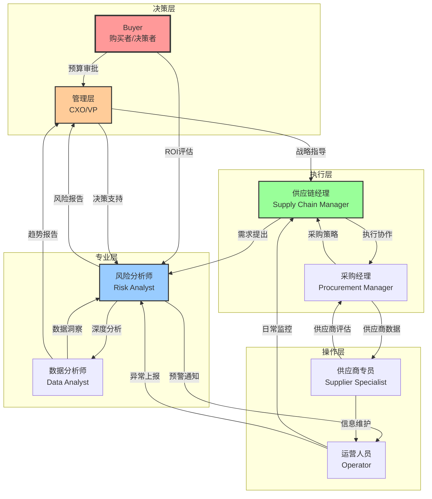
```mermaid
graph TB
    subgraph "决策层"
        B[Buyer<br/>购买者/决策者]
        M[管理层<br/>CXO/VP]
    end

    subgraph "执行层"
        SM[供应链经理<br/>Supply Chain Manager]
        PM[采购经理<br/>Procurement Manager]
    end

    subgraph "专业层"
        RA[风险分析师<br/>Risk Analyst]
        DA[数据分析师<br/>Data Analyst]
    end

    subgraph "操作层"
        OP[运营人员<br/>Operator]
        SP[供应商专员<br/>Supplier Specialist]
    end

    B -->|"预算审批"| M
    B -->|"ROI评估"| RA
    M -->|"战略指导"| SM
    M -->|"决策支持"| RA

    SM -->|"需求提出"| RA
    SM -->|"执行协作"| PM

    PM -->|"供应商数据"| SP
    PM -->|"采购策略"| SM

    RA -->|"风险报告"| M
    RA -->|"预警通知"| OP
    RA -->|"深度分析"| DA

    DA -->|"数据洞察"| RA
    DA -->|"趋势报告"| M

    OP -->|"日常监控"| SM
    OP -->|"异常上报"| RA

    SP -->|"供应商评估"| PM
    SP -->|"信息维护"| OP

    style B fill:#ff9999,stroke:#333,stroke-width:3px
    style M fill:#ffcc99,stroke:#333,stroke-width:2px
    style RA fill:#99ccff,stroke:#333,stroke-width:2px
    style SM fill:#99ff99,stroke:#333,stroke-width:2px
```

### 1.2 角色使用频率与深度矩阵

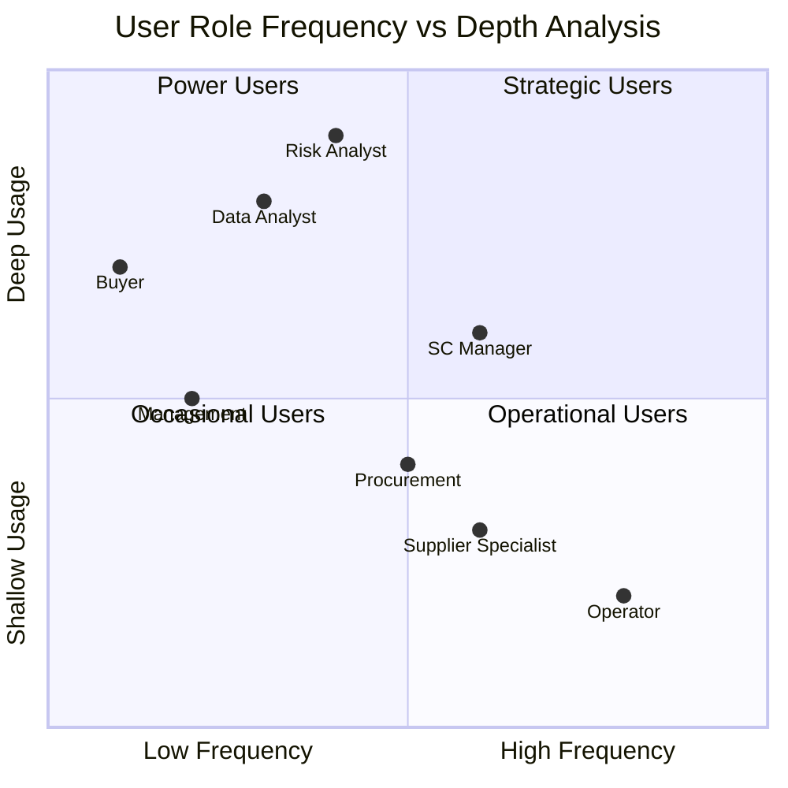
```mermaid
quadrantChart
    title User Role Frequency vs Depth Analysis
    x-axis Low Frequency --> High Frequency
    y-axis Shallow Usage --> Deep Usage
    quadrant-1 Strategic Users
    quadrant-2 Power Users
    quadrant-3 Occasional Users
    quadrant-4 Operational Users
    Operator: [0.8, 0.2]
    "Supplier Specialist": [0.6, 0.3]
    Procurement: [0.5, 0.4]
    "SC Manager": [0.6, 0.6]
    "Risk Analyst": [0.4, 0.9]
    "Data Analyst": [0.3, 0.8]
    Management: [0.2, 0.5]
    Buyer: [0.1, 0.7]
```

**象限说明**:

| 象限 | 描述 | 角色 |
|------|------|------|
| **高频深度使用者** | 高频 + 深层 | 风险分析师、数据分析师 |
| **高频浅层使用者** | 高频 + 浅层 | 运营人员、供应商专员 |
| **低频浅层使用者** | 低频 + 浅层 | （较少） |
| **低频深度使用者** | 低频 + 深层 | 购买者、管理层 |

---

## 2. 用户画像详细定义

### 2.1 角色详细画像

#### 🎯 Buyer（购买者/决策者）

```yaml
角色名称: Buyer / 购买者 / 决策层
决策影响力: ⭐⭐⭐⭐⭐
使用频率: 低 (主要在采购决策阶段)
技术能力: 中等

背景信息:
  职位: CPO, CFO, 采购 VP, IT 决策者
  部门: 采购部、财务部、IT 部
  年龄: 40-55 岁
  经验: 15+ 年行业经验

核心目标:
  - 评估供应链风险解决方案的 ROI
  - 确保采购决策符合企业战略
  - 控制成本并最大化价值
  - 降低供应商风险敞口

关键痛点:
  - 难以量化风险管理的价值
  - 供应商风险评估依赖主观判断
  - 缺乏供应商全生命周期视图
  - 不同系统间数据孤岛

使用场景:
  场景1 - 供应商准入评估:
    触发: 新供应商入围评审
    行为: 查看供应商风险评分、合规状态、财务健康度
    期望: 一目了然的准入建议和风险提示

  场景2 - 供应商续约决策:
    触发: 年度供应商评审
    行为: 查看供应商绩效趋势、风险变化、对比分析
    期望: 数据驱动的续约/替换建议

  场景3 - 供应商组合优化:
    触发: 季度战略规划
    行为: 查看供应商集中度分析、地域分布、风险敞口
    期望: 可视化的组合优化建议

  场景4 - 危机应对决策:
    触发: 重大风险事件发生
    行为: 查看影响范围、备选方案、财务影响评估
    期望: 快速获取决策所需的关键信息

关键需求:
  - 供应商 360° 全景视图
  - 风险量化指标 (风险评分、财务影响)
  - 供应商对比分析工具
  - 执行摘要报告 (Executive Summary)
  - 移动端随时查看
  - ROI 计算器

不关注的内容:
  - 原始新闻数据
  - 技术实现细节
  - 复杂的数据筛选
  - 操作层面的告警

成功指标:
  - 供应商决策时间缩短 50%
  - 供应商风险事件减少 30%
  - 采购成本优化 10-15%
```

#### 其他角色补充定义

```yaml
供应链经理 (Supply Chain Manager):
  决策影响力: ⭐⭐⭐⭐
  使用频率: 高
  核心目标: 保障供应链稳定、优化供应链网络
  关键场景:
    - 网络优化: 查看全球供应链网络的风险分布
    - 应急响应: 协调多方资源应对突发事件
    - 绩效监控: 跟踪供应链 KPI 和风险指标

风险分析师 (Risk Analyst):
  决策影响力: ⭐⭐⭐
  使用频率: 极高
  核心目标: 识别、评估和监控供应链风险
  关键场景:
    - 深度分析: 专题风险研究和根因分析
    - 预警管理: 设置和优化预警规则
    - 报告生成: 定期输出风险评估报告

运营人员 (Operator):
  决策影响力: ⭐⭐
  使用频率: 极高
  核心目标: 日常监控和异常处理
  关键场景:
    - 实时监控: 监控看板和告警处理
    - 事件跟进: 风险事件的处置追踪
    - 数据维护: 基础数据更新和校验
```

### 2.2 角色决策权限矩阵

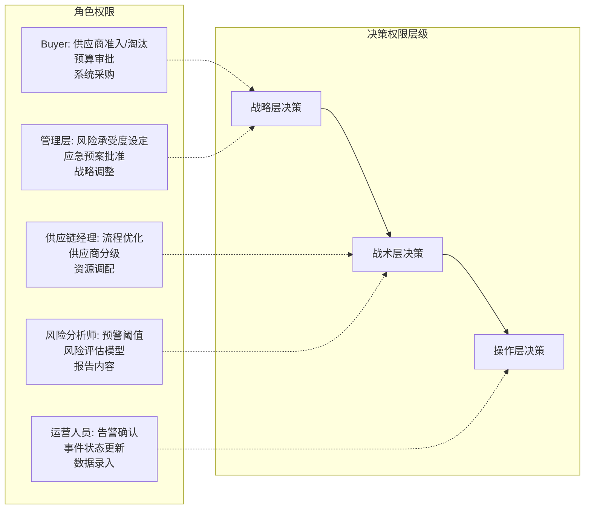
```mermaid
graph LR
    subgraph "决策权限层级"
        direction TB

        L1[战略层决策]
        L2[战术层决策]
        L3[操作层决策]

        L1 --> L2 --> L3
    end

    subgraph "角色权限"
        direction TB

        B[Buyer: 供应商准入/淘汰<br/>预算审批<br/>系统采购]
        M[管理层: 风险承受度设定<br/>应急预案批准<br/>战略调整]
        SM[供应链经理: 流程优化<br/>供应商分级<br/>资源调配]
        RA[风险分析师: 预警阈值<br/>风险评估模型<br/>报告内容]
        OP[运营人员: 告警确认<br/>事件状态更新<br/>数据录入]
    end

    B -.-> L1
    M -.-> L1
    SM -.-> L2
    RA -.-> L2
    OP -.-> L3
```

---

## 3. 核心用户旅程地图

### 3.1 风险发现与处置旅程（全角色）

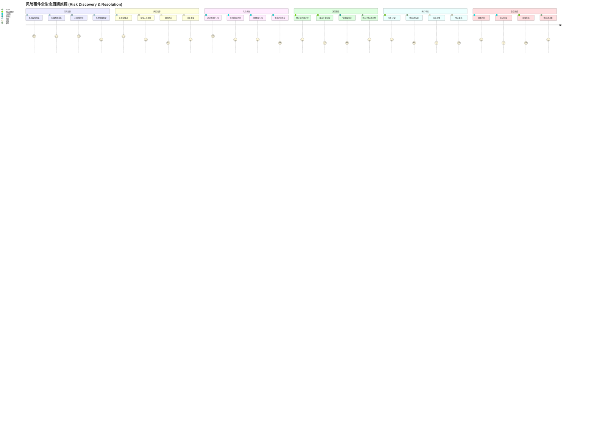
```mermaid
journey
    title 风险事件全生命周期旅程 (Risk Discovery & Resolution)

    section 风险识别
      系统监控扫描: 5: 系统
      多源数据采集: 5: 系统
      AI风险识别: 5: 系统
      风险等级判定: 4: 系统

    section 风险告警
      多渠道推送: 5: 系统
      运营人员接收: 4: 运营
      初步确认: 3: 运营
      升级上报: 4: 运营

    section 风险评估
      分析师深度分析: 5: 分析师
      影响范围评估: 4: 分析师
      关联图谱分析: 4: 分析师
      生成评估报告: 3: 分析师

    section 决策制定
      供应链经理评审: 4: 供应链经理
      备选方案制定: 3: 供应链经理
      管理层审批: 3: 管理层
      Buyer供应商评估: 4: Buyer

    section 执行响应
      任务分配: 4: 供应链经理
      供应商沟通: 3: 采购
      库存调整: 3: 运营
      物流重排: 3: 运营

    section 复盘总结
      效果评估: 4: 分析师
      知识沉淀: 3: 分析师
      流程优化: 3: 供应链经理
      供应商调整: 4: Buyer
```

### 3.2 分角色旅程时间轴


```mermaid
gantt
    title 风险事件响应角色时间轴
    dateFormat X
    axisFormat %s

    section 系统层
    自动监控检测           :0, 1
    AI风险分析             :1, 3
    自动告警触发           :3, 4

    section 运营层
    告警接收确认           :4, 5
    初步信息核实           :5, 8
    事件分级上报           :8, 10

    section 分析师
    深度风险分析           :10, 20
    影响评估报告           :15, 25
    趋势预测分析           :20, 30

    section 供应链经理
    策略制定               :25, 35
    资源协调               :30, 40
    执行监控               :40, 50

    section Buyer
    供应商评估             :30, 45
    备选方案决策           :40, 50
    合同条款调整           :50, 60

    section 管理层
    决策审批               :35, 40
    战略调整               :50, 55
```

---

## 4. 场景化用户旅程

### 4.1 场景一：突发风险应急响应

**场景描述**: 某核心供应商所在地区发生自然灾害，系统检测到相关新闻并触发风险告警

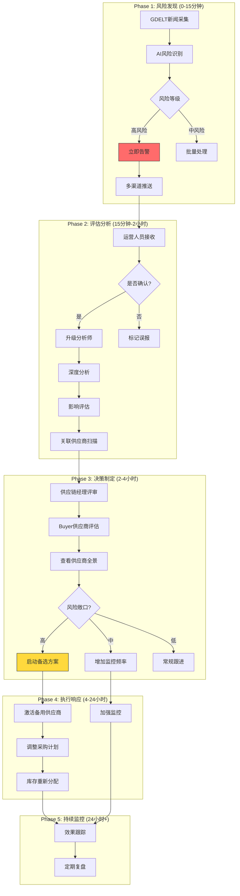
```mermaid
flowchart TB
    subgraph "Phase 1: 风险发现 (0-15分钟)"
        A[GDELT新闻采集] --> B[AI风险识别]
        B --> C{风险等级}
        C -->|高风险| D[立即告警]
        C -->|中风险| E[批量处理]
        D --> F[多渠道推送]
    end

    subgraph "Phase 2: 评估分析 (15分钟-2小时)"
        F --> G[运营人员接收]
        G --> H{是否确认?}
        H -->|是| I[升级分析师]
        H -->|否| J[标记误报]
        I --> K[深度分析]
        K --> L[影响评估]
        L --> M[关联供应商扫描]
    end

    subgraph "Phase 3: 决策制定 (2-4小时)"
        M --> N[供应链经理评审]
        N --> O[Buyer供应商评估]
        O --> P[查看供应商全景]
        P --> Q{风险敞口?}
        Q -->|高| R[启动备选方案]
        Q -->|中| S[增加监控频率]
        Q -->|低| T[常规跟进]
    end

    subgraph "Phase 4: 执行响应 (4-24小时)"
        R --> U[激活备用供应商]
        U --> V[调整采购计划]
        V --> W[库存重新分配]
        S --> X[加强监控]
    end

    subgraph "Phase 5: 持续监控 (24小时+)"
        W --> Y[效果跟踪]
        X --> Y
        Y --> Z[定期复盘]
    end

    style D fill:#ff6b6b,stroke:#333
    style R fill:#ffd93d,stroke:#333
```

**角色活动详细描述**:

| 时间点 | 角色 | 活动 | 使用功能 | 情绪状态 |
|--------|------|------|----------|----------|
| T+0 | 系统 | 自动检测并推送 | SSE推送 | - |
| T+5min | 运营人员 | 接收并确认告警 | 告警中心 | 😰 紧张 |
| T+30min | 风险分析师 | 深度分析影响 | 事件详情+AI助手 | 🤔 专注 |
| T+1h | Buyer | 评估供应商风险 | 供应商360视图 | 😟 担忧 |
| T+2h | 供应链经理 | 制定应对策略 | 关联图谱+报表 | 😤 果断 |
| T+4h | 采购 | 执行供应商切换 | 供应商管理 | 😓 忙碌 |

### 4.2 场景二：供应商准入评估

**场景描述**: Buyer 需要评估一家新供应商的准入资格

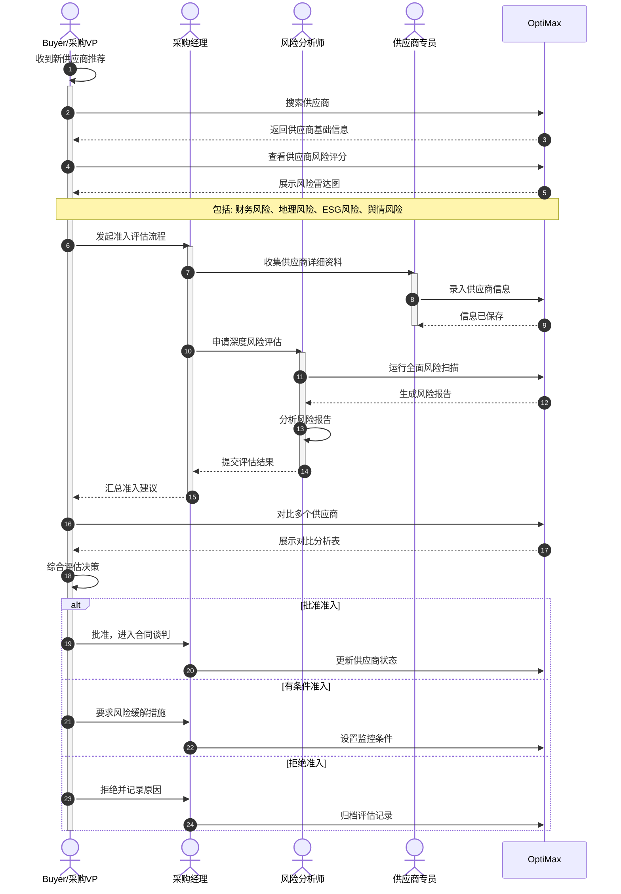
```mermaid
sequenceDiagram
    autonumber
    actor B as Buyer/采购VP
    actor PM as 采购经理
    actor RA as 风险分析师
    actor SP as 供应商专员

    B->>B: 收到新供应商推荐
    activate B

    B->>OptiMax: 搜索供应商
    OptiMax-->>B: 返回供应商基础信息

    B->>OptiMax: 查看供应商风险评分
    OptiMax-->>B: 展示风险雷达图
    Note over B,OptiMax: 包括: 财务风险、地理风险、ESG风险、舆情风险

    B->>PM: 发起准入评估流程
    activate PM

    PM->>SP: 收集供应商详细资料
    activate SP
    SP->>OptiMax: 录入供应商信息
    OptiMax-->>SP: 信息已保存
    deactivate SP

    PM->>RA: 申请深度风险评估
    activate RA

    RA->>OptiMax: 运行全面风险扫描
    OptiMax-->>RA: 生成风险报告

    RA->>RA: 分析风险报告
    RA-->>PM: 提交评估结果
    deactivate RA

    PM-->>B: 汇总准入建议
    deactivate PM

    B->>OptiMax: 对比多个供应商
    OptiMax-->>B: 展示对比分析表

    B->>B: 综合评估决策

    alt 批准准入
        B->>PM: 批准，进入合同谈判
        PM->>OptiMax: 更新供应商状态
    else 有条件准入
        B->>PM: 要求风险缓解措施
        PM->>OptiMax: 设置监控条件
    else 拒绝准入
        B->>PM: 拒绝并记录原因
        PM->>OptiMax: 归档评估记录
    end

    deactivate B
```

**Buyer 在此场景中的关键决策点**:

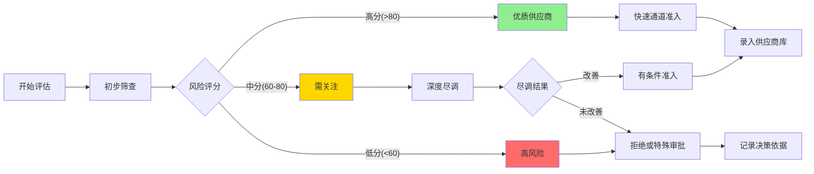
```mermaid
flowchart LR
    A["开始评估"] --> B["初步筛查"]
    B --> C{"风险评分"}

    C -->|"高分(>80)"| D["优质供应商"]
    C -->|"中分(60-80)"| E["需关注"]
    C -->|"低分(<60)"| F["高风险"]

    D --> G["快速通道准入"]
    E --> H["深度尽调"]
    F --> I["拒绝或特殊审批"]

    H --> J{"尽调结果"}
    J -->|"改善"| K["有条件准入"]
    J -->|"未改善"| I

    G --> L["录入供应商库"]
    K --> L
    I --> M["记录决策依据"]

    style D fill:#90EE90
    style E fill:#FFD700
    style F fill:#FF6B6B
```

### 4.3 场景三：日常监控与预警

**场景描述**: 运营人员的日常工作流程

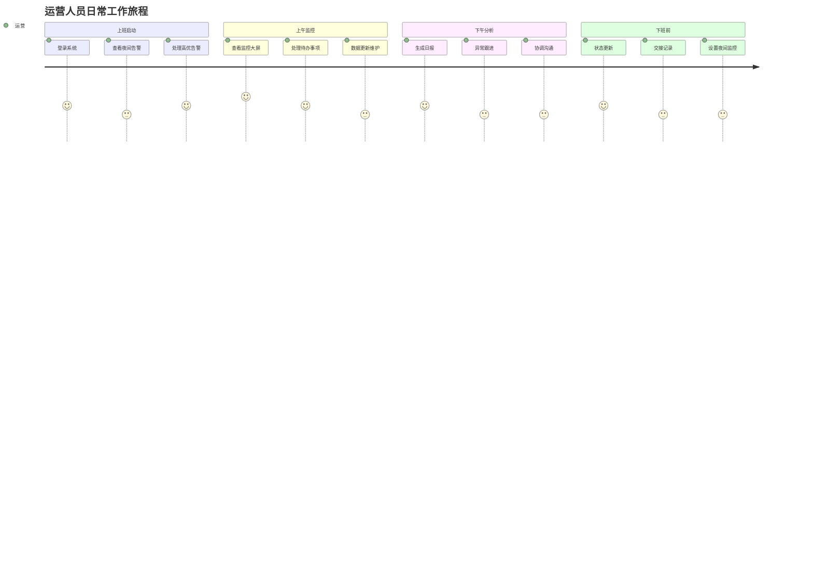
```mermaid
journey
    title 运营人员日常工作旅程

    section 上班启动
      登录系统: 4: 运营
      查看夜间告警: 3: 运营
      处理高优告警: 4: 运营

    section 上午监控
      查看监控大屏: 5: 运营
      处理待办事项: 4: 运营
      数据更新维护: 3: 运营

    section 下午分析
      生成日报: 4: 运营
      异常跟进: 3: 运营
      协调沟通: 3: 运营

    section 下班前
      状态更新: 4: 运营
      交接记录: 3: 运营
      设置夜间监控: 3: 运营
```

### 4.4 场景四：战略供应商评审（管理层）

**场景描述**: 季度战略会议前的供应商组合分析

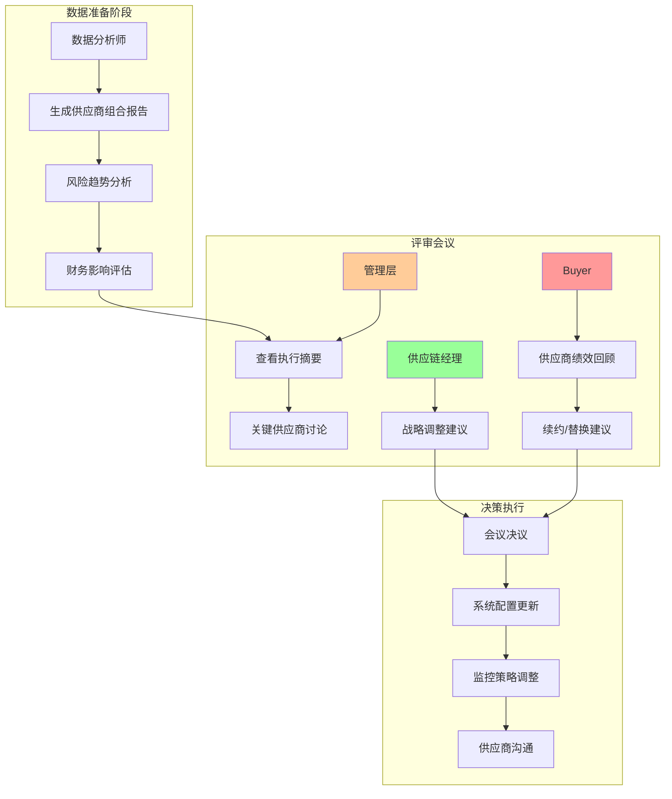
```mermaid
graph TB
    subgraph "数据准备阶段"
        A[数据分析师] --> B[生成供应商组合报告]
        B --> C[风险趋势分析]
        C --> D[财务影响评估]
    end

    subgraph "评审会议"
        E[管理层] --> F[查看执行摘要]
        F --> G[关键供应商讨论]

        H[Buyer] --> I[供应商绩效回顾]
        I --> J[续约/替换建议]

        K[供应链经理] --> L[战略调整建议]
    end

    subgraph "决策执行"
        M[会议决议] --> N[系统配置更新]
        N --> O[监控策略调整]
        O --> P[供应商沟通]
    end

    D --> F
    J --> M
    L --> M

    style E fill:#ffcc99
    style H fill:#ff9999
    style K fill:#99ff99
```

### 4.5 场景五：深度风险研究（分析师）

**场景描述**: 风险分析师针对特定主题进行深度研究


```mermaid
flowchart LR
    subgraph "研究启动"
        A[确定研究主题] --> B[设定研究范围]
        B --> C[配置监控参数]
    end

    subgraph "数据收集"
        D[系统自动采集] --> E[多渠道数据整合]
        E --> F[初步筛选分类]
    end

    subgraph "深度分析"
        G[AI辅助分析] --> H[关联图谱构建]
        H --> I[风险传导建模]
        I --> J[情景模拟]
    end

    subgraph "报告输出"
        K[生成分析报告] --> L[可视化制作]
        L --> M[团队分享]
        M --> N[知识库沉淀]
    end

    C --> D
    F --> G
    J --> K

    style G fill:#99ccff
    style H fill:#99ccff
    style I fill:#99ccff
```

---

## 5. 角色协同工作流程

### 5.1 跨角色协作图谱

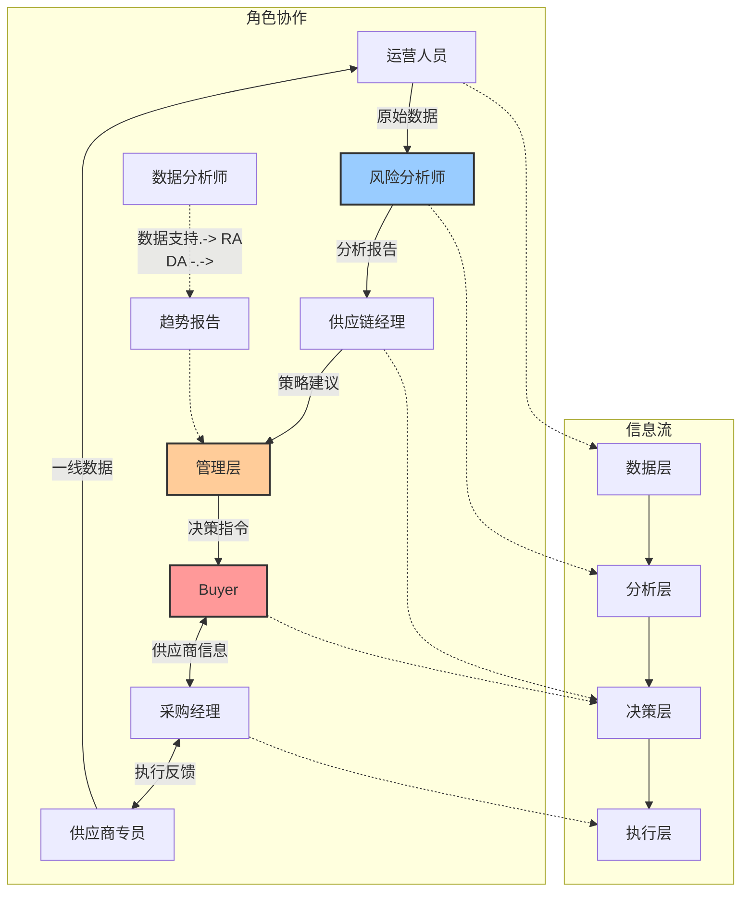
```mermaid
graph TB
    subgraph "信息流"
        direction TB

        Data[数据层]
        Analysis[分析层]
        Decision[决策层]
        Action[执行层]

        Data --> Analysis --> Decision --> Action
    end

    subgraph "角色协作"
        direction LR

        OP[运营人员] -->|原始数据| RA[风险分析师]
        RA -->|分析报告| SM[供应链经理]
        SM -->|策略建议| M[管理层]
        M -->|决策指令| B[Buyer]

        B <-->|供应商信息| PM[采购经理]
        PM <-->|执行反馈| SP[供应商专员]
        SP -->|一线数据| OP

        DA[数据分析师] -.->|数据支持.-> RA
        DA -.->|趋势报告.-> M
    end

    OP -.-> Data
    RA -.-> Analysis
    SM -.-> Decision
    B -.-> Decision
    PM -.-> Action

    style RA fill:#99ccff,stroke:#333,stroke-width:2px
    style B fill:#ff9999,stroke:#333,stroke-width:2px
    style M fill:#ffcc99,stroke:#333,stroke-width:2px
```

### 5.2 典型协作场景：月度风险评审

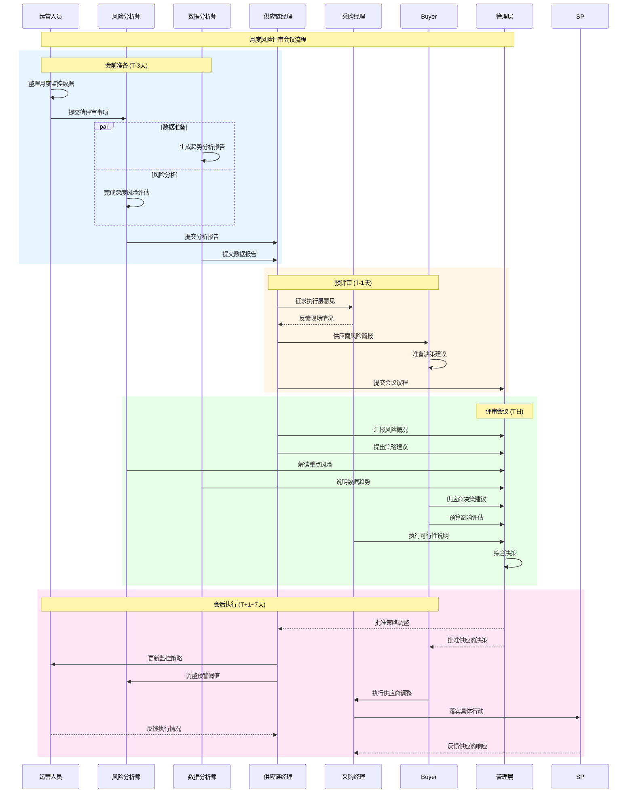
```mermaid
sequenceDiagram
    participant OP as 运营人员
    participant RA as 风险分析师
    participant DA as 数据分析师
    participant SM as 供应链经理
    participant PM as 采购经理
    participant B as Buyer
    participant M as 管理层

    Note over OP,M: 月度风险评审会议流程

    rect rgb(230, 245, 255)
        Note over OP,DA: 会前准备 (T-3天)
        OP->>OP: 整理月度监控数据
        OP->>RA: 提交待评审事项

        par 数据准备
            DA->>DA: 生成趋势分析报告
        and 风险分析
            RA->>RA: 完成深度风险评估
        end

        RA->>SM: 提交分析报告
        DA->>SM: 提交数据报告
    end

    rect rgb(255, 245, 230)
        Note over SM,B: 预评审 (T-1天)
        SM->>PM: 征求执行层意见
        PM-->>SM: 反馈现场情况

        SM->>B: 供应商风险简报
        B->>B: 准备决策建议

        SM->>M: 提交会议议程
    end

    rect rgb(230, 255, 230)
        Note over M,M: 评审会议 (T日)

        SM->>M: 汇报风险概况
        SM->>M: 提出策略建议

        RA->>M: 解读重点风险
        DA->>M: 说明数据趋势

        B->>M: 供应商决策建议
        B->>M: 预算影响评估

        PM->>M: 执行可行性说明

        M->>M: 综合决策
    end

    rect rgb(255, 230, 245)
        Note over OP,B: 会后执行 (T+1~7天)

        M-->>SM: 批准策略调整
        M-->>B: 批准供应商决策

        SM->>OP: 更新监控策略
        SM->>RA: 调整预警阈值

        B->>PM: 执行供应商调整
        PM->>SP: 落实具体行动

        OP-->>SM: 反馈执行情况
        SP-->>PM: 反馈供应商响应
    end
```

---

## 6. 用户触点分析

### 6.1 全渠道触点地图

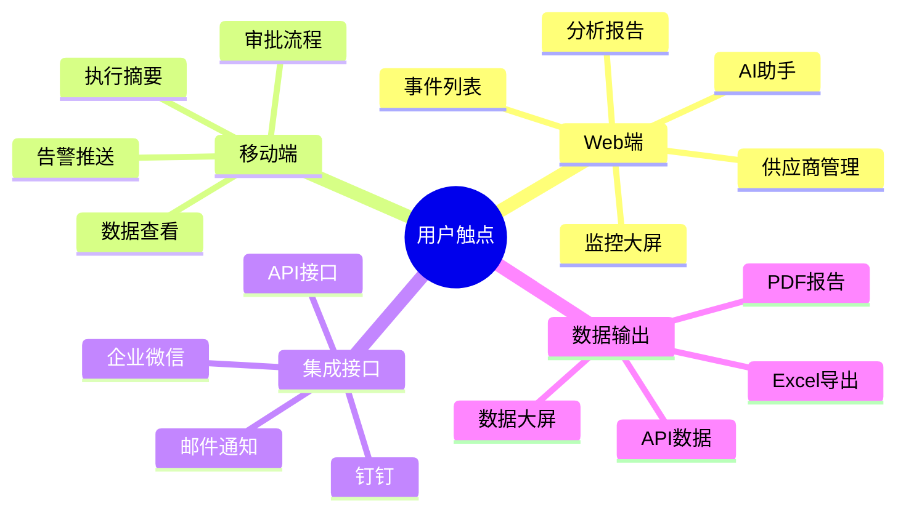
```mermaid
mindmap
  root((用户触点))
    Web端
      监控大屏
      事件列表
      供应商管理
      分析报告
      AI助手
    移动端
      告警推送
      执行摘要
      审批流程
      数据查看
    集成接口
      企业微信
      钉钉
      邮件通知
      API接口
    数据输出
      PDF报告
      Excel导出
      数据大屏
      API数据
```

### 6.2 分角色触点偏好

**Buyer 触点使用分布**:
- 供应商全景视图: 35%
- 对比分析工具: 25%
- 移动端简报: 20%
- ROI计算器: 15%
- 审批工作流: 5%

**运营人员 触点使用分布**:
- 监控大屏: 40%
- 告警中心: 30%
- 事件处理: 20%
- 数据录入: 10%

### 6.3 触点体验评分

| 触点 | Buyer | 管理层 | 供应链经理 | 分析师 | 运营 |
|------|-------|--------|------------|--------|------|
| Web Dashboard | ⭐⭐⭐⭐ | ⭐⭐⭐⭐ | ⭐⭐⭐⭐⭐ | ⭐⭐⭐⭐⭐ | ⭐⭐⭐⭐ |
| 移动端 | ⭐⭐⭐⭐⭐ | ⭐⭐⭐⭐ | ⭐⭐⭐ | ⭐⭐ | ⭐⭐⭐ |
| 告警推送 | ⭐⭐⭐ | ⭐⭐⭐ | ⭐⭐⭐⭐ | ⭐⭐⭐⭐⭐ | ⭐⭐⭐⭐⭐ |
| AI助手 | ⭐⭐⭐⭐ | ⭐⭐⭐ | ⭐⭐⭐⭐ | ⭐⭐⭐⭐⭐ | ⭐⭐⭐ |
| 报告导出 | ⭐⭐⭐⭐⭐ | ⭐⭐⭐⭐⭐ | ⭐⭐⭐⭐ | ⭐⭐⭐⭐⭐ | ⭐⭐⭐ |

---

## 7. 痛点与机会点

### 7.1 用户痛点地图

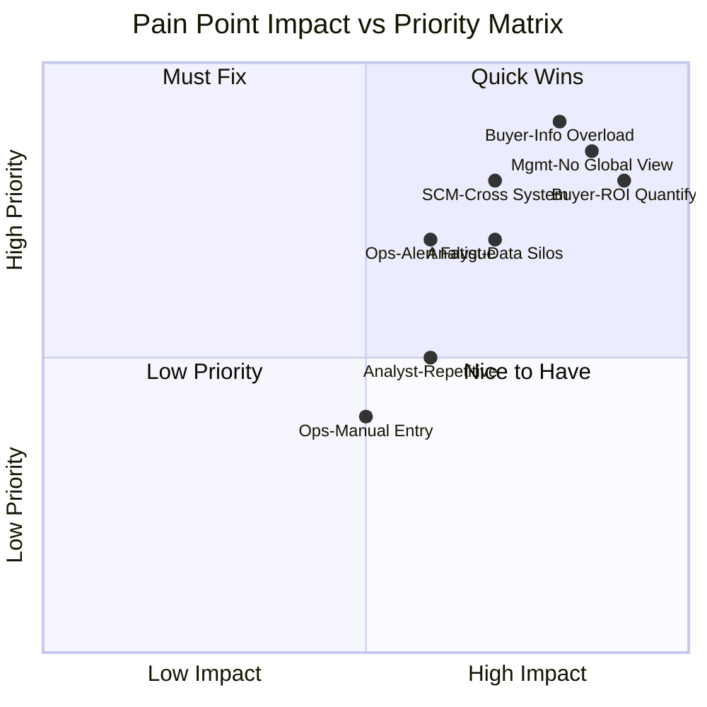
```mermaid
quadrantChart
    title Pain Point Impact vs Priority Matrix
    x-axis Low Impact --> High Impact
    y-axis Low Priority --> High Priority
    quadrant-1 Quick Wins
    quadrant-2 Must Fix
    quadrant-3 Low Priority
    quadrant-4 Nice to Have
    "Buyer-Info Overload": [0.8, 0.9]
    "Buyer-ROI Quantify": [0.9, 0.8]
    "Mgmt-No Global View": [0.85, 0.85]
    "Analyst-Data Silos": [0.7, 0.7]
    "Analyst-Repetitive": [0.6, 0.5]
    "SCM-Cross System": [0.7, 0.8]
    "Ops-Alert Fatigue": [0.6, 0.7]
    "Ops-Manual Entry": [0.5, 0.4]
```

**象限说明**:

| 象限 | 描述 | 痛点 |
|------|------|------|
| **立即解决** | 高影响 + 高优先级 | Buyer-信息过载、管理层-缺乏全局视图、Buyer-难以量化ROI、供应链经理-跨系统操作 |
| **重要改进** | 低影响 + 高优先级 | 运营-告警疲劳 |
| **持续关注** | 低影响 + 低优先级 | 分析师-重复性工作、运营-手动数据录入 |
| **快速修复** | 高影响 + 低优先级 | 分析师-数据孤岛 |

### 7.2 Buyer 专项痛点分析

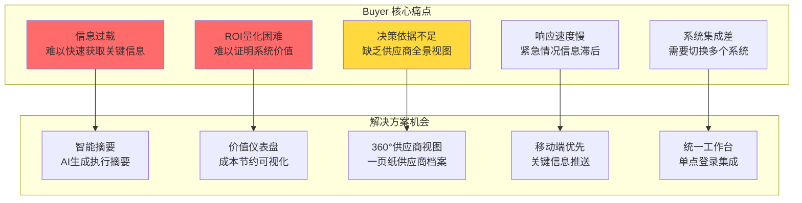
```mermaid
flowchart TB
    subgraph "Buyer 核心痛点"
        P1[信息过载
        难以快速获取关键信息]

        P2[ROI量化困难
        难以证明系统价值]

        P3[决策依据不足
        缺乏供应商全景视图]

        P4[响应速度慢
        紧急情况信息滞后]

        P5[系统集成差
        需要切换多个系统]
    end

    subgraph "解决方案机会"
        S1[智能摘要
        AI生成执行摘要]

        S2[价值仪表盘
        成本节约可视化]

        S3[360°供应商视图
        一页纸供应商档案]

        S4[移动端优先
        关键信息推送]

        S5[统一工作台
        单点登录集成]
    end

    P1 --> S1
    P2 --> S2
    P3 --> S3
    P4 --> S4
    P5 --> S5

    style P1 fill:#ff6b6b
    style P2 fill:#ff6b6b
    style P3 fill:#ffd93d
```

### 7.3 机会点优先级矩阵

| 机会点 | 用户价值 | 业务价值 | 技术可行性 | 优先级 |
|--------|----------|----------|------------|--------|
| Buyer 智能决策助手 | ⭐⭐⭐⭐⭐ | ⭐⭐⭐⭐⭐ | ⭐⭐⭐ | P0 |
| 供应商 360° 全景 | ⭐⭐⭐⭐⭐ | ⭐⭐⭐⭐ | ⭐⭐⭐⭐ | P0 |
| 移动端 Executive Summary | ⭐⭐⭐⭐⭐ | ⭐⭐⭐⭐ | ⭐⭐⭐⭐⭐ | P1 |
| ROI 价值计算器 | ⭐⭐⭐⭐ | ⭐⭐⭐⭐⭐ | ⭐⭐⭐ | P1 |
| 智能预警分级 | ⭐⭐⭐⭐ | ⭐⭐⭐⭐ | ⭐⭐⭐⭐ | P1 |
| 供应商对比工具 | ⭐⭐⭐⭐⭐ | ⭐⭐⭐ | ⭐⭐⭐⭐⭐ | P2 |

---

## 8. 设计建议

### 8.1 Buyer 专属功能设计

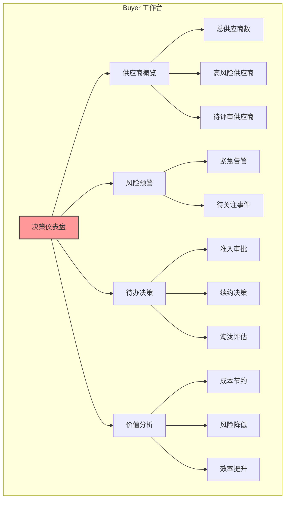
```mermaid
graph TB
    subgraph "Buyer 工作台"
        A[决策仪表盘]

        A --> B[供应商概览]
        A --> C[风险预警]
        A --> D[待办决策]
        A --> E[价值分析]

        B --> B1[总供应商数]
        B --> B2[高风险供应商]
        B --> B3[待评审供应商]

        C --> C1[紧急告警]
        C --> C2[待关注事件]

        D --> D1[准入审批]
        D --> D2[续约决策]
        D --> D3[淘汰评估]

        E --> E1[成本节约]
        E --> E2[风险降低]
        E --> E3[效率提升]
    end

    style A fill:#ff9999,stroke:#333,stroke-width:2px
```

### 8.2 用户旅程优化建议

| 旅程阶段 | 当前痛点 | 优化建议 | 预期效果 |
|----------|----------|----------|----------|
| **风险发现** | 告警噪音多 | AI智能分级+个性化阈值 | 告警准确率提升 40% |
| **风险评估** | 分析耗时长 | 一键生成分析报告 | 分析时间缩短 60% |
| **决策制定** | 信息分散 | 一页纸决策视图 | 决策时间缩短 50% |
| **执行跟踪** | 进度不透明 | 实时状态跟踪 | 执行效率提升 30% |
| **复盘总结** | 知识难沉淀 | 自动知识库归档 | 知识复用率提升 |

### 8.3 角色个性化首页设计

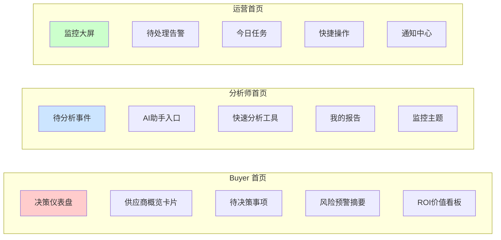
```mermaid
flowchart LR
    subgraph "Buyer 首页"
        B1[决策仪表盘]
        B2[供应商概览卡片]
        B3[待决策事项]
        B4[风险预警摘要]
        B5[ROI价值看板]
    end

    subgraph "分析师首页"
        A1[待分析事件]
        A2[AI助手入口]
        A3[快速分析工具]
        A4[我的报告]
        A5[监控主题]
    end

    subgraph "运营首页"
        O1[监控大屏]
        O2[待处理告警]
        O3[今日任务]
        O4[快捷操作]
        O5[通知中心]
    end

    style B1 fill:#ffcccc
    style A1 fill:#cce5ff
    style O1 fill:#ccffcc
```

---

## 附录

### A. 用户旅程验证清单

- [ ] 每个角色的核心旅程已识别
- [ ] 关键触点已映射
- [ ] 痛点已量化
- [ ] 改进机会已排序
- [ ] 设计建议可落地

### B. 后续行动建议

1. **用户访谈**: 针对 Buyer 角色进行深度访谈
2. **原型验证**: 制作 Buyer 工作台原型
3. **数据埋点**: 完善用户行为数据收集
4. **A/B测试**: 验证新设计的有效性
5. **持续迭代**: 基于反馈持续优化

---

**文档结束**
