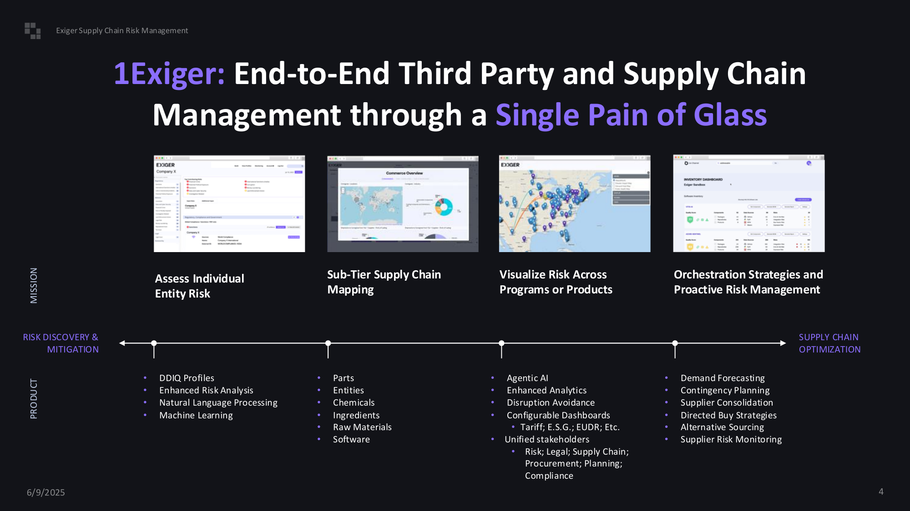
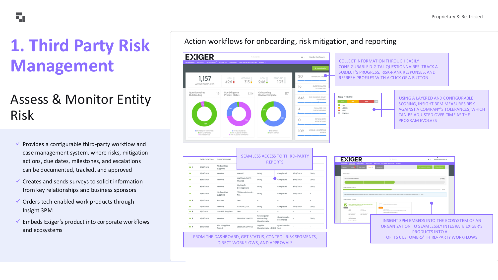
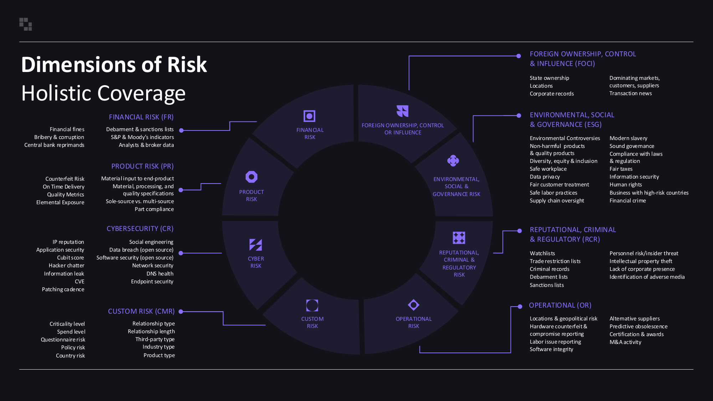
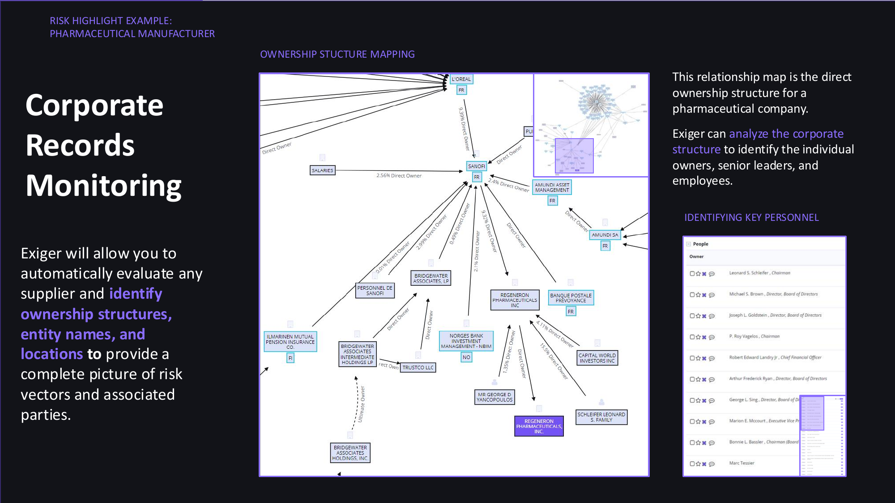
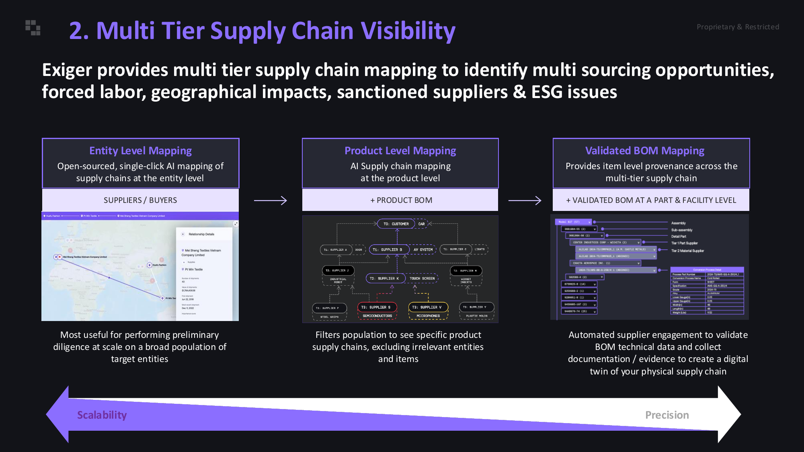
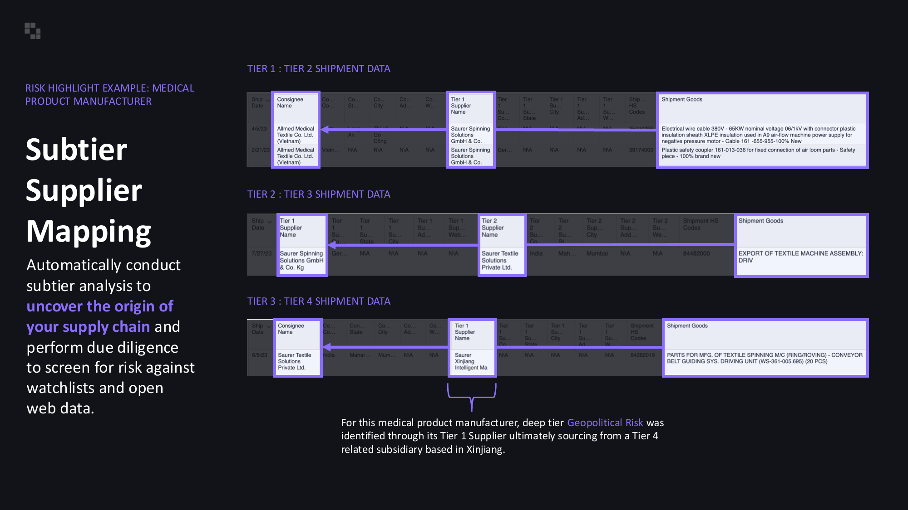
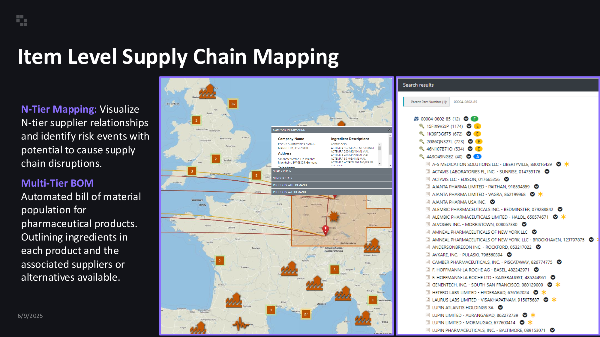
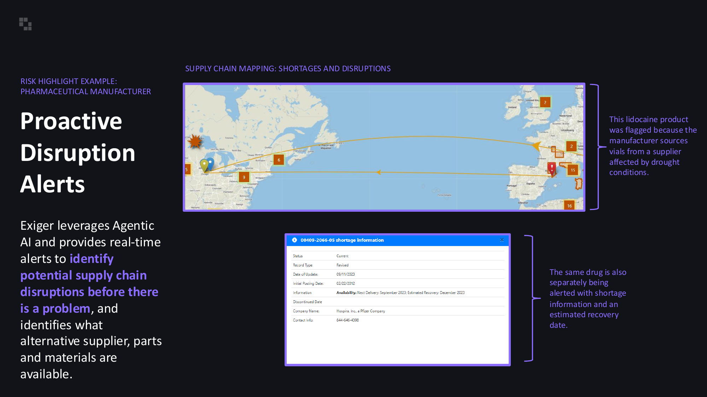
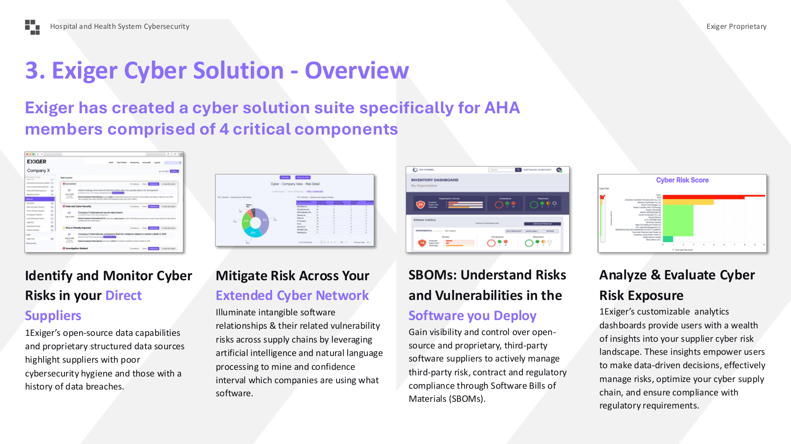
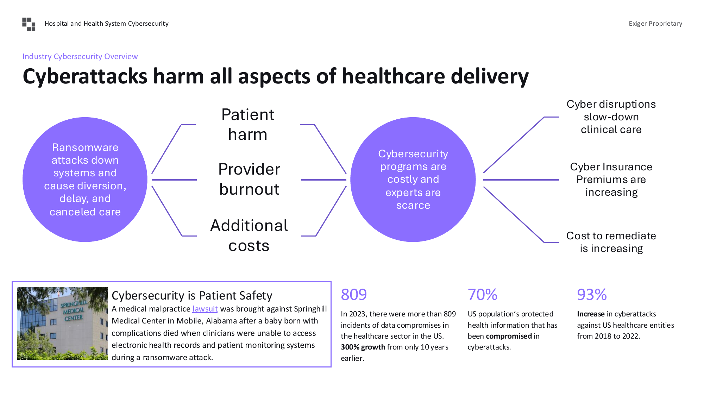

# Exiger 供应链风险平台深度分析报告

> **Healthcare Supply Chain Risk Management** | Version 1.0 | Updated: 2025-06-09
> Source: Exiger SCRC Presentation | Analyst: Claude

---

## 📋 执行摘要与产品分析

### 产品定位

**Exiger** 是一款面向企业（特别是医疗行业）的**第三方风险与供应链智能管理平台**，核心定位是帮助客户实现端到端的供应链可视化、风险监控和合规管理。Exiger 在 2025 Gartner Magic Quadrant 中被评选为供应商风险管理解决方案的**领导者**。

**目标用户**：
- 供应链合规官、风险管理人员
- 采购经理、供应商管理专员
- 医疗行业合规团队（HHS、VA等政府机构）
- 网络安全与IT风险管理团队

### 核心能力矩阵

| 能力域 | 功能描述 | 商业价值 |
|--------|----------|----------|
| **第三方风险评估** | 8维度风险扫描（财务、网络、ESG、运营等） | 供应商准入尽职调查 |
| **多级供应链穿透** | Tier-N 供应链映射，提单数据解析 | 发现隐藏风险和依赖关系 |
| **网络风险管理** | SBOM分析、软件物料清单监控 | 医疗设备和系统安全合规 |
| **主动风险预警** | Agentic AI 实时监控和短缺预警 | 提前识别供应中断 |
| **企业架构分析** | 股权结构、关联方识别 | 理解供应商真实控制结构 |

---

## 1. 产品概览

### 1.1 平台愿景

Exiger 提供**端到端的第三方和供应链管理单一视图**（Single Pane of Glass），覆盖从风险发现到供应链优化的完整价值链。

**产品演进路径**：

```
风险发现与缓解 ──────────────────────────────────────────────> 供应链优化
       │                │                │                │
   DDIQ档案        多级映射          风险可视化         主动管理
   风险分析        零部件/实体         Agentic AI        需求预测
   NLP处理         化学品/原料        中断避免          应急计划
   机器学习        软件识别           可配置仪表板       供应商整合
```

### 1.2 行业认可

- **2025 Gartner Magic Quadrant**: 被评为供应商风险管理解决方案**领导者**
- **FedRAMP授权**: 允许与美国联邦政府合作
- **客户覆盖**: 550+全球客户，包括150家财富500强企业
- **医疗行业客户**: Northwell Health、Sanofi、McKesson、Johnson & Johnson等

---

## 2. 核心功能模块

### 2.1 第三方风险管理 (Third Party Risk Management)

#### 2.1.1 Insight 3PM 工作台

**核心界面组件**：

| 组件 | 功能描述 |
|------|----------|
| **供应商统计卡片** | 显示活跃供应商数量、风险等级分布（高/中/低） |
| **问卷状态圆环图** | 可视化问卷完成状态（绿色=已完成、紫色=进行中） |
| **尽职调查状态** | 跟踪尽职调查流程进度 |
| **风险评分条** | 分层可配置评分，根据企业容忍度衡量风险 |
| **工作流控制面板** | 管理风险细分、指导工作流程和审批 |

**工作流程特性**：
- ✅ 可配置的第三方工作流和案例管理系统
- ✅ 创建和发送调查问卷收集关键关系信息
- ✅ 通过 Insight 3PM 订购技术支持的工作产品
- ✅ 无缝嵌入企业生态系统和工作流程

### 2.2 风险维度全景覆盖

Exiger 监控**8大风险维度**，每个维度包含详细指标：

#### 维度一：财务风险 (Financial Risk)
- 金融罚款、贿赂与腐败
- 央行处罚、S&P/Moody 指标
- 分析师与经纪商数据

#### 维度二：产品风险 (Product Risk)
- 假冒风险、准时交付
- 质量指标、元素暴露
- 材料输入到最终产品追踪

#### 维度三：网络安全 (Cybersecurity)
- IP声誉、应用安全、Cubit评分
- 黑客情报、信息泄露、CVE
- 补丁节奏、社会工程、数据泄露

#### 维度四：ESG风险
- 环境争议、无害产品
- 多元化与包容、安全工作场所
- 现代奴隶制、数据隐私

#### 维度五：声誉/犯罪/监管 (RCR)
- 观察名单、贸易限制名单
- 犯罪记录、制裁名单
- 知识产权盗窃

#### 维度六：运营风险 (Operational)
- 地理位置风险、硬件假冒
- 劳工问题报告、软件完整性
- 替代供应商、预测性过时

#### 维度七：外国所有权控制 (FOCI)
- 国家所有权、企业记录
- 市场主导地位、交易新闻

#### 维度八：自定义风险 (Custom Risk)
- 关键性级别、支出级别
- 问卷风险、政策风险、国家风险

---

## 3. 多级供应链可见性 (Multi-Tier Supply Chain Visibility)

### 3.1 三层映射架构

Exiger 提供三种递进式供应链映射能力：

#### Level 1: 实体级映射 (Entity Level Mapping)
**特点**：
- 开源、一键AI映射
- 供应商/买方关系可视化
- 适用于大规模目标实体的初步尽职调查

**UI特征**：
- 地图视图展示供应商地理分布
- 关系详情弹窗显示连接信息
- 可扩展性优先

#### Level 2: 产品级映射 (Product Level Mapping)
**特点**：
- AI供应链映射到产品级别
- 结合产品BOM数据
- 筛选特定产品供应链，排除无关实体

**UI特征**：
- 树状图/网络图展示产品层级结构
- 从T0（客户）到T3供应商的可视化路径
- 标注关键组件（如半导体、触摸屏）

#### Level 3: 验证BOM映射 (Validated BOM Mapping)
**特点**：
- 零部件和设施级别的验证BOM
- 自动化供应商参与验证BOM技术数据
- 创建物理供应链的数字孪生

**UI特征**：
- 详细的零部件清单表格
- 多级供应商验证状态
- 技术数据收集与证据存档

### 3.2 子层级供应商映射

**数据可视化能力**：
- **Tier 1→Tier 2 货运数据**: 显示收货人、供应商、货物详情
- **Tier 2→Tier 3 货运数据**: 追踪中间供应商连接
- **Tier 3→Tier 4 货运数据**: 深入原材料和组件来源

**风险识别案例**：
- 通过Tier 1供应商追溯到Tier 4的新疆相关子公司
- 识别地缘政治风险（如制裁、强迫劳动）

### 3.3 项目级供应链映射

**N-Tier Mapping 特性**：
- 可视化N级供应商关系
- 识别可能导致供应链中断的风险事件
- 地图视图标注受影响区域和供应商

**多级BOM功能**：
- 药品自动化物料清单生成
- 列出每种产品的成分
- 显示关联供应商或替代方案

---

## 4. 企业记录监控 (Corporate Records Monitoring)

### 4.1 股权结构映射

**可视化能力**：
- 展示制药公司的直接所有权结构
- 识别最终受益所有人(UBO)
- 分析企业架构识别个人所有者、高管和员工

**UI组件**：
- 树状网络图展示持股关系
- 持股比例标注（如2.56%直接所有权）
- 关联方高亮显示

### 4.2 关键人员识别

**人员信息面板**：
- 职位角色分类（Owner、Director、Officer等）
- 人员详情列表（姓名、职位）
- 风险标记（如制裁名单匹配）

---

## 5. 主动中断预警 (Proactive Disruption Alerts)

### 5.1 短缺与中断映射

**地图可视化**：
- 显示受短缺影响的产品和地理区域
- 标注受干旱影响的供应商位置
- 展示跨大西洋供应链路径

**案例展示**：
- Lidocaine产品因供应商受干旱影响而被标记
- 同一药物同时收到短缺信息和预计恢复日期预警

### 5.2 Agentic AI 预警系统

**核心能力**：
- 实时预警识别潜在供应链中断
- 在问题发生前预警
- 识别替代供应商、零部件和材料

**UI特征**：
- 预警卡片显示产品信息
- 状态标签（Current/Revised）
- 可用性预测（如下次交付时间）
- 恢复日期估算

---

## 6. 网络安全解决方案

### 6.1 四大核心组件

#### 组件1: 直接供应商网络风险识别
- 开源数据能力
- 专有结构化数据源
- 突出网络安全卫生差的供应商
- 识别有数据泄露历史的供应商

#### 组件2: 扩展网络风险缓解
- AI和自然语言处理挖掘软件关系
- 识别哪些公司使用什么软件
- 置信区间评估

#### 组件3: SBOM（软件物料清单）
- 开源和专有第三方软件供应商可见性
- 管理软件风险、合同和监管合规

#### 组件4: 网络风险暴露分析
- 可定制分析仪表板
- 数据驱动的决策支持
- 网络供应链优化

### 6.2 医疗行业网络安全洞察

**关键统计数据**：
- **809起**: 2023年美国医疗行业数据泄露事件（10年前仅约270起，300%增长）
- **70%**: 美国人口受保护健康信息在网络攻击中受损
- **93%**: 2018-2022年针对美国医疗实体的网络攻击增长

**风险影响模型**：
- 勒索软件攻击 → 系统瘫痪 → 患者伤害/护理转移/延误
- 网络安全项目成本高昂且专家稀缺 → 保险费用增加
- 补救成本持续上升

---

## 7. UI/UX 设计分析

### 7.1 视觉设计系统

**配色方案**：
- **主色调**: 深紫色/靛蓝 (#6366F1) - 科技感与专业性
- **背景色**: 深色模式为主 (#0F0F1A) - 适合数据可视化
- **风险等级色**:
  - 高风险: 红色/橙色
  - 中风险: 黄色
  - 低风险: 绿色
  - 信息: 蓝色

**排版系统**：
- 标题使用粗体无衬线字体（Inter/SF Pro风格）
- 数据使用等宽字体或清晰数字字体
- 层级分明：Page Title > Section Header > Card Title > Body

### 7.2 关键界面截图

#### 截图1: 产品概览 - 四大核心能力


**UI分析**：
- 四列卡片布局展示核心功能
- 每张卡片包含：标题 + 界面截图 + 功能列表
- 底部时间线可视化产品演进路径
- 使用渐变紫色强调"Single Pane of Glass"理念

---

#### 截图2: 第三方风险管理工作台


**UI分析**：
- **顶部KPI卡片**: 大号数字显示关键指标（1,157活跃供应商）
- **环形图**: 三色圆环展示问卷完成率、尽职调查状态
- **右侧风险面板**: 垂直进度条显示各维度风险评分
- **中部表格**: 第三方报告列表，支持排序和筛选
- **底部工作流视图**: 时间线/进度条展示流程状态

**设计亮点**：
- 信息密度高但层次分明
- 紫色标注强调关键洞察
- 圆环图颜色编码直观易懂

---

#### 截图3: 八维度风险轮盘


**UI分析**：
- 中心圆环分为8个扇形区域
- 每个扇形使用不同图标和颜色区分
- 径向连线指向详细说明面板
- 深色背景 + 发光效果营造科技感

**交互逻辑**：
- 每个维度可展开查看详细指标
- 图标设计直观（$=财务，🔒=网络安全）

---

#### 截图4: 企业股权结构图


**UI分析**：
- 网络图展示复杂的股权关系
- 节点使用公司logo/图标
- 连线标注持股比例
- 右侧人员列表显示关键高管

**可视化特点**：
- 力导向图布局自动优化节点位置
- 高亮显示目标公司（Sanofi案例）
- 缩放和平移支持探索大型网络

---

#### 截图5: 多级供应链映射流程


**UI分析**：
- 三阶段水平布局（左→右：可扩展性→精确性）
- 每个阶段包含：标题栏 + 界面截图 + 描述
- 渐变箭头指示演进方向
- 紫色边框统一视觉风格

**三种视图模式**：
1. **实体级**: 地图 + 列表视图
2. **产品级**: 树状网络图
3. **BOM级**: 详细零部件表格

---

#### 截图6: 子层级货运数据追踪


**UI分析**：
- 三层货运数据表格（Tier1→2, Tier2→3, Tier3→4）
- 箭头指示数据流向
- 关键字段高亮（收货人、供应商、货物描述）
- HS编码显示（39174000, 84482000等）

**数据完整性**：
- 部分数据标记为N/A（隐私保护）
- 货物描述详细（电缆规格、纺织机械部件）

---

#### 截图7: 项目级供应链映射


**UI分析**：
- 左侧：欧洲地图标注供应商位置（数字表示供应商数量）
- 右侧：搜索结果列表显示替代供应商
- 中间弹窗：公司信息 + 成分描述 + 供应链路径

**地理可视化**：
- 热力图效果展示供应商聚集区域
- 连线展示跨国供应关系
- 数字标签（2, 3, 9, 27等）表示该地点供应商数量

---

#### 截图8: 主动中断预警界面


**UI分析**：
- 地图视图展示全球供应链路径
- 爆炸图标标记风险地点
- 详情弹窗显示短缺信息：
  - 状态和记录类型
  - 更新日期和发布日期
  - 可用性和停产日期
  - 公司联系信息

**预警信息结构**：
- 预计恢复时间（9月交付，12月恢复）
- 多源数据整合（天气、物流、生产）

---

#### 截图9: 网络安全解决方案概览


**UI分析**：
- 四列卡片展示网络解决方案
- 每张卡片：界面截图 + 标题 + 描述
- 浅灰色背景区分内容区块
- 紫色标题强调模块名称

**模块UI特点**：
- 风险评分仪表板使用红/黄/绿颜色编码
- 饼图展示供应商风险分布
- 列表视图展示软件组件清单

---

#### 截图10: 医疗网络安全数据看板


**UI分析**：
- 左右双圆环对比布局
- 中心辐射状连接线
- 底部统计数据使用大号紫色数字
- 案例研究卡片（图片+文字）

**数据可视化**：
- 紫色(#7C3AED)强调关键数字
- 简洁的图标和标签
- 信息层次：风险类型→影响→统计数据

---

### 7.3 交互设计模式

**导航模式**：
- 顶部主导航栏（Dashboard, Suppliers, Monitoring, Reporting等）
- 左侧二级导航（筛选、集合、收藏）
- 面包屑导航显示当前位置

**数据表格模式**：
- 可排序列标题
- 行内操作按钮（编辑、删除、查看）
- 分页或无限滚动
- 批量选择复选框

**表单与输入**：
- 分步向导（问卷创建、供应商邀请）
- 自动完成搜索
- 日期范围选择器
- 多选下拉菜单

**反馈机制**：
- Toast通知（成功/错误/警告）
- 加载状态指示器
- 确认对话框
- 进度条（问卷完成度、风险评估进度）

---

## 8. 与 Prewave 的对比分析

### 8.1 功能对比矩阵

| 功能领域 | Exiger | Prewave | 差异分析 |
|----------|--------|---------|----------|
| **风险评估维度** | 8维度（财务、产品、网络、ESG等） | 多维度（基于公开媒体） | Exiger更全面的结构化风险评估 |
| **供应链穿透** | Tier-N + BOM + 提单数据 | Tier-N + BOL数据 | 两者能力接近，Exiger更强调BOM |
| **网络风险** | 专门SBOM模块 | 基础网络安全评分 | Exiger在网络安全方面更深入 |
| **合规支持** | FedRAMP、医疗行业 | LkSG、欧盟法规 | 地域合规重点不同 |
| **AI技术** | Agentic AI | NLP + 机器学习 | 两者都使用AI，Exiger强调Agentic |
| **数据可视化** | 深色主题、网络图 | 浅色主题、地图 | 视觉风格差异明显 |
| **股权结构** | UBO识别 | 基础公司信息 | Exiger更深入的受益所有人分析 |

### 8.2 UI/UX 对比

| 维度 | Exiger | Prewave |
|------|--------|---------|
| **主题风格** | 深色模式为主 | 浅色模式为主 |
| **主色调** | 紫色/靛蓝 | 橙色/蓝色 |
| **图表风格** | 科技感、发光效果 | 商务感、简洁清晰 |
| **信息密度** | 较高，专业分析师导向 | 中等，业务用户友好 |
| **地图可视化** | 深色底图、热力图 | 浅色底图、风险标记 |
| **响应速度** | 待测试 | 较快 |

### 8.3 差异化优势

**Exiger 优势**：
1. **网络安全深度**: SBOM分析是独特能力
2. **政府合规**: FedRAMP授权适合政府机构
3. **医疗行业专注**: 针对医疗供应链的专业功能
4. **股权穿透**: UBO识别和受益所有人分析

**Prewave 优势**：
1. **欧洲合规**: LkSG等欧盟法规支持更成熟
2. **公开媒体覆盖**: 全球媒体监控能力
3. **360度评分**: 更成熟的供应商评分体系
4. **多语言支持**: 欧洲语言覆盖更好

---

## 9. 关键洞察与建议

### 9.1 值得借鉴的Exiger功能

#### 1. SBOM（软件物料清单）模块
**价值**: 随着软件供应链攻击增加（如SolarWinds事件），SBOM成为关键需求。
**建议**: 考虑在OptiMax中增加软件组件风险扫描功能。

#### 2. 股权结构可视化
**价值**: 识别隐藏的关联方和受益所有人，避免制裁合规风险。
**建议**: 增加企业股权穿透和UBO识别功能。

#### 3. 八维度风险轮盘
**价值**: 直观展示全面的风险覆盖范围。
**建议**: 设计类似的可视化组件展示我们的风险维度。

#### 4. Agentic AI 预警
**价值**: 主动识别潜在中断而非被动响应。
**建议**: 开发预测性风险预警功能。

### 9.2 UI/UX 设计启示

#### 1. 深色模式支持
- Exiger大量使用深色模式，适合数据可视化和长时间使用
- 考虑为OptiMax增加深色主题选项

#### 2. 网络图可视化
- Exiger的股权结构和供应链网络图使用力导向布局
- 评估引入类似的网络可视化库（如D3.js、Cytoscape.js）

#### 3. 渐进式信息展示
- Exiger使用"Scalability → Precision"的渐进式映射
- 设计多级钻取的用户旅程

#### 4. 信息卡片设计
- Exiger的KPI卡片使用大数字 + 图标 + 进度指示器
- 参考设计我们的风险摘要卡片

### 9.3 竞争定位建议

**短期（3-6个月）**：
1. 完善基础供应链可视化功能
2. 优化地图和风险仪表盘的UI
3. 增加更多行业特定的风险指标

**中期（6-12个月）**：
1. 开发软件供应链风险模块
2. 增强股权穿透和UBO识别
3. 实现预测性风险预警

**长期（12个月+）**：
1. 构建Agentic AI风险助手
2. 垂直行业解决方案（医疗、制造等）
3. 生态系统集成（与ERP、采购系统深度集成）

---

## 10. 附录：截图索引

本报告包含以下UI截图（存放于 `exiger_ui_screenshots/` 文件夹）：

| 截图文件 | 所在章节 | 描述 |
|---------|---------|------|
| page-01.png | 封面 | Healthcare Supply Chain Priorities for 2025 |
| page-02.png | 1.1 | 医疗行业客户关系和客户logo |
| page-03.png | 1.2 | 2025 Gartner Magic Quadrant - 领导者位置 |
| page-04.png | 1.3 | 产品概览 - 四大核心能力 |
| page-05.png | 2.0 | 医疗供应链挑战列表 |
| page-06.png | 2.1 | 三大风险优先级 |
| page-07.png | 3.1 | Insight 3PM 工作台界面 |
| page-08.png | 3.2 | 八维度风险轮盘图 |
| page-09.png | 4.1 | 企业股权结构映射 |
| page-10.png | 5.1 | 三级供应链映射架构 |
| page-11.png | 5.2 | 子层级货运数据追踪 |
| page-12.png | 5.3 | 项目级供应链映射 |
| page-13.png | 6.1 | 主动中断预警界面 |
| page-14.png | 7.1 | 网络安全解决方案四大组件 |
| page-15.png | 7.2 | 医疗网络安全数据看板 |
| page-16.png | 8.0 | About Exiger - 公司介绍 |

---

*报告版本: 1.0*
*基于: Exiger Healthcare Supply Chain Risk Management Presentation (2025.06.09)*
*生成日期: 2026-03-19*
