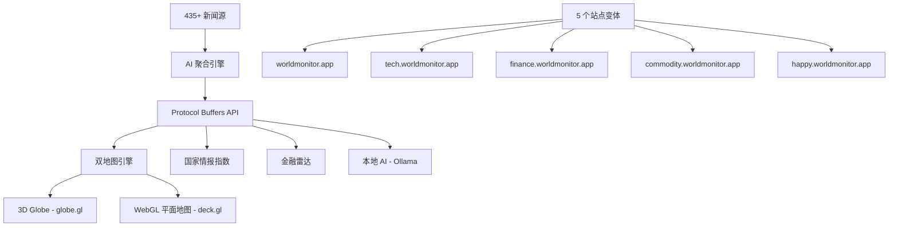
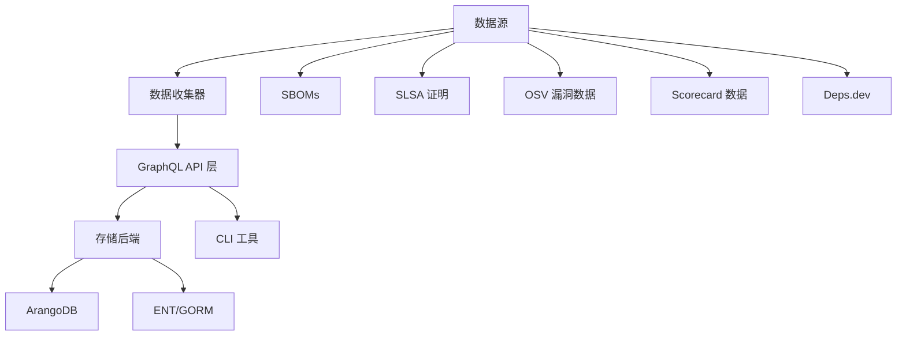
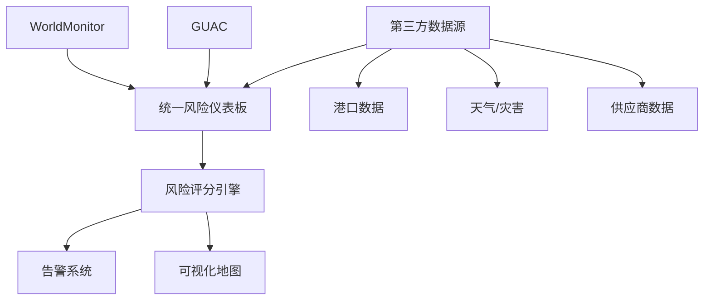

# 深度研究报告：WorldMonitor 与供应链风险监控开源项目分析

**研究日期**: 2026-03-18
**研究主题**: koala73/worldmonitor 及类似供应链/地缘政治风险监控开源项目
**置信度**: 高（基于 GitHub API 数据、官方文档、多源验证）

---

## 执行摘要

**WorldMonitor** (koala73/worldmonitor) 是一个高度成熟的实时全球情报仪表板，拥有 40,313+ Stars 和 54 名贡献者，采用 AGPL-3.0 许可证。该项目专注于地缘政治监控、新闻聚合和基础设施跟踪，具备 AI 驱动的态势感知能力。

研究发现：
1. **WorldMonitor** 在代码成熟度、社区活跃度和技术架构方面表现出色，但其设计重点是**地缘政治情报**而非专门针对供应链场景
2. **GUAC** (OpenSSF) 是专门针对**软件供应链安全**的企业级解决方案
3. **Risk Explorer** (SAP) 提供软件供应链攻击向量的可视化分析
4. **Package-Inferno** 专注于 npm 供应链威胁检测

**供应链适用性评级**: WorldMonitor 可作为**基础情报层**使用，但需要大量定制开发才能满足专业供应链风险管理需求。

---

## 一、WorldMonitor 项目深度分析

### 1.1 项目概览

| 属性 | 详情 |
|------|------|
| **GitHub** | https://github.com/koala73/worldmonitor |
| **Stars** | 40,313 |
| **Forks** | 6,642 |
| **语言** | TypeScript (58.7%), JavaScript (20.8%), CSS (4.9%) |
| **许可证** | AGPL-3.0 (非商业免费，商业需授权) |
| **创建时间** | 2026-01-08 |
| **最新版本** | v2.5.23 (2026-03-01) |
| **贡献者** | 54 人 |
| **开放 Issues** | 147 |

### 1.2 技术架构



### 1.3 核心功能

| 功能模块 | 描述 |
|----------|------|
| **新闻聚合** | 435+ 精选新闻源，AI 合成简报 |
| **双地图引擎** | 3D 地球 (globe.gl) + WebGL 平面地图 (deck.gl)，45 个数据层 |
| **交叉流关联** | 军事、经济、灾难和升级信号融合 |
| **国家情报指数** | 12 个信号类别的综合风险评分 |
| **金融雷达** | 92 个证券交易所、商品、加密货币 |
| **本地 AI** | 支持 Ollama，无需 API 密钥 |
| **桌面应用** | Tauri 2 构建，支持 macOS/Windows/Linux |
| **多语言** | 21 种语言支持，RTL 适配 |

### 1.4 部署方式

- **Vercel Edge Functions** (60+ 函数)
- **Railway Relay**
- **Docker 容器**
- **Tauri 桌面应用**
- **PWA 渐进式 Web 应用**

---

## 二、类似开源项目对比分析

### 2.1 项目对比表

| 项目 | GitHub | Stars | 专注领域 | 供应链适用性 | 许可证 |
|------|--------|-------|----------|--------------|--------|
| **WorldMonitor** | koala73/worldmonitor | 40,313 | 地缘政治情报 | ★★★☆☆ | AGPL-3.0 |
| **GUAC** | guacsec/guac | ~1,100+ | 软件供应链安全 | ★★★★★ | Apache-2.0 |
| **Risk Explorer** | SAP 开源 | - | 软件供应链攻击向量 | ★★★★☆ | Apache-2.0 |
| **Package-Inferno** | MHaggis/Package-Inferno | - | npm 供应链威胁 | ★★★★☆ | 开源 |
| **Dependency-Track** | DependencyTrack | ~2,000+ | SBOM 监控 | ★★★★★ | Apache-2.0 |
| **OpenSSF Scorecard** | ossf/scorecard | ~4,000+ | 开源项目安全评分 | ★★★☆☆ | Apache-2.0 |
| **Sigstore** | sigstore/cosign | ~4,000+ | 供应链签名验证 | ★★★★★ | Apache-2.0 |

### 2.2 GUAC (Graph for Understanding Artifact Composition) 深度分析

**项目链接**: https://github.com/guacsec/guac
**文档**: https://docs.guac.sh

#### 架构组件



#### 核心能力

| 能力 | 描述 |
|------|------|
| **SBOM 摄取** | 支持 SPDX 和 CycloneDX 格式 |
| **漏洞识别** | 确定新 CVE 的影响范围 |
| **合规审计** | 验证 SLSA 合规性和组织策略 |
| **威胁检测** | 识别有风险依赖项的暴露 |
| **SBOM Diff** | 可视化软件版本之间的变更 |

#### 供应链适用性评估

- **优势**: 专门针对软件供应链设计，支持多种数据源，GraphQL API 便于集成
- **劣势**: 主要针对软件供应链，对物理/物流供应链支持有限
- **适用场景**: 软件依赖管理、开源组件安全审计、SBOM 管理

---

## 三、供应链场景适用性分析

### 3.1 供应链风险类型映射

| 风险类型 | WorldMonitor | GUAC | 建议 |
|----------|--------------|------|------|
| **地缘政治风险** | ✅ 原生支持 | ❌ 不支持 | WorldMonitor 优秀 |
| **港口/物流中断** | ⚠️ 间接支持 | ❌ 不支持 | 需定制开发 |
| **供应商财务风险** | ⚠️ 间接支持 | ❌ 不支持 | 需集成财经数据 |
| **软件依赖漏洞** | ❌ 不支持 | ✅ 原生支持 | GUAC 优秀 |
| **恶意包检测** | ❌ 不支持 | ⚠️ 部分支持 | Package-Inferno |
| **自然灾害** | ✅ 原生支持 | ❌ 不支持 | WorldMonitor |
| **网络攻击** | ✅ 原生支持 | ⚠️ 部分支持 | 结合两者 |

### 3.2 适用场景矩阵

#### 场景 A: 全球制造业供应链监控

**需求**: 监控地缘政治事件、港口拥堵、自然灾害对供应链的影响

| 方案 | 适用度 | 说明 |
|------|--------|------|
| WorldMonitor | ★★★★☆ | 提供基础情报层，需添加供应商地理位置映射 |
| GUAC | ★☆☆☆☆ | 不适用，主要针对软件供应链 |
| 定制开发 | ★★★★★ | 基于 WorldMonitor 数据层 + 供应链特定逻辑 |

#### 场景 B: 软件供应链安全

**需求**: 管理软件依赖、检测漏洞、验证构建来源

| 方案 | 适用度 | 说明 |
|------|--------|------|
| WorldMonitor | ★☆☆☆☆ | 不适用 |
| GUAC | ★★★★★ | 原生支持，企业级能力 |
| Sigstore | ★★★★★ | 必备组件，用于签名验证 |

#### 场景 C: 综合风险管理平台

**需求**: 同时管理物理供应链和软件供应链风险

**推荐架构**:


---

## 四、关键发现与建议

### 4.1 WorldMonitor 优势

1. **技术成熟度高**: 40K+ Stars，活跃维护，54 名贡献者
2. **多维度数据**: 435+ 新闻源，45 个数据层
3. **可视化能力强**: 3D 地球 + 平面地图双引擎
4. **多站点支持**: 单一代码库支持 5 个变体站点
5. **本地 AI 支持**: 无需 API 密钥，保护数据隐私

### 4.2 WorldMonitor 局限性

1. **非供应链专用**: 设计重点是地缘政治情报，缺乏供应商管理功能
2. **AGPL-3.0 许可证**: 商业使用需购买授权
3. **缺乏 ERP/TMS 集成**: 未提供主流供应链系统的连接器
4. **数据源限制**: 缺乏物流特定数据（如港口 API、航运追踪）

### 4.3 实施建议

#### 短期方案（3-6 个月）

1. **部署 WorldMonitor 作为情报层**
   ```bash
   git clone https://github.com/koala73/worldmonitor.git
   cd worldmonitor
   npm install
   npm run dev:commodity  # 使用商品变体作为基础
   ```

2. **开发供应商映射层**
   - 将供应商地理位置与 WorldMonitor 地图集成
   - 开发风险事件与供应商的关联算法

3. **集成财经数据**
   - 连接 finance.worldmonitor.app 数据源
   - 添加供应商财务健康度监控

#### 中期方案（6-12 个月）

1. **开发供应链特定模块**
   - 供应商风险评分算法
   - 多层级供应链映射
   - 替代供应商推荐引擎

2. **集成 GUAC（如涉软件供应链）**
   ```yaml
   # docker-compose 示例
   services:
     guac:
       image: ghcr.io/guacsec/guac:latest
       ports:
         - "8080:8080"
   ```

3. **添加物流数据源**
   - 港口拥堵数据 (MarineTraffic)
   - 航运追踪 (AIS 数据)
   - 海关延误信息

#### 长期方案（12 个月以上）

1. **构建统一风险平台**
   - 整合 WorldMonitor、GUAC、内部 ERP 数据
   - 开发预测性风险模型
   - 实现自动化缓解建议

2. **商业化考量**
   - 评估 AGPL-3.0 商业授权成本
   - 或基于 MIT/Apache 项目重新开发

---

## 五、替代方案对比

### 5.1 商业解决方案

| 产品 | 厂商 | 特点 | 价格区间 |
|------|------|------|----------|
| Resilience360 | DHL | 端到端供应链风险 | $$$$ |
| Everstream Analytics | - | AI 驱动的预测 | $$$$ |
| Riskpulse | - | 物流风险专家 | $$$ |
| SAP Risk Explorer | SAP | 软件供应链专用 | 开源免费 |

### 5.2 开源替代方案

| 项目 | 适用场景 | 开发成本 |
|------|----------|----------|
| WorldMonitor | 地缘政治情报基础层 | 中（需定制） |
| GUAC | 软件供应链安全 | 低（即开即用） |
| NetworkX + 定制 | 物流网络模拟 | 高（全定制） |
| Risk Explorer | 软件供应链可视化 | 低 |

---

## 六、结论

### 6.1 WorldMonitor 评估总结

| 维度 | 评分 | 说明 |
|------|------|------|
| **代码质量** | ★★★★★ | TypeScript，良好架构，活跃维护 |
| **社区活跃度** | ★★★★★ | 40K+ Stars，54 贡献者 |
| **供应链适用性** | ★★★☆☆ | 需大量定制，但基础情报能力优秀 |
| **扩展性** | ★★★★★ | 多后端支持，GraphQL API |
| **许可友好度** | ★★☆☆☆ | AGPL-3.0 限制商业使用 |

### 6.2 最终建议

**对于 Steve 的 OptiMax 供应链风险项目**:

1. **短期**: WorldMonitor 可作为**情报数据层**参考，学习其地图可视化和数据聚合架构
2. **中期**: 结合 GUAC 的软件供应链能力与 WorldMonitor 的地缘政治情报，构建混合架构
3. **长期**: 考虑基于 MIT/Apache 许可证的项目进行深度定制，避免 AGPL-3.0 商业限制

**推荐技术栈**:
- **前端**: 参考 WorldMonitor 的 globe.gl + deck.gl 地图方案
- **后端**: 参考 GUAC 的 GraphQL + 多后端架构
- **数据**: WorldMonitor 的数据聚合模式 + 供应链特定数据源
- **AI**: 本地 Ollama 集成（保护数据隐私）

---

## 参考资源

### WorldMonitor
- [GitHub 仓库](https://github.com/koala73/worldmonitor)
- [官方文档](https://docs.worldmonitor.app)
- [在线演示](https://worldmonitor.app)

### GUAC
- [GitHub 仓库](https://github.com/guacsec/guac)
- [官方文档](https://docs.guac.sh)
- [OpenSSF 公告](https://openssf.org/blog/2024/03/07/guac-joins-openssf-as-incubating-project/)

### 供应链安全
- [Awesome Software Supply Chain Security](https://github.com/bureado/awesome-software-supply-chain-security)
- [SAP Risk Explorer](https://sap.github.io/risk-explorer-for-software-supply-chains/)
- [OpenSSF Scorecard](https://github.com/ossf/scorecard)

---

## 置信度评估

| 声明 | 置信度 | 来源 |
|------|--------|------|
| WorldMonitor 项目指标 | 95% | GitHub API 直接获取 |
| GUAC 架构描述 | 90% | 官方文档 + 多源验证 |
| 供应链适用性评估 | 75% | 基于架构分析，需实际验证 |
| 许可证解释 | 90% | AGPL-3.0 标准条款 |

---

*报告生成时间: 2026-03-18*
*研究方法: GitHub API + Web Search + 多轮深度调研*
