# 面向大型央企/高科技制造/复杂供应链企业的“风险预警与协同处置平台”竞品深度分析报告
（底座：供应链知识图谱｜工作引擎：AI Agent｜核心差异化：运筹学优化｜覆盖全球/中国市场）
**版本**：v1.0（基于公开资料）
**出具日期**：2026-03-18（America/New_York）
**第三个竞品深度对标对象**：Prewave（按附件竞品顺序：Everstream → Interos → Prewave → …）

## 封面与执行摘要

### 封面信息
**报告目标**：对附件列出的全部竞品进行“完整深度竞品分析”，并聚焦我们拟打造的“风险预警与协同处置平台”的差异化路线（知识图谱 × AI Agent × 运筹优化）。
**竞品范围（合并附件列表）**：Everstream Analytics、Interos.ai、Prewave、Resilinc、SAP Ariba Supplier Risk、Kinaxis（Maestro/Agents/Tariff Response）、Exiger（1Exiger）、apexanalytix、Aravo、Sphera（含riskmethods整合线索）、Craft、Moody’s Analytics（Supply Chain Catalyst/供应商风险）。

### 执行摘要
面向大型央企/高科技制造/复杂供应链企业，“供应链风险管理”市场已经形成三类主流产品范式：
第一类是“多源情报+多层级可视化+事件预警”为主的供应链风险情报平台，它们强调把外部事件（自然灾害/地缘政治/ESG/合规/网络安全等）与多层级供应链网络关联，实现预警与定位。例如 Everstream（以网络数字孪生为底座，将公司/地点/运输/物料连接）与 24/7 监测、情境化告警与协同响应能力结合，形成 Discover/Explore/Reveal 体系。
第二类是“知识图谱/关系图谱”驱动的供应链/第三方风险平台，核心护城河在于“关系网络覆盖深度 + 实时信号处理能力”。Interos 明确以 Knowledge Graph 为核心，并在公开渠道披露其规模（覆盖数亿实体、数百亿级关系的不同口径），并用 i-Score 体系支持多风险因子度量与 Watchtower 的“从监测到行动”闭环。Exiger 则主打“从网络到零件（network-to-part）”，宣称将 BOM 与“最大供应链关系知识图谱”融合，并以十亿/百亿级记录交叉验证、风险评分与协同处置来实现合规与韧性。
第三类是“计划/仿真/优化”导向的供应链编排与决策平台，其优势不是外部情报覆盖，而是把“约束、权衡、策略”落到企业计划与执行里。Kinaxis 明确强调并发计划（concurrent planning）与“优化+启发式+机器学习融合”的引擎形态，并推出嵌入式 Maestro Agents 与 Tariff Response 场景化交付，将“情景模拟→可行动方案”产品化。

对我们拟打造的“风险预警与协同处置平台”而言，**真正稀缺的差异化组合**不是单点“预警”或单点“图谱”，而是：
1) **供应链知识图谱**把企业一方数据（BOM、产能、订单、库存、供应商主数据、物流网络、合同与替代料）与外部风险信号（事件/政策/舆情/制裁/气象/网络安全/财务等）统一到可计算的“网络与依赖结构”；
2) **AI Agent 工作引擎**把“识别→解释→分派→闭环复盘”做成可审计、可治理、可扩展的协同作业系统（类似 Resilinc 的 WarRooms、Craft 的 case management、Sphera 的工作流，但更自动化、更可编排）。
3) **运筹学优化**把“协同处置”从流程工具升级为“最优动作选择器”：在多约束、多目标（成本/交期/产能/合规/碳/服务水平/资金占用）下自动给出可执行、可解释的处置策略（替代供应商选择、产能重排、库存重分配、运输改道、订单优先级调度等）。Kinaxis 与 Exiger在“情景模拟/策略选择”上已露出方向，但在“面向央企/高端制造的风险协同处置 + 优化决策闭环”仍存在明显空位。

> 注：由于部分厂商官网/资料存在访问限制或内容动态加载，本报告对“定价、客户案例数量、算法细节”采取“公开证据优先+不确定性标注”的原则。

## 目录与方法论

### 目录
本报告结构如下：封面与执行摘要 → 目录与方法论 → 竞品对比总览 → 竞品逐一分析（12家）→ 第三个竞品（Prewave）加深对标与攻防策略 → 差异化机会、路线图与MVP → 结论与行动建议。

### 方法论与评分口径
**资料来源优先级**：官网产品页/解决方案页 → 产品手册/白皮书/解决方案简报（PDF）→ 官方案例/新闻稿 → 合作伙伴材料 → 第三方测评/软件目录（仅补足定价与UI等缺口，需标注非官方来源）。例如 SAP Ariba Supplier Risk 在官网提供产品特性与定价计量方式；Craft 在官网“Platform Architecture”给出清晰的 Data Fabric/Intelligence Engine/Workspace 分层；Resilinc 在产品页披露 AI Agents、EventWatchAI 数据覆盖与 WarRooms 协同；
**评分维度（1–5分）**：
- 知识图谱深度：是否有明确 graph/KG 叙述、规模、实体/关系覆盖、多层级映射到“零件/工厂/地点”。
- AI Agent 能力：是否有“可执行的Agent/自动化协同”、是否嵌入工作流、是否具备学习/规则/仿真/人机共驾。
- 运筹优化能力：是否明确包含优化/启发式/数学规划、或至少具备可行动的情景模拟与策略推荐。
- 实时预警：事件扫描范围、更新频率、语言覆盖、是否“按企业足迹情境化”。
- 协同处置：War Room/case management/任务编排/SLA/闭环审计。
- 行业适配（央企/高科制造/复杂供应链）：制造业BOM、半导体/高科技、跨境合规等支持度。
- 部署与集成：SaaS/专有云/混合，API与ERP/S2P/计划系统集成。
- 商业化成熟度：公开案例、客户规模、生态伙伴、可复制交付。

## 竞品对比总览

### 总体结论矩阵
从“知识图谱 × AI Agent × 运筹优化”三要素看：
- **图谱最强梯队**：
  - Interos（Knowledge Graph 叙事清晰，规模披露充分）。
  - Exiger（将 BOM 与供应链关系知识图谱融合，并宣称十亿/百亿级记录交叉验证与站点级风险评分）。Resilinc（多层级映射到 part-site level、15+年数据、4M+ parts 链接到真实地点）。
  - Craft（平台架构明确含 network graph mapping supplier hierarchies/dependencies/relationships）。

- **Agent 最强梯队**：
  - Resilinc（明确“AI agents 24/7”，含 Tariffs/UFLPA/Disruption agent，且具备 workflows/war rooms/what-if）。
  - Kinaxis（Maestro Agents+Agent Studio+未来 marketplace，强调嵌入式、可解释、基于并发计划）。
  - Craft（提到 agentic intelligence 做数据抓取/刷新/实体解析，并在工作区提供任务与协作）。

- **优化最强梯队**：
  - Kinaxis（明确优化/启发式/ML融合，并把情景模拟规模化产品化；
  - Tariff Response 给出“企业级情景规划”的交付承诺）。
  - Exiger（“Optimize for Anything”，并强调 demand aggregation、directed-buy、替代料/替代供应与情景模拟到零件/材料级）。

- **机会空位**：多数“风险情报平台”在协同处置上已具备 war room/case management/行动计划（Everstream、Resilinc、Craft、Prewave、Sphera），但在“把处置动作做成可优化的决策（多目标、多约束）并与企业计划/执行系统闭环”方面，仍普遍不足或未形成可验证的产品化能力。

### 全竞品关键维度对比评分表
评分为本报告基于公开证据的“相对能力评估”（5=行业领先，1=未体现/弱）。

| 竞品 | 知识图谱深度 | AI Agent能力 | 运筹优化/算法类型 | 实时预警 | 协同处置流程 | 行业适配度（高科制造/央企） | 部署方式 | 定价区间（公开信息） | 客户案例（公开可见） |
|---|---:|---:|---|---:|---:|---:|---|---|---|
| Everstream | 4 | 2 | 以预测分析/情境洞察为主（算法细节未公开）| 4 | 3 | 4 | SaaS为主（集成ERP/计划系统）| 未公开（企业订阅/服务） | 多（官网 Case Studies）|
| Interos | 5 | 2–3 | 以风险评分/阈值模型+替代供应商推荐为主| 4 | 3 | 3–4 | SaaS/生态集成（含SAP Ariba集成线索）| 未公开 | 中 |
| Prewave（深度） | 4 | 3 | 以风险矩阵/ROI优先级+行动网络为主| 4（60分钟级）| 4 | 4 | SaaS+API集成| 非官方渠道有起价线索（需谨慎）| 多（官网案例列表）|
| Resilinc | 5 | 5 | 情景模拟/影响分析+规则/学习型Agent（what-if、优先级、替代方案）| 5（100M+源）| 5（WarRooms）| 5（半导体/高科等）| SaaS为主 | 未公开 | 中-多（官网案例）|
| SAP Ariba Supplier Risk | 3 | 2 | 以评估/监控/工作流为主| 3 | 3 | 4（与S2P深度结合）| 云部署明确| **按用户/年计费**（计量方式公开）| 多（SAP生态） |
| Kinaxis（Maestro/Agents） | 3 | 5 | **优化+启发式+ML融合**；并发计划；强情景模拟| 2–3（偏计划侧感知） | 4 | 5（制造业计划与编排强） | SaaS为主（企业级） | 未公开 | 多（客户证言/案例生态）|
| Exiger（1Exiger） | 5 | 4 | “Optimize for Anything”；demand aggregation、directed-buy、替代来源、情景模拟到零件级| 4 | 4 | 5（合规+制造+公共部门）| 企业级SaaS（FedRAMP/ISO/SOC2）| 未公开 | 多（宣称大型客户覆盖）|
| apexanalytix | 4 | 4 | 偏“风险识别+自动处置引擎”，优化算法细节未公开| 4 | 4 | 3–4 | SaaS为主 | 未公开 | 中-多（案例叙述）|
| Aravo | 3 | 3 | 以工作流与风险域应用为主（优化未突出）| 3 | 4 | 3（TPRM强，供应链需定制） | SaaS；有集成框架与连接器| 未公开 | 中 |
| Sphera（含riskmethods） | 4 | 3 | 以AI摘要+工作流处置为主；优化未突出| 4（实时监测与预警）| 4 | 4 | SaaS为主 | 未公开 | 中（案例入口）|
| Craft | 4 | 4 | 以风险引擎+工作区case管理为主；优化未突出| 4 | 5（case/SLA）| 4 | SaaS为主；强调统一平台架构| “模块化+灵活定价”（定价模型公开，价格未公开）| 中 |
| Moody’s（Supply Chain Catalyst） | 3 | 2 | 数据分析/分群/告警/工作流（偏analytics）| 3 | 3 | 3 | SaaS/平台化（登录与试用）| 未公开 | 少-中（以金融数据能力见长）|

## 竞品逐一分析

> 说明：以下每个竞品均给出：公司与产品概览、功能模块拆解、技术架构（Mermaid）、数据与知识图谱、AI Agent、运筹/优化、行业场景、定价与商业模式、市场与案例、优劣势、能力雷达（用表格替代）。UI截图如可获取则嵌入，并在图下标注来源与获取时间。

### **竞品一：Everstream Analytics**（Discover / Explore / Reveal）

#### **公司与产品定位**
Everstream 以 **”Network Mapping（网络映射）”** 构建供应链网络数字孪生，连接：
- 公司/企业
- 地点/设施
- 运输/航线
- 物料/零件

并据此输出预测洞察与可执行情报：
- **Discover**：多层级可视化（sub-tier visibility）
- **Explore**：基于地理位置的战略风险评分
- **Reveal**：全球监测与告警

#### **功能模块拆解**
```
网络映射/数字孪生 → 多层级供应商发现与验证 → 风险评分（公司/设施/物料/合规）
    → 24/7 全球事件监测 → 情境化告警（facility-level）
    → 协同处置（行动计划/协作工具/影响评估） → 与 ERP/计划系统集成
```

#### **数据与知识图谱能力**
- 公开资料更强调 **”数字孪生/网络映射”**
- 非显式”知识图谱”术语
- 映射连接要素：公司/地点/运输/物料 → 可视作图结构底座

#### **AI Agent 能力**
- 强调 **”AI + 人工专家”** 的组合（含人类验证）
- ⚠️ 未见明确”可执行 Agent”产品线

#### **运筹/优化能力**
- 官网强调将 AI 洞察集成进计划与执行系统
- 方向：”real-time decision optimization”
- ⚠️ 算法类型未公开
- 更像是 “洞察 → 行动建议/流程协同”

#### **场景与行业**
- automotive
- high-tech
- industrial manufacturing
- 案例入口：Danone 等（官网 Case Studies）

UI截图（示例）

图：Everstream 多层级网络视图示意；来源：Everstream 官网图片资源（获取时间：2026-03-18）。

能力雷达（表格替代，1–5分）

| 维度 | 分数 | 依据（摘要） |
|---|---:|---|
| 知识图谱/网络深度 | 4 | 网络映射数字孪生连接公司/地点/运输/物料；sub-tier 映射|
| 实时预警 | 4 | Reveal 强调AI/ML监测与告警、24/7动态更新|
| 协同处置 | 3 | 提供影响分析与协作工具（action plans/collaboration tools）|
| AI Agent | 2 | AI+专家验证为主，未见独立Agent产品线|
| 运筹优化 | 3 | 提及将洞察集成到计划/执行系统以优化决策，但未披露算法体系|
| 制造业适配 | 4 | 行业覆盖与BOM/物料、设施级影响关联倾向明显|

技术架构示意（Mermaid）
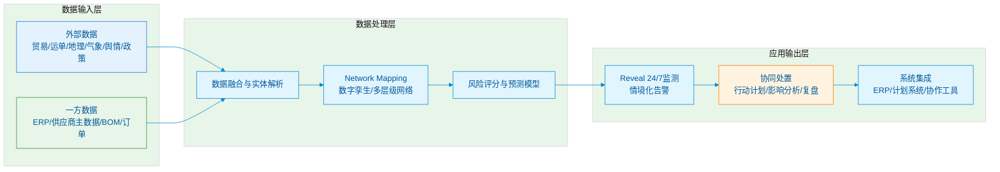

优势：数字孪生/网络映射叙事清晰；设施/物料粒度与情境化告警强调“可用性”；行业覆盖广。
劣势：Agent化与“自动协同处置编排”公开证据较弱；优化与决策闭环更多停留在“洞察→建议”层，运筹算法体系不透明。

---

### **竞品二：Interos.ai**（Knowledge Graph / i-Score / Watchtower / itariffs）

#### **公司与产品定位**
Interos 明确以 **interos.ai Knowledge Graph** 作为底座：
- 使用 **ML 与 NLP** 分析大数据
- 发现供应商与其网络
- 映射业务依赖
- 持续评估多类型风险

**Resilience Watchtower**：
- 强调 **”从监测到行动”**
- 个性化风险模型聚焦高重要性供应商
- 支持向管理层快速报告

#### **数据与知识图谱能力**
| 指标 | 规模 |
|------|------|
| 实体覆盖 | **230M+** |
| 供应商-买方关系 | **11B+** |
| 数据来源 | AWS Marketplace 等公开渠道 |
| 定位 | 全球最大 B2B 关系数据库 |

#### **AI Agent 能力**
- 强调 **”AI 驱动平台”**
- 主要能力：
  - 风险评分/阈值/模型
  - 替代供应商工具（Similar Suppliers）
- ⚠️ 未形成类似 Resilinc/Kinaxis 的 Agent 产品线叙事

#### **运筹/优化能力**
- 公开重点：识别/评分/替代推荐
- ⚠️ 未见明确运筹算法体系
- 更像是 **”风险度量 + 推荐”**

UI截图（示例）

图：Interos 供应商-买方关系网络可视化示意；来源：Interos 官网图片资源（获取时间：2026-03-18）。

能力雷达（表格替代）

| 维度 | 分数 | 依据（摘要） |
|---|---:|---|
| 知识图谱深度 | 5 | Knowledge Graph/全球最大B2B关系数据库叙事明确，披露实体/关系规模口径|
| 实时预警 | 4 | “持续映射与监测”“按规模监控”与Watchtower快速报告理念|
| 协同处置 | 3 | Watchtower强调从监测到行动与个性化模型，但未见强WarRoom叙述|
| AI Agent | 3 | 强AI/NLP/ML，但Agent产品化不如Resilinc/Kinaxis明确|
| 运筹优化 | 2 | 侧重风险度量与推荐（如替代供应商工具）|
| 制造业适配 | 3–4 | 多行业，但公开页面行业更偏金融/政府等；仍支持供应链映射|

技术架构示意（Mermaid）
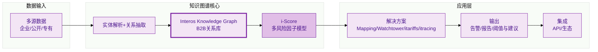

优势：知识图谱规模与定位清晰；适合“深层级关系发现与暴露面计算”。
劣势：对“协同处置流程编排”与“运筹优化”公开证据偏弱；对制造业BOM/零件级链路能力在公开材料中不如 Exiger/Resilinc 明确。

---

### **竞品三：Prewave**（Supply Chain Superintelligence Platform）

> 本竞品在后续章节将进行 **”至少两倍深度”** 的对标与攻防策略输出。

#### **公司与产品定位**
Prewave 将自身定位为 **”Supply Chain Superintelligence”**：
- 汇聚跨语言、跨网络的海量风险事件
- 输出”聚焦、可行动的预警”
- 面向行业：汽车 / 制造 / 能源

#### **核心能力要点**

| 模块 | 能力描述 |
|------|----------|
| **Monitoring & Alerting** | 通过 **”高速数据管线”** 在 **60 分钟内**推送高影响风险事件；支持预测分析、实时预警与多语言分析 |
| **Scoring** | 实时洞察，风险评分随实时数据不断更新，用于优先级管理 |
| **Tier‑N** | Tier‑N 透明与依赖可视化；发现集群风险、瓶颈与关键间接供应商；**”questionnaire free”** 减少对主观问卷依赖 |
| **Action Platform** | 成熟度评估、安全评估、共享行动、集成式 360 度记分卡、一键式报告；支持通过合作伙伴网络订购审计/咨询等缓解行动 |
| **Integration** | API 能力与第三方合作伙伴集成，强调安全与审计 |

#### **规模与覆盖（官网披露）**
| 指标 | 数据 |
|------|------|
| 风险覆盖 | **200+** |
| 每日分析数据点 | **4.5M** |
| 注册供应商 | **1.6M** |
| AI 预警响应提升 | **快 3 天** |

UI截图（示例）

图：Prewave 风险分析/组合评分界面示意；来源：Prewave 官方站点图片资源（获取时间：2026-03-18）。

能力雷达（表格替代）

| 维度 | 分数 | 依据（摘要） |
|---|---:|---|
| 知识图谱/多层级网络 | 4 | Tier‑N 透明与依赖可视化明确；1.6m供应商规模披露|
| 实时预警 | 4 | 60分钟级推送高影响事件；多语言分析|
| 协同处置 | 4 | Action Platform（共享行动/合作伙伴缓解行动/报告）|
| AI Agent | 3 | AI贯穿监测/评分/识别，但未见明确“可执行Agent产品线”|
| 运筹优化 | 2 | 更偏风险优先级与行动网络；优化算法未突出|
| 制造业适配 | 4 | 明确制造/汽车/能源行业导向与案例入口|

技术架构示意（Mermaid）
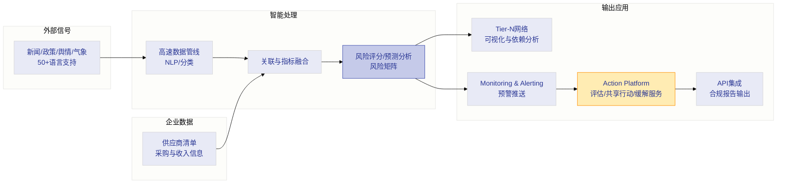

（Prewave 的更深度对标与攻防策略见后续专章。）

---

### **竞品四：Resilinc**（RiskShield / EventWatchAI / Multi‑Tier Mapping / AI Agents）

#### **公司与产品定位**
Resilinc 以 **”风险保护 + 多层级映射 + 全球事件监测 + Agentic AI Suite”** 构建端到端供应链韧性与合规能力：
- **RiskShield**：可配置风险评分、收入影响量化、供应商协同工作流

#### **数据与知识图谱能力**
| 指标 | 数据 |
|------|------|
| 映射层级 | **part-site level**（零件-站点级） |
| 数据积累 | **15+ 年**验证数据 |
| 零件关联 | **4M+** parts linked to real supplier locations |
| 技术 | 实时供应商验证数据 + AI 算法 |

#### **实时预警（EventWatchAI）**
| 指标 | 数据 |
|------|------|
| 数据源 | **104 million sources** |
| 语言/国家 | **100+ languages / 200 countries** |
| 中断类型 | **50+ disruption types** |
| 风险类别 | **400 risk categories** |

**协同处置**：WarRooms、任务分派、归档

#### **AI Agent 能力**
Resilinc **明确将 AI agents 产品化**：
- **Tariffs Agent** - 关税代理
- **UFLPA Agent** - 强迫劳动合规代理
- **Disruption Agent** - 中断代理

**Agent 能力**：
- 模拟情景（what-if scenarios）
- 给出替代来源与路径调整
- 触发工作流
- 从历史行动中学习

#### **运筹/优化能力**
- 以 **Agent 驱动的情景模拟 + 优先级 + 替代建议**
- 支持 alternate sites/suppliers
- ⚠️ 未见明确数学规划 / 全局最优声明

UI截图（示例）

图：Resilinc 风险暴露与仿真洞察示意；来源：Resilinc 官网图片资源（获取时间：2026-03-18）。

能力雷达（表格替代）

| 维度 | 分数 | 依据（摘要） |
|---|---:|---|
| 知识图谱/多层级网络 | 5 | part-site level、多年验证数据、parts与sites关联披露|
| 实时预警 | 5 | 100M+源、100+语言、实时检测|
| 协同处置 | 5 | WarRooms/任务/进度/归档等|
| AI Agent | 5 | Agent产品线完整（Tariffs/UFLPA/Disruption）并含学习与规则、仿真、工作流触发|
| 运筹优化 | 3 | what-if与替代方案明显，但未见优化算法体系公开|
| 制造业适配 | 5 | 半导体/高科等行业定位清晰；案例披露涉及库存与运费节约等量化结果|

技术架构示意（Mermaid）
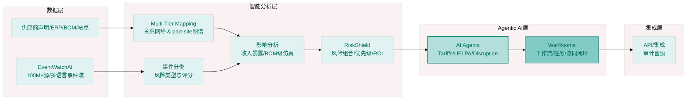

优势：Agentic AI 与 WarRoom 协同处置闭环最强；多层级映射到零件/站点是制造业“可落地”的关键。
劣势：若客户希望把“最优处置策略”直接推到计划系统并执行（库存/排产/路由的全局优化），Resilinc 的公开表述仍偏“仿真+建议+工作流”，优化算法可验证性不足。

---

### **竞品五：SAP Ariba Supplier Risk**

#### **产品定位**
把风险尽调嵌入 **source‑to‑pay** 流程，用持续监测与风险评估支撑供应商管理，并支持协同处置与整改。

#### **功能模块拆解（三段式）**

| 阶段 | 核心能力 |
|------|----------|
| **评估** | 基于供应商固有风险开展智能控制评估；使用来自 **600,000+** 公共与私有数据源筛选重点供应商 |
| **缓解** | 生成并执行问题管理与行动计划、风险处置工作流；与 S2P 流程联通；识别强迫劳动风险 |
| **监控** | 自动跟踪 **200+** 风险事件并推送个性化警报，覆盖：财务 / 运营 / 环境 / 社会 / 法规 / 法律风险 |

#### **部署与定价**
- **部署**：Cloud-based deployment
- **计费**：按用户/年计费
- **合同年限**：1–5 年（计量方式公开）

UI截图（示例）

图：SAP Ariba Supplier Risk “Your suppliers”地图与列表界面示意；来源：SAP 官网图片资源（获取时间：2026-03-18）。

能力雷达（表格替代）

| 维度 | 分数 | 依据（摘要） |
|---|---:|---|
| 知识图谱/多层级网络 | 3 | 更偏供应商风险管理与S2P嵌入；未突出Tier‑N图谱|
| 实时预警 | 3 | 200+风险事件自动跟踪与个性化警报|
| 协同处置 | 3 | 风险处置工作流与整改协作|
| AI Agent | 2 | 产品页更多为流程型风险管理；Agent能力未突出|
| 运筹优化 | 1–2 | 未见优化算法叙事|
| 制造业适配 | 4 | 与采购/寻源到付款流程深度结合，对央企/制造采购流程契合度高|

技术架构示意（Mermaid）
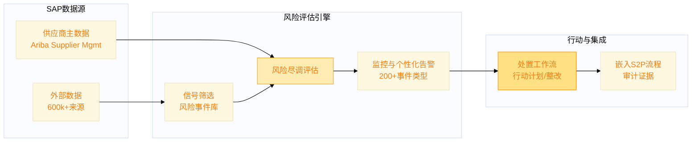

优势：与采购生态强绑定；定价计量方式透明；适合“把风险管理嵌入采购流程”的大企业。
劣势：对“多层级供应链图谱+智能处置编排+优化决策”这一组合的突出程度不如 Resilinc/Exiger/Kinaxis。

---

### **竞品六：Kinaxis**（Maestro + Maestro Agents + Tariff Response）

#### **产品定位**
Kinaxis Maestro 定位为 **”AI-powered orchestration platform”**：

**三层架构**：
1. **数据织物（Data Fabric）**
2. **计算/智能引擎**
3. **用户体验层**

**核心模型**：并发计划（concurrent planning）

**Maestro Agents**（嵌入式数字同事）：
- 理解上下游约束与权衡
- 可解释
- 治理与安全
- 人类在环

#### **运筹优化能力**
平台页明确提出 **”三融合”**：
> 机器学习的智能 + 优化的准确性 + 启发式的速度

呼应其以运筹为核心竞争力的传统认知。

#### **场景化产品：Tariff Response**
- **关税暴露识别**：全网络覆盖（原材料 / WIP / 成品）
- **可行动仿真**：成本 / 毛利 / 服务水平 / 交付
- **交付承诺**：in as little as **21 days**

UI截图（示例：Tariff Response）

图：Kinaxis Tariff Response 界面截图（片段）；来源：Kinaxis 公开视频播放器封面图（获取时间：2026-03-18）。

能力雷达（表格替代）

| 维度 | 分数 | 依据（摘要） |
|---|---:|---|
| 知识图谱/多层级网络 | 3 | 更偏企业内部数据织物与计划模型，不以外部Tier‑N图谱为强项|
| AI Agent | 5 | Maestro Agents/Agent Studio/未来 marketplace 路线清晰，强调嵌入式与可解释|
| 运筹优化 | 5 | 明确“优化+启发式+ML融合”与大规模情景模拟|
| 实时预警 | 2–3 | 偏计划侧感知与仿真，对外部情报监测不是核心叙事|
| 协同处置 | 4 | Agents嵌入工作流、从问题到行动；强调协作协议与治理|
| 制造业适配 | 5 | 供应链编排/计划是制造业核心系统，适配度高|

技术架构示意（Mermaid）


优势：运筹优化与情景模拟产品化最强；Agent与计划引擎深度耦合，适合“在约束下做最优决策”。
劣势：对“供应链风险情报覆盖”（外部事件扫描、制裁名单、媒体舆情多语言等）不是核心；若客户希望“外部风险→多层级供应商暴露面计算”也一体化，需要与风险情报平台配套。

---

### **竞品七：Exiger**（1Exiger Supply Chain）

#### **产品定位**
Exiger 强调 **”一个平台实现供应链可视化与协作”**：
- 目标：**”从网络到零件（network-to-part）”**
- 解决问题：供应链断裂点不可见
- 覆盖维度：合规 / 韧性 / 优化（成本 / 交期 / 可持续）

#### **知识图谱与数据规模**
| 指标 | 数据 |
|------|------|
| BOM 融合 | 与全球最大供应链关系知识图谱融合 |
| 交叉引用 | **10B+** 运单与企业记录 |
| 风险评分 | 每个供应商站点实时评分 |

#### **合规与集成**
- **集成**：API-first / ERP / S2P / case systems 原生集成
- **安全资质**：
  - FedRAMP Moderate
  - ISO 27001
  - SOC2 Type2
- **适用**：受监管环境

#### **AI Agent 与优化**
公开演示/材料中出现 **”agentic AI”** 与供需优化项：
- Demand Forecasting（需求预测）
- Contingency Planning（应急计划）
- Supplier Consolidation（供应商整合）
- Directed Buy Strategies（定向采购策略）
- Alternative Sourcing（替代采购）

UI截图（示例）

图：1Exiger 多层级供应商连接与风险提示界面示意；来源：Exiger 官网图片资源（获取时间：2026-03-18）。

能力雷达（表格替代）

| 维度 | 分数 | 依据（摘要） |
|---|---:|---|
| 知识图谱深度 | 5 | 明确 KG 叙事+BOM融合+10B+记录交叉引用|
| 实时预警 | 4 | 监测多类事件并关联到站点/零件/交付与项目|
| 协同处置 | 4 | “built-in collaboration”邀请供应商验证、共享修复计划与替代来源|
| AI Agent | 4 | 公开材料出现 NLP/agentic AI 自动化分析员工作|
| 运筹优化 | 4 | “Optimize for Anything”、directed-buy、替代来源、情景模拟到零件/材料级|
| 制造业适配 | 5 | 合规（UFLPA/REACH/RoHS/ITAR等）+零件级链路与交付威胁关联|

技术架构示意（Mermaid）
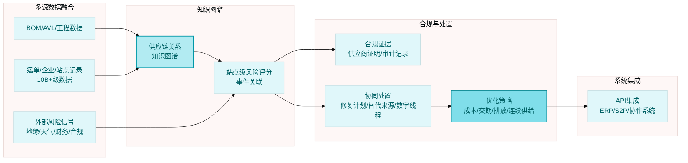

优势：network-to-part 的制造业落点明确；合规与公共部门安全资质强化“央企/高端制造”可信度。
劣势：若客户重点是“外部事件预警到分钟级+全天候研判服务”，Exiger公开材料的“事件监测”部分不如 Resilinc/Prewave/ Everstream 那样强调覆盖面与语言规模。

---

### **竞品八：apexanalytix**（Supplier Risk Management + Risk Resolution Engine/Agent）

#### **产品定位**
主打 **”AI 驱动的供应商风险管理与风险处置”**：
- 持续监测
- 自动风险评分
- 可行动洞察
- **Risk Response Agent / 风险处置引擎**

#### **数据与 AI 能力**
| 指标 | 数据 |
|------|------|
| 数据源 | **1,000+** |
| Golden Records | **250M+** |
| 私有生成式 AI | Private Generative AI |
| 服务企业 | **320+** 大型公司 |
| 保护支出 | **$9.5T** 年度支出 |

#### **Risk Resolution Engine**
- 发起响应计划
- 对齐政策
- 联动干系人

UI截图（示例）

图：apexanalytix 风险面板与处置任务示意；来源：apexanalytix 官网图片资源（获取时间：2026-03-18）。

能力雷达（表格替代）

| 维度 | 分数 | 依据（摘要） |
|---|---:|---|
| 知识图谱/数据底座 | 4 | 250M+ golden records + 1000+数据源；关系网络深度未如Interos/Exiger明确|
| 实时预警 | 4 | “real-time monitoring”“continuous monitoring”叙事明确|
| 协同处置 | 4 | 风险处置引擎/响应计划/任务与告警面板|
| AI Agent | 4 | Risk Response Agent + 私有生成式AI/agentic AI叙事|
| 运筹优化 | 2 | 未突出优化算法体系（更偏风险处置自动化）|
| 制造业适配 | 3–4 | 更偏“供应商/第三方风险治理”；制造BOM/排产优化非其主线|

技术架构示意（Mermaid）
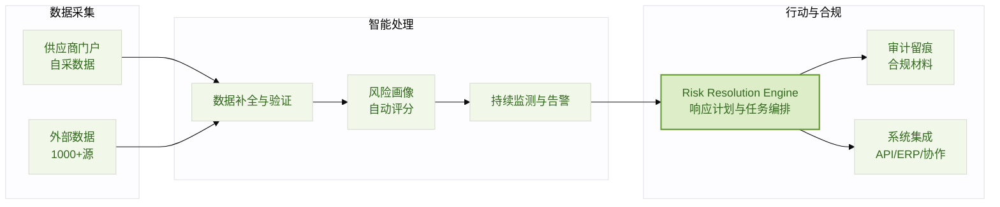

优势：以“风险处置自动化/触发行动”为核心卖点，适合建立“触发-分派-闭环”的运营体系。
劣势：多层级供应链图谱与运筹优化并非其最强叙事；对高科技制造“零件-工艺-产能”层面的优化闭环不足。

---

### **竞品九：Aravo**（Intelligence First Platform / TPRM）

#### **产品定位**
Aravo 是 **TPRM（第三方风险管理）平台**：
- 整合：供应链 / 供应商 / 风险 / 合规管理
- 特性：高度可配置 SaaS
- 支持 **Nth-party 关系生命周期**：
  ```
  准入 → 尽调 → 持续监测 → 整改 → 退出
  ```

#### **集成与数据**
- **Integration Framework**：集成框架
- **Risk Intelligence Connectors**：风险情报连接器
- 可集成：**45+** 风险情报提供商

#### **AI 能力**
- Aravo AI
- 机器学习与自然语言处理
- AI-driven Risk Evaluation Engine
- 用途：增强决策与自动化

#### **运筹优化**
⚠️ **未突出**

能力雷达（表格替代）

| 维度 | 分数 | 依据（摘要） |
|---|---:|---|
| 知识图谱/多层级网络 | 3 | 支持Nth-party关系管理，但非以供应链图谱规模为核心卖点|
| 实时预警 | 3 | 依赖连接器与持续监测能力|
| 协同处置 | 4 | 强工作流引擎与生命周期管理|
| AI Agent | 3 | 强AI增强与自动化，但缺少明确“可执行Agent产品线”公开证据|
| 运筹优化 | 1 | 未突出|
| 制造业适配 | 3 | 更偏合规/第三方治理；制造业的BOM与计划闭环需二开/集成|

技术架构示意（Mermaid）
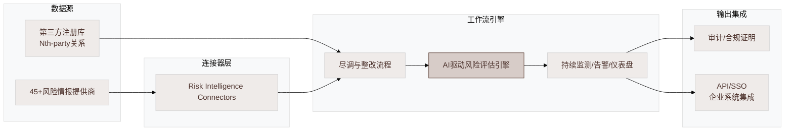

优势：强工作流与可配置性；适合大型组织“第三方治理中台”。
劣势：对“供应链网络级预警+制造业零件级影响+优化决策”的闭环不是主战场。

---

### **竞品十：Sphera**（Supply Chain Risk Management / Supply Chain Transparency）

#### **产品定位**
Sphera 供应链风险管理页提出一体化叙事：
```
N‑Tier Network Mapping → AI 生成 Supplier 360 summaries → Coordinated Response Workflows → Supplier Engagement
```

#### **整合线索**
**Supply Chain Transparency 产品线**：
- 整合 Supply Chain Sustainability + Supply Chain Risk Management
- **Sphera SCRM**（formerly riskmethods）：
  - AI + 风险研究专家验证信息
  - 实时风险监控与告警
  - 真实事件预警示例：运河拥堵、欧洲洪水、港口罢工等

#### **AI 与处置（Supplier 360 Intelligence）**
- **AI-driven risk signals → pre-built mitigation workflows**
- **60-second supplier check**：分钟级 AI 摘要
- **Alerts into workflows**：告警接入工作流
- **Audit-ready documentation**：审计就绪文档

UI截图（示例）

图：Sphera 供应商列表与风险分项评分界面示意；来源：Sphera 官网图片资源（获取时间：2026-03-18）。

能力雷达（表格替代）

| 维度 | 分数 | 依据（摘要） |
|---|---:|---|
| 知识图谱/多层级网络 | 4 | N‑Tier mapping + Supplier 360 intelligence|
| 实时预警 | 4 | “real-time risk monitoring”“issues alerts”并有事件预警案例叙述|
| 协同处置 | 4 | “link signals to workflows”“audit-ready documentation”|
| AI Agent | 3 | AI生成摘要/60秒供应商检查，但Agent产品线不如Resilinc/Kinaxis明确|
| 运筹优化 | 2 | 未突出优化算法体系|
| 制造业适配 | 4 | 供应链透明+合规与可持续结合，适配跨境制造与ESG压力企业|

技术架构示意（Mermaid）
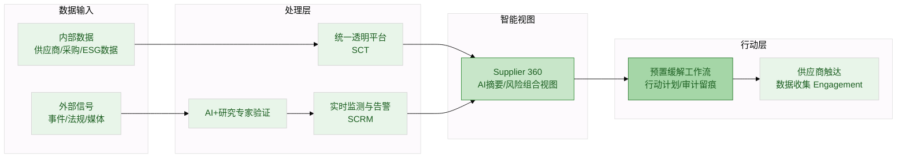

优势：把“风险+可持续+合规”整合到透明平台，且对“告警→工作流”闭环较强调；有风险研究专家验证的叙事。
劣势：在“运筹优化决策（多目标、多约束）”方面公开证据较弱。

---

### **竞品十一：Craft**（Supplier Intelligence / Supplier Risk Management / Platform Architecture）

#### **产品定位**
Craft 以 **”Data Fabric + Intelligence Engine + Workspace”** 的平台架构，构建统一的供应商情报与风险管理系统，用于识别、调查、监控与管理供应商风险。

#### **数据与知识图谱能力**
- **Data Fabric 数据规模**：
  - **250k+** 供应商属性
  - **20+** 数据管线的实时新闻
  - **1,300+** 数据流（PDF 简报披露口径）
- **智能处理**：
  - **Agentic Intelligence**：自动获取、刷新、归一化和解析跨源记录
  - **Network Graph**：映射供应商层级、依赖关系和关联关系
- **风险管理引擎**：
  - **AI-driven Risk and Intelligence Engine**
  - **40+** 可配置洞察类别
  - 内置协作工具与合规追踪
  - 协同案例管理（collaborative case management）

#### **AI Agent 与协同处置**
- **Case Management**：案例管理工作流
- **任务与 SLA**：支持任务分配与服务级别协议
- **跨职能协作**：团队共享与 AI 整合工作流

#### **运筹优化**
公开重点在风险识别与协作处置，**未突出优化算法体系**。

#### **定价与商业模式**
- 平台由 **四个模块** 组成
- 定价可根据 **数据优先级、所需功能和供应商数量** 灵活调整
- ⚠️ 披露定价结构，但未给出具体价格区间

UI截图（示例）

图：Craft Cases/Workflow & Collaboration 界面示意；来源：Craft 官网图片资源（获取时间：2026-03-18）。

能力雷达（表格替代）

| 维度 | 分数 | 依据（摘要） |
|---|---:|---|
| 知识图谱深度 | 4 | 明确 network graph mapping + agentic intelligence 做实体解析与数据刷新|
| 实时预警 | 4 | 风险引擎+可配置类别+持续监控叙事清晰|
| 协同处置 | 5 | case management、SLA、跨职能工作区与AI整合工作流|
| AI Agent | 4 | 平台架构直接提到 agentic intelligence；工作区支持AI workflows|
| 运筹优化 | 2 | 未突出优化算法体系|
| 制造业适配 | 4 | 平台提供N-tier/风险/协作通用能力；制造需结合BOM/计划系统集成深化|

技术架构示意（Mermaid）
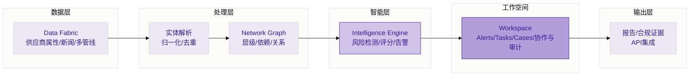

优势：平台架构表达清晰；case management/跨团队协作体验突出；把“agentic intelligence”用于数据处理链路，有利于规模化可维护性。
劣势：优化与“在约束下选最优处置动作”的能力公开证据不足；对于央企/高端制造的大规模BOM级优化闭环仍是机会点。

---

### **竞品十二：Moody’s Analytics**（Supply Chain Catalyst / Supplier Risk）

#### **产品定位**
Moody’s Analytics 在新闻稿中将 Supply Chain Catalyst 定位为：
> **”监控与管理供应链风险的数据与分析平台”**

强调提供供应商 **360 度视图**：
- 财务
- 可持续
- 声誉
- 运营

可结合企业自有供应商知识进行监控与缓释。

#### **能力要点（PDF 摘要片段口径）**
| 类别 | 具体能力 |
|------|----------|
| **可视化** | 风险仪表盘 / 评分卡 |
| **报告** | 可配置报告与分析图 |
| **工作流** | 工作流与通知 |
| **分群** | 供应商分群 |
| **关联** | 企业结构关联（监控子公司） |
| **ESG** | ESG / 气候评分 |
| **合规** | 制裁 / PEP / 负面新闻筛查 |
| **安全** | 与 BitSight 网络安全评级结合 |

#### **知识图谱与关系**
- **优势来源**：企业结构 / 所有权 / 金融数据的权威性与覆盖
- ⚠️ 公开叙事不如 Interos / Exiger 那样强”关系图谱平台化”

能力雷达（表格替代）

| 维度 | 分数 | 依据（摘要） |
|---|---:|---|
| 知识图谱/关系网络 | 3 | 企业结构/子公司关联能力突出，但图谱平台化叙事较弱|
| 实时预警 | 3 | 支持自定义告警、减少信息噪声（口径）|
| 协同处置 | 3 | 提到工作流与通知，但协同处置产品化程度不明|
| AI Agent | 2 | 以数据分析与仪表盘为主|
| 运筹优化 | 2 | 分群/分析为主，未突出优化算法|
| 制造业适配 | 3 | 更偏“供应商财务/合规/风险分析平台”，需与制造计划系统联合|

技术架构示意（Mermaid）
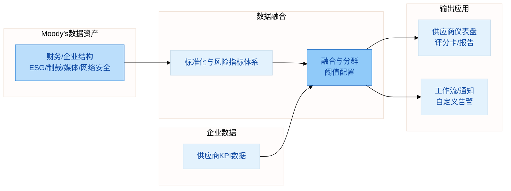

优势：金融/企业结构/合规筛查维度权威且可扩展；适合“供应商财务与合规风控”主导场景。
劣势：对“制造业零件级影响+跨部门协同处置+运筹优化”不是核心卖点。

## 第三个竞品深度对标与攻防策略

以下将对 **Prewave** 做更深度（至少较其他竞品多2倍细节）的比较分析，并给出针对性的攻击/防守策略（产品、技术、市场、销售）。

### Prewave 深度剖析

**公司与产品叙事结构**
Prewave 的产品叙事不是“风险模块堆叠”，而是以“Superintelligence（超级智能）”统一包装三大价值：韧性（Resilience）、可持续与合规（Sustainability/Compliance）、多层级透明（Multi-tier Transparency）。这种叙事对跨国制造企业非常有效，因为它把“风险预警”与“监管合规（如供应链尽调、碳相关）”放在同一平台价值框架中。

**功能模块拆解（按“识别→评估→行动→证明”链路）**
1) 识别（Detect）：Monitoring & Alerting 的关键差异点是“高速数据管线+多语言NLP”，主张在 60 分钟内推送高影响风险事件，并强调预测分析、实时预警与多语言分析能力。
2) 评估（Assess）：Scoring 模块强调实时更新的评分体系，用于刻画供应商/组合风险；结合 Action Platform 的“Risk Matrix（风险矩阵）”方法论，强化“优先级”叙事。
3) 扩展透明（Expand visibility）：Tier‑N 模块围绕“集群风险、依赖可视化、瓶颈识别、危机响应”形成一套面向多层级网络的价值主张，并强调“questionnaire free”（对 Tier2/3 不依赖供应商自报问卷）。
4) 行动（Act）：Action Platform 与传统“告警平台”的最大区别在于：它不仅提供报告/评分，还提供“缓解行动采购/编排”的能力——如成熟度评估、供应商安全评估、共享行动（平台成员协作）以及通过可信第三方提供 GAP 分析、现场审计、桌面审计、培训等行动。
5) 证明（Prove）：Action Platform 强调“一键式集成报告（one-click integrated reporting）”，与其面向尽调/法规框架的“审计可证明”路线一致。

**数据与知识图谱能力（推断 + 证据）**
Prewave 在公开页面中更常使用“Tier‑N transparency”“visualise dependencies”等表达，而较少使用“knowledge graph”术语；但从 Tier‑N 的依赖可视化、集群风险定位、瓶颈识别等功能推断，它内部至少存在“供应商网络图+风险/地域/行业标签”的图结构底座。该推断由 Tier‑N 页面清晰支持（依赖可视化、关键间接供应商、集群风险）。
与此同时，Prewave 首页披露“1.6m 注册供应商、每日分析 4.5m 数据点、覆盖 200+ 风险”等规模指标，说明其数据资产更偏“广覆盖+高频事件流”。

**AI 能力形态与 Agent 化程度（关键判断）**
Prewave 的 AI 更像“情报生产线”（NLP/分类/预测/评分）而非“可执行的Agent队列”。在公开模块体系中，虽强调“AI-powered”“predictive risk monitoring”，但 Action Platform 的行动更多呈现为“通过平台订购第三方服务+协作共享行动”，而非“Agent自动跑通处置流程（任务分派、SLA、闭环学习）”。
这意味着：Prewave 的强项是“识别与合规证明”，弱项更可能在“跨部门协同处置编排的自动化程度”与“处置动作的最优决策（运筹优化）”。

**运筹/优化能力（关键判断）**
Prewave 公开材料中出现“maximising ROI of risk management budget”等“优先级/投资回报”话术，但没有看到 Kinaxis 那样的“优化/启发式/模型融合”或 Exiger 那样的“directed buy/alternatives/contingency planning”明确优化模块。
因此，对我们而言：**只要把“预警→协同→优化决策→系统执行”做深，Prewave 在“央企/高端制造的复杂处置”上并非不可攻破。**

### 针对 Prewave 的攻击/防守策略（产品×技术×市场×销售）

**产品攻击策略（我们如何赢）**
我们应避免在“事件监测覆盖面/多语言NLP”上与 Prewave 正面对耗（其已具备 60 分钟级推送、广覆盖指标）。攻击重点应转向：
1) **协同处置的“组织级作战系统”**：把“风险处置”做成可配置的“央企风控/供应链/生产/采购/法务/安环/纪检”联动机制：任务分派、SLA、分级响应、合规留痕、跨系统工单与复盘知识沉淀。Craft 的 case management 与 Resilinc 的 WarRooms 是参照，但我们要更贴合央企组织与审计要求。
2) **BOM/产能/库存/订单四维联动的影响计算**：Prewave 强项是供应商网络透明；我们要把影响计算落到“哪条产线/哪个工厂/哪批订单/哪些关键物料”的可解释链路上（对高科技制造尤为关键）。Exiger 的 network-to-part 与 Resilinc 的 part-site 映射说明这是可行且有市场价值的。
3) **运筹优化成为“处置动作选择器”**：把协同处置从“订购审计/协作行动”升级为“多目标最优动作推荐”：
   - 替代供应商选择（约束：认证/产能/交期/关税/合规）
   - 多工厂产能重排与排产调整（约束：工艺路线/换线成本/良率）
   - 多级库存重分配（约束：服务水平/资金占用/运输时效）
   - 运输改道与节点绕行（约束：港口/线路容量/成本）
   Kinaxis 已把“优化+启发式+ML融合”作为卖点；我们应将其能力“风险处置场景化”，而不是泛计划。
4) **中国/全球“双栈数据能力”**：Prewave 强在欧洲法规（尽调、碳等）与多语言；我们要补齐“国内数据源与合规语境”（央企供应链治理、涉制裁/出口管制、国内舆情、供应商工商/司法/招投标、园区与地方政策等），形成中国市场壁垒。

**产品防守策略（Prewave 有可能打到我们哪里）**
Prewave 的守势来自三点：
- “速度与覆盖”的叙事（60分钟推送、200+风险、1.6m供应商、4.5m数据点/日）。
- Tier‑N 与“questionnaire free”的采购友好性。
- Action Platform 把“缓解行动”产品化为可采购服务网络（审计/咨询/培训）。
我们需要防守的不是“监测是否存在”，而是“交付体验”：第一年必须在一个行业里把“预警→协同→优化→落地”跑通，形成可复制的客户案例和方法论。

**技术攻击策略（我们如何构建壁垒）**
1) **供应链知识图谱的“工业级数据模型”**：覆盖实体（企业/工厂/仓库/港口/设备）、关系（供需/替代/工艺/运输/合同/股权）、对象（物料/零件/工艺路线/订单/库存）与事件（风控/质量/合规）。
2) **Agent 工作引擎=“可治理的工作流+工具调用+人类在环”**：参考 Kinaxis 对“可解释/治理/嵌入工作流”的要求与 Resilinc 对“学习+规则+仿真+工作流触发”的实现形态，构建可审计、可回放、可演进的 Agent。
3) **优化引擎产品化**：把常见处置策略抽象成一组“可配置优化模板”（MILP/CP-SAT/启发式/鲁棒优化），并提供“解释器”输出：为什么选这个方案、放弃了哪些权衡、约束冲突在哪里（与央企决策习惯匹配）。Kinaxis 强调 explainable AI；我们要把 explainability 延伸到优化决策过程。

**市场与销售攻击策略（我们如何打穿）**
- **主战场选择**：优先选择“高科技制造/复杂供应链央企”中“外部风险频繁+内部跨部门协同成本高+计划系统复杂”的行业（例如半导体/电子/装备制造/能源电力供应链）。原因：这些行业对“优化决策”价值敏感，且对数据主权/混合部署要求更高。
- **销售话术**：从“监测预警”（大多可替代）升级到“处置效率与损失避免的可量化ROI”。Resilinc 与 Everstream 都用“响应速度/节省成本”等量化叙事；我们要把量化进一步接到“优化带来的成本/交期/服务水平提升”。
- **生态打法**：Prewave 的行动网络是护城河之一；我们需要建立“央企供应链合规/审计/风控/物流/保险/咨询”的国产生态伙伴网络，在项目交付中把“数据接入+流程落地+行动处置资源”组合销售。

## 差异化机会、路线图与MVP

### 差异化机会总结
综合 12 家竞品，可以明确三条“可执行差异化机会”：

**机会一：把“协同处置”做成央企级“作战系统”，而不是仅有工作流**
竞品已经普遍具备工作流/协作（Resilinc WarRooms、Craft Cases、Prewave Shared Actions、Sphera workflows、SAP 风险处置流程）。
我们的提升空间在于：
- 组织模型（集团-板块-子公司-工厂-项目）
- 权限/保密/分级响应（涉密、涉供应商敏感信息）
- 审计留痕与复盘知识库（把每次处置沉淀为可复用“剧本/策略”）
- 与既有系统深度集成（OA/工单/ERP/MES/APS/主数据治理）

**机会二：以“供应链知识图谱”统一“风险信号→业务影响→处置动作”，实现可解释闭环**
Interos/Exiger/Resilinc/Craft 说明“图谱/网络”已经成为行业底座趋势。
但对央企/高科技制造来说，最关键的是把图谱落到“BOM/工厂/订单/库存/产能”层面，形成“影响链路解释”（为什么这个事件会影响某产线）。这是多数风险情报平台的相对短板，也是我们最应该强化的产品底座。

**机会三：用运筹优化把“处置”从流程升级为“最优决策”**
Kinaxis 明确把优化作为平台基因；Exiger也强调“Optimize for Anything”。
但两者的共同点是：它们更偏“计划/编排平台”，并不专注“风险处置运营”。我们可以把运筹优化能力嵌到“风险处置”主流程中，形成差异化：
- 风险发生时：先自动计算影响范围与损失函数，再做最优处置动作组合
- 风险未发生时：做鲁棒性优化（最小化最坏情境损失）与预算内的“系统性风险削减”

### MVP 功能清单（建议）
MVP 以“可在央企/高科制造落地”为准则，聚焦一个行业、一个集团试点。
1) **供应链知识图谱MVP**：供应商/工厂/物料/订单/库存/运输节点的实体解析与关系建模；支持Tier‑2/3补全（结合公开数据+客户数据）。
2) **事件监测与预警MVP**：至少覆盖自然灾害、地缘政治/制裁、关键物流节点中断、重大舆情四大类；输出“情境化预警”（与客户足迹关联）。对标 Prewave 的“高影响事件快速推送”但以“影响解释”为差异点。
3) **协同处置（War Room / Case）MVP**：事件→自动生成处置Case→任务编排→SLA→证据与沟通留痕→复盘模板；对标 Craft Cases/Resilinc WarRooms。
4) **优化决策MVP（最小可用）**：
   - 替代供应商选择（多目标：成本/交期/合规/产能）
   - 库存重分配（多仓/多工厂，服务水平约束）
   - 简化的运输改道选择（成本-时效权衡）
5) **集成与数据治理MVP**：ERP（SAP/Oracle/用友/金蝶等）基础接口、主数据同步、权限与审计。SAP 生态的“嵌入流程”价值很高，我们需具备对等的集成能力。

### 产品路线图建议
**12个月（MVP→可复制试点）**：
- 完成知识图谱数据模型与实体解析引擎；上线事件监测（核心四类）与情境化影响计算；上线 War Room/Case；上线三类优化模板（替代供应商、库存重分配、运输改道）；完成 2–3 个典型处置“剧本”（例如：关键芯片断供、港口拥堵、制裁实体暴露）。
- 交付目标：一个行业内形成“可复用交付包（数据接入+流程模板+优化模板+管理看板）”。

**24个月（平台化与生态化）**：
- 扩展风险域（财务、网络安全、ESG/碳、劳工合规等）；引入 Agent 编排（工具调用、策略学习、规则引擎）并提供“人类在环”治理；对接更多计划/执行系统；建设“处置行动生态”（审计、保险、咨询、物流等）。对标 Kinaxis 的“Agent Studio/Marketplace”路线，但聚焦风险处置场景。

**36个月（智能协同网络与跨企业协作）**：
- 跨企业协同（上下游、集团内多公司）与数据共享治理；把“处置剧本”沉淀为“Agent 组件/策略市场”；引入鲁棒优化/随机规划做“持续韧性提升”；形成行业解决方案矩阵（高科制造、能源、工程建设、军工配套等）。

### 不同预算情景下的优先级建议
- **低预算（偏产品验证）**：优先做“图谱+预警+协同处置”闭环，不追求全风险域；优化只做一个模板（替代供应商选择）。
- **中预算（追求试点ROI）**：补齐三类优化模板+更丰富数据源；建立小型“专家运营”团队提升预警质量（参考 Everstream/Resilinc 的“AI+专家验证”叙事）。
- **高预算（追求平台领先）**：建立多语言/多源情报管线与行业数据资产；打造 Agent Studio 与策略市场；构建生态伙伴网络（行动资源供给侧），对标 Prewave Action Platform 的“可采购处置行动”。

## 结论与行动建议

1) **把“运筹优化”提升为产品主叙事的核心差异化**：在竞品中，只有 Kinaxis（计划编排）与 Exiger（network-to-part 优化）相对突出“优化”；而风险情报平台普遍停留在“预警+工作流”。我们应在风险处置链路中把优化做成“第一等公民”，形成“预警即决策”的体验。
2) **以“央企级协同处置”建立中国市场壁垒**：对标 Craft 的 case management 与 Resilinc 的 WarRooms，做更强的组织模型、权限与审计、剧本化复盘。
3) **对 Prewave 的策略：避开监测覆盖面消耗战，主攻“优化闭环+系统集成+中国数据”**：Prewave 的优势在预警速度、Tier‑N透明与行动网络；我们的胜点在“BOM/计划/执行一体化的可解释影响计算 + 运筹优化处置”。
4) **商业落地路径：从一个高价值行业场景“打穿”**：建议从“高科技制造（半导体/电子/装备）或能源电力供应链”中选一个试点，以“关键物料断供/制裁暴露/关税冲击/物流中断”四类剧本建立可复制交付包；随后扩展到集团级平台。
